

  

## Pass Interview ( Harmony NEXT )

A brushing application for front-end programmers, providing front-end frequently met questions, project business
interview questions, interview experience and other content services.

HarmonyOS NEXT https://github.com/HarmonyOS-Next/interview-handbook-project

HarmonyOS 4.0

- document https://harmonyos-next.github.io/interview-handbook-project/
- code https://github.com/HarmonyOS-Next/interview-handbook-project/tree/main

## Screen Shots

|                                     |                                     |
|-------------------------------------|-------------------------------------|
| 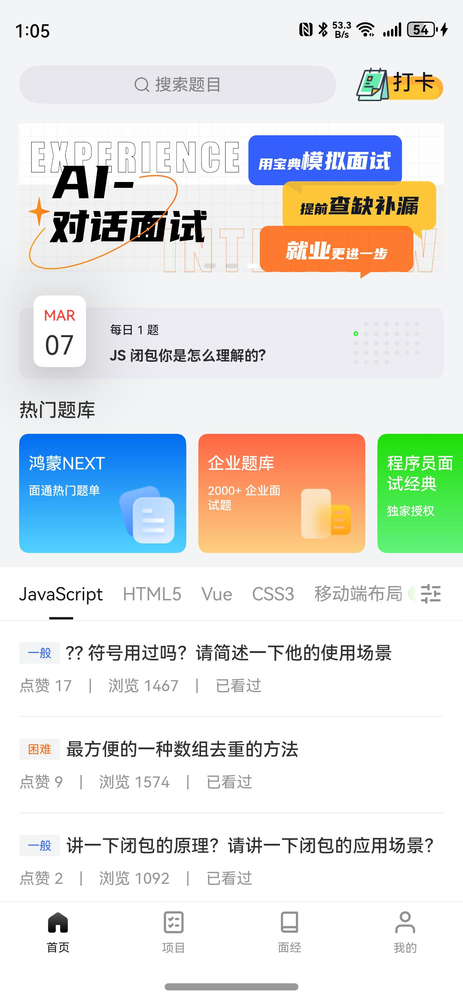 |  |
| 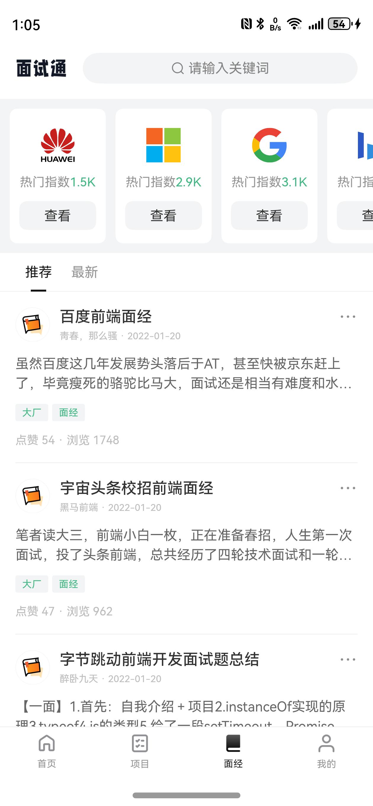 | 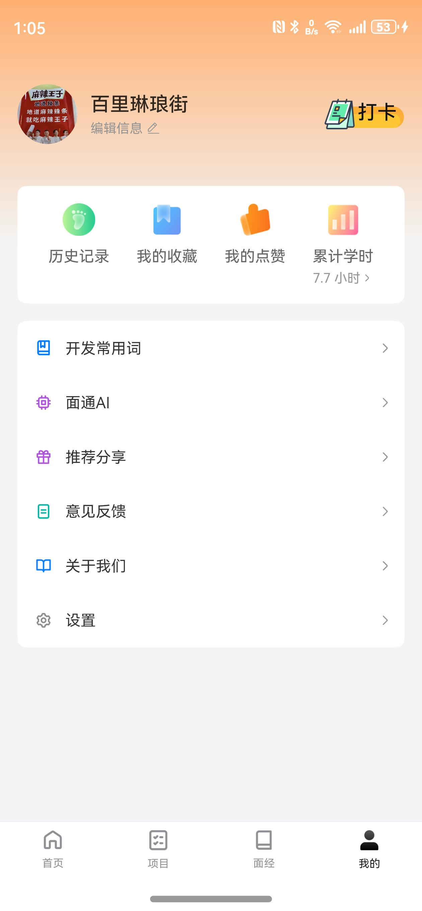 |
| 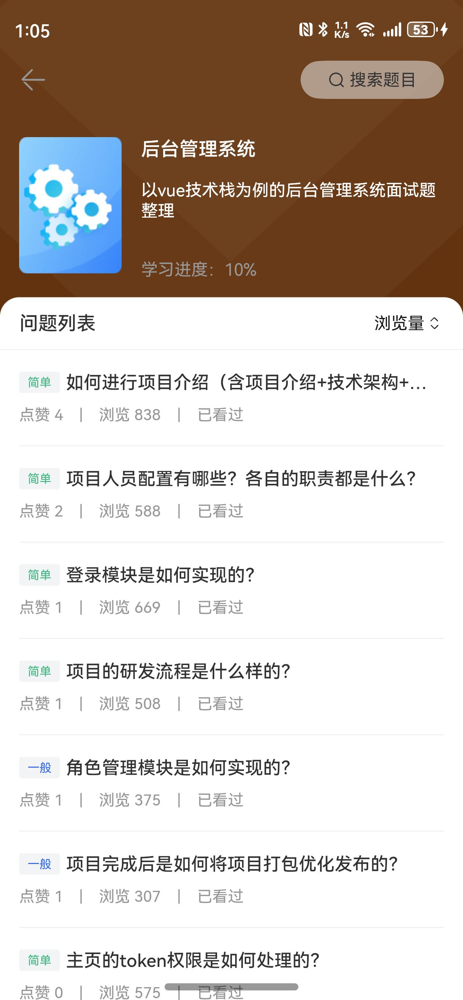 | 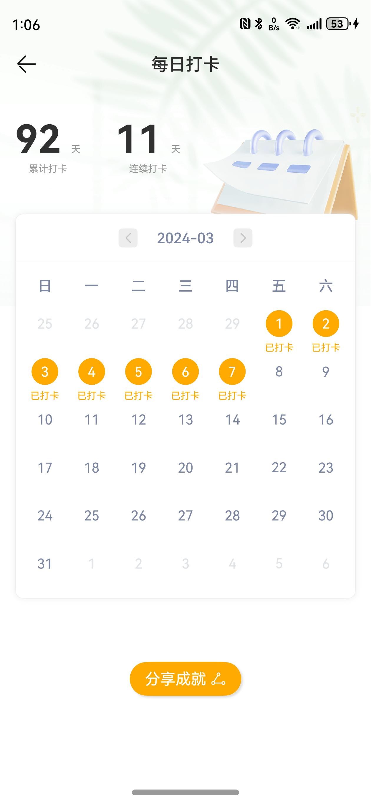 |
| 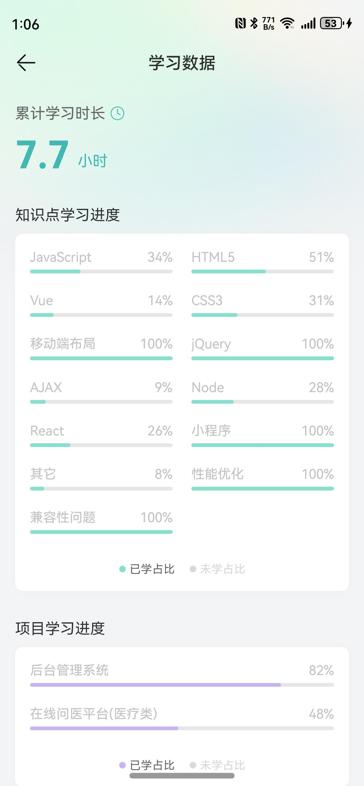 | 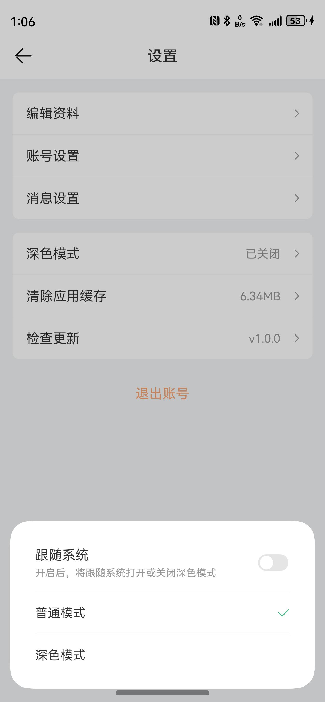 |
| 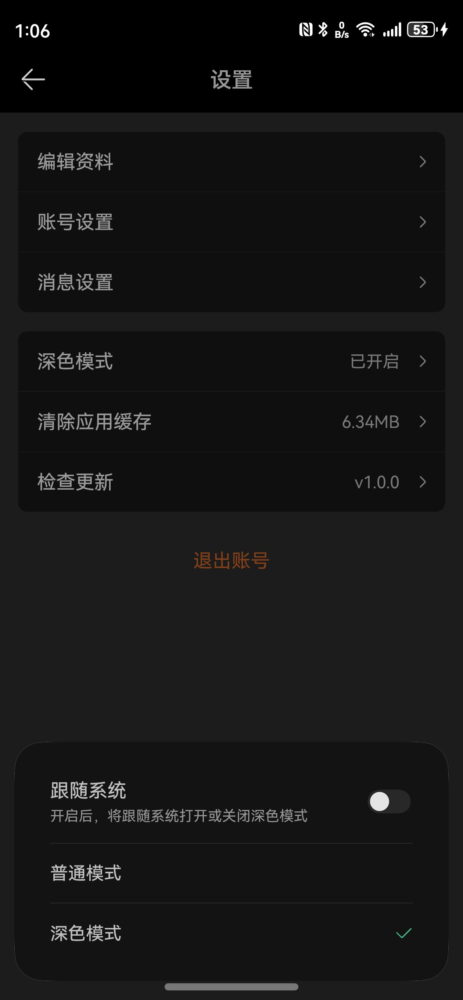 | 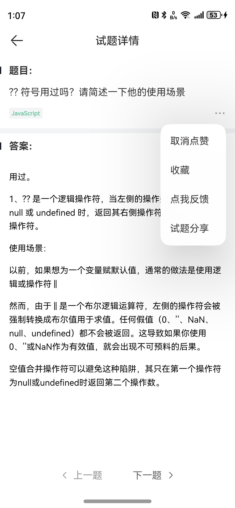 |
| 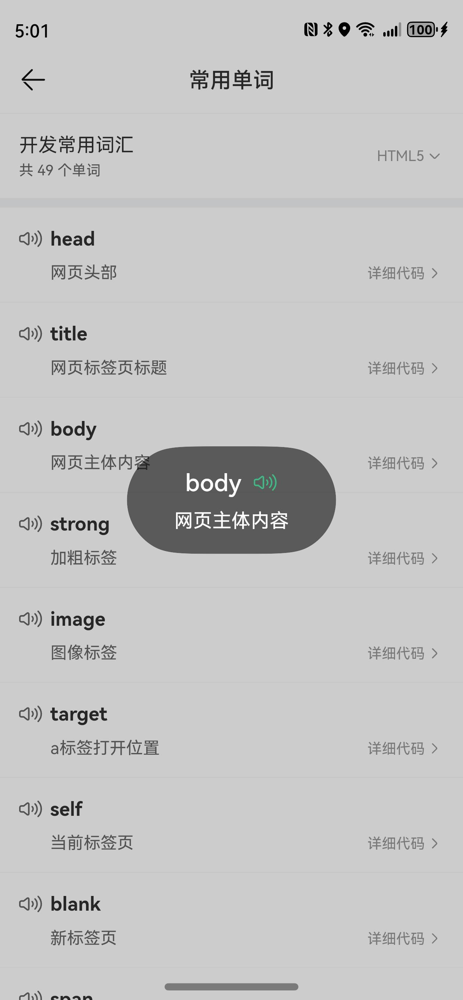 | 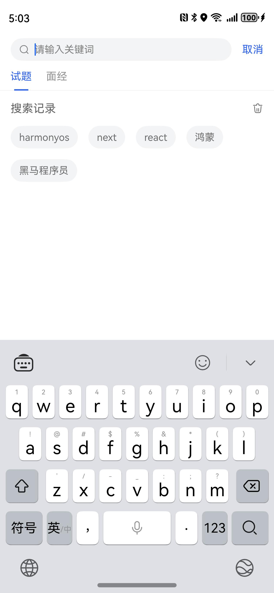 |

