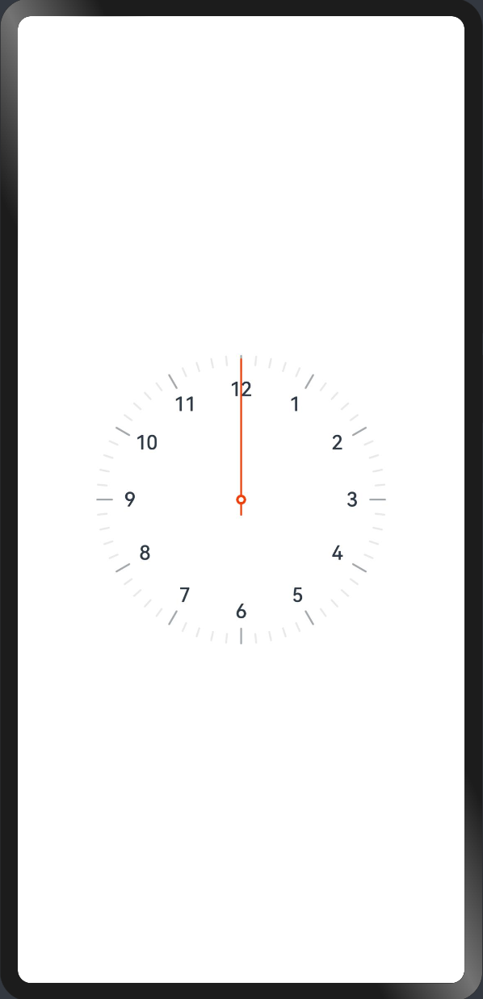

# 鸿蒙-应用程序开发

## 路由与生命周期

### 1. 路由-常用API

> 如何新建页面，如何跳转和回退操作

1）新建页面

```typescript title="pages/DetailPage.ets"
@Entry
@Component
struct DetailPage {
  build() {
    Column({ space: 15 }) {
      Text('Detail Page')
        .fontSize(40)
      Button('Back')
    }
    .height('100%')
    .width('100%')
    .justifyContent(FlexAlign.Center)
  }
}
```

```diff title="src/main/resources/base/profile/main_pages.json"
{
  "src": [
    "pages/Index",
+    "pages/DetailPage"
  ]
}
```

::: tip
- 手动新建一个页面（ets）文件，需要在 `main_pages.json` 中手动配置
- 可以自动创建
    
:::

2）跳转与后退 API 

- 跳转 `router.pushUrl()`
- 后退 `router.back()`
- 替换跳转 `router.replaceUrl()`

```typescript
import router from '@ohos.router'
@Entry
@Component
struct Index {
  build() {
    Column({ space: 15 }) {
      Text('Index Page')
        .fontSize(40)
      Button('Jump To Detail Page')
        .onClick(() => {
          // 1. 跳转，压入页面栈顶部
          // router.pushUrl({
          //   url: 'pages/DetailPage'
          // })

          // 2. 跳转，替换当前页面栈
          // router.replaceUrl({
          //   url: 'pages/DetailPage'
          // })

          // 3. 返回
          // router.back()
        })
    }
    .height('100%')
    .width('100%')
    .justifyContent(FlexAlign.Center)
  }
}
```

::: tip
- 页面栈的最大容量为32个页面。如果超过这个限制，可以调用 `router.clear()` 方法清空历史页面栈，释放内存空间。

:::

### 2. 路由-参数传递

> 页面参数传递和获取

1）传参

```typescript {26} title="pages/Index.ets"
import router from '@ohos.router'

class User {
  name: string
  age: number
}

@Entry
@Component
struct Index {

  @State
  user: User = {
    name: 'jack',
    age: 18
  }

  build() {
    Column({ space: 15 }) {
      Text('Index Page')
        .fontSize(40)
      Button('Jump To Detail Page')
        .onClick(() => {
          router.pushUrl({
            url: 'pages/DetailPage',
            params: this.user
          })
        })
    }
    .height('100%')
    .width('100%')
    .justifyContent(FlexAlign.Center)
  }
}
```

2）获取

```typescript {7-10} title="pages/DetailPage.ets"
import router from '@ohos.router'
import promptAction from '@ohos.promptAction'
@Entry
@Component
struct DetailPage {

  aboutToAppear() {
    const params = router.getParams()
    promptAction.showToast({ message: params['name'] + params['age'] })
  }

  build() {
    Column({ space: 15 }) {
      Text('Detail Page')
        .fontSize(40)
      Button('Back')
        .onClick(() => {
          router.back()
        })
    }
    .height('100%')
    .width('100%')
    .justifyContent(FlexAlign.Center)
  }
}
```

### 3. UIAbility-生命周期

> 当用户打开、切换和返回到对应应用时，应用中的UIAbility实例会在其生命周期的不同状态之间转换。


1. UIAbility实例创建完成时触发，系统会调用 `onCreate()` 回调。
    - 可以在该回调中进行应用初始化操作，例如变量定义资源加载等，用于后续的UI界面展示。
  
2. `onForeground()` 回调，在 UIAbility 的UI界面可见之前，如 UIAbility 切换至前台时触发。
    - 可以在 onForeground() 回调中申请系统需要的资源，或者重新申请在 onBackground() 中释放的资源。

3. `onBackground()` 回调，在 UIAbility 的UI界面完全不可见之后，如 UIAbility 切换至后台时候触发。
    - 可以在 onBackground() 回调中释放UI界面不可见时无用的资源，或者在此回调中执行较为耗时的操作，例如状态保存等

4. Destroy 状态在 UIAbility 实例销毁时触发，系统会调用 `onDestroy()` 回调。
    - 可以在该回调中进行系统资源的释放、数据的保存等操作。


### 4. 组件-生命周期


1）任何组件

`aboutToAppear`

- aboutToAppear 函数在创建自定义组件的新实例后，在执行其 build 函数之前执行。
- 允许在 aboutToAppear 函数中改变状态变量，更改将在后续执行 build 函数中生效。

`aboutToDisappear`

- aboutToDisappear 函数在自定义组件析构销毁之前执行。
- 不允许在 aboutToDisappear 函数中改变状态变量，特别是 @Link 变量的修改可能会导致应用程序行为不稳定。


2）仅页面 `@Entry` 组件 

`onPageShow`

- 页面每次显示时触发一次，包括路由过程、应用进入前后台等场景，仅 @Entry 修饰的自定义组件生效。

`onPageHide`

- 页面每次隐藏时触发一次，包括路由过程、应用进入前后台等场景，仅 @Entry 修饰的自定义组件生效。

`onBackPress`

- 当用户点击返回按钮时触发，仅 @Entry 修饰的自定义组件生效。


### 5. UIAbility跳转

> UIAbility组件是一种包含UI界面的应用组件，主要用于和用户交互

- UIAbility组件是系统调度的基本单元，为应用提供绘制界面的窗口；
- 一个UIAbility组件中可以通过多个页面来实现一个功能模块；
- 每一个UIAbility组件实例，都对应于一个最近任务列表中的任务。

```typescript title="OtherAbility"
Button('Jump To PayAbility Page')
  .onClick(() => {
    const context = getContext(this) as common.UIAbilityContext
    const want: Want = {
      bundleName: 'com.itcast.myapplication',
      abilityName: 'PayAbility'
    }
    context.startAbility(want)
  })
```


```typescript title="EntryAbility"
Button('Back')
  .onClick(() => {
    router.back()
  })
```

::: tip

- 后续消息通知跳转到应用也需要跳转到对应的 UIAbility 方式类似

:::


## 使用动画

### 1. 属性动画

> 组件的某些通用属性变化时，可以通过属性动画实现渐变过渡效果，提升用户体验。

- 支持的属性包括width、height、backgroundColor、opacity、scale、rotate、translate等。

```typescript
@Entry
@Component
struct Index {
  @State
  widthSize: number = 100
  @State
  heightSize: number = 40

  build() {
    Column({ space: 15 }) {
      Button('元素动画')
        .width(this.widthSize)
        .height(this.heightSize)
        .onClick(() => {
          this.widthSize = 200
          this.heightSize = 100
        })
        .animation({
          // 动画时间
          duration: 1000,
          // 执行次数
          iterations: -1,
          // 动画曲线
          curve: Curve.Ease,
          // 延时时间
          delay: 1000,
          // 播放模式
          playMode: PlayMode.Alternate
        })
    }
    .height('100%')
    .width('100%')
    .justifyContent(FlexAlign.Center)
  }
}
```

### 2. 显示动画

> 提供全局animateTo显式动画接口来指定由于闭包代码导致的状态变化插入过渡动效。

```typescript
import promptAction from '@ohos.promptAction'
@Entry
@Component
struct Index {
  @State
  show: boolean = true

  build() {
    Column({ space: 15 }) {
      Column() {
        Row() {
          Text('一级菜单')
            .fontColor('#fff')
            .height(50)
        }
        .onClick(() => {
          animateTo({
            duration: 200,
            onFinish: () => {
              // 动画结束
              promptAction.showToast({ message: 'finish' })
            }
          },() => {
            this.show = !this.show
          })
        })

        if (this.show) {
          Column() {
            Text('二级菜单')
              .fontColor('#fff')
              .height(50)
            Text('二级菜单')
              .fontColor('#fff')
              .height(50)
          }
        }
      }
      .width(100)
      .backgroundColor('#069')
    }
    .height('100%')
    .width('100%')
  }
}
```


### 3. 元素共享转场

> 当路由进行切换时，可以通过设置组件的 `sharedTransition` 属性将该元素标记为共享元素并设置对应的共享元素转场动效。


```typescript title="Index.ets"
import router from '@ohos.router'
@Entry
@Component
struct Index {
  build() {
    Row({ space: 15 }) {
      Column({ space: 10 }){
        Image($rawfile('apple.png'))
          .width('100%')
          .aspectRatio(1)
          .sharedTransition('apple', { duration: 500 })
        Text('鸣春谷 正宗甘肃特产花牛水果苹果 【天水直发】 4.5-5斤中果A(约13-16个)')
          .sharedTransition('text', { duration: 500 })
      }
      .padding(15)
      .width('50%')
      .onClick(() => {
        router.pushUrl({
          url: 'pages/DetailPage'
        })
      })
    }
    .width('100%')
  }
}
```

```typescript title="DetailPage.ets"
@Entry
@Component
struct DetailPage {
  build() {
    Column({ space: 15 }) {
      Column({ space: 10 }){
        Image($rawfile('apple.png'))
          .width('100%')
          .aspectRatio(1)
          .sharedTransition('apple', { duration: 500 })
        Text('鸣春谷 正宗甘肃特产花牛水果苹果 【天水直发】 4.5-5斤中果A(约13-16个)')
          .fontSize(18)
          .sharedTransition('text', { duration: 500 })
      }
      .padding(15)
    }
    .height('100%')
    .width('100%')
  }
}
```

### 4. 拖动手势-阻尼和磁吸

> 拖动手势（PanGesture）

- 拖动手势用于触发拖动手势事件，滑动达到最小滑动距离（默认值为5vp）时拖动手势识别成功。

实现下拉刷新效果：

1. 使用 `Stack` 堆叠下拉刷新容器和列表容器
2. 使用手势事件 `PanGesture` 实现拖动列表容器
3. 使用 `animateTo` 实现磁吸动画效果
4. 拖动距离超出阀值，模拟开启加载效果，控制文字显示和动画

```typescript
import promptAction from '@ohos.promptAction'
@Entry
@Component
struct Index {
  @State
  translateY: number = 0
  @State
  text: string = '下拉即可刷新'
  @State
  loading: boolean = false

  ease (originValue: number = 0) {
    const space = 60
    const damp = 0.3
    if ( originValue > space ) {
      return space + ( originValue - space ) * damp
    }
    return originValue
  }

  build() {
    Stack({ alignContent: Alignment.Top }) {
      Row() {
        if (this.loading) {
          LoadingProgress()
            .width(32)
            .aspectRatio(1)
        }
        Text(this.text)
          .fontColor('#999')
          .width(100)
      }
      .height(100)

      List() {

      }
      .backgroundColor('#fff')
      .height('100%')
      .width('100%')
      .translate({ y: this.translateY })
      .gesture(
        PanGesture()
          .onActionUpdate((event: GestureEvent) => {
            this.translateY = this.ease(event.offsetY)
            if ( this.translateY > 100 ) {
              this.text = '释放立即刷新'
            }
          })
          .onActionEnd((event: GestureEvent) => {
            if (this.translateY > 100) {
              this.loading = true
              this.text = '正在刷新中...'
              animateTo({ duration: 300 }, () => {
                this.translateY = 100
              })
              // 加载数据
              setTimeout(() => {
                this.loading = false
                this.text = ''
                animateTo({ duration: 300, onFinish: () => this.text = '下拉即可刷新' }, () => {
                  this.translateY = 0
                })
                promptAction.showToast({ message: '刷新成功' })
              }, 2000)
            } else {
              animateTo({ duration: 300 }, () => {
                this.translateY = 0
              })
            }
          })
      )
    }
    .height('100%')
    .width('100%')
    .backgroundColor('#f3f4f5')
  }
}
```

## 系统能力

### 1. 数据管理-用户首选项

> 用户首选项为应用提供 `Key-Value` 键值型的数据处理能力，支持应用持久化轻量级数据，并对其修改和查询。

- `Key` 键为 string 类型，要求非空且长度不超过 80 个字节。
- 如果 `Value` 值为 string 类型，可以为空，不为空时长度不超过 8192 个字节。
- 内存会随着存储数据量的增大而增大，所以存储的数据量应该是轻量级的，建议存储的数据不超过一万条，否则会在内存方面产生较大的开销。

1）知晓 API 用法

```text
// 获取首选项实例
getPreferences(context: Context, name: string): Promise<Preferences>

// 首选项实→获取数据
get(key: string, defValue: ValueType): Promise<ValueType>
// 首选项实→设置|修改数据
put(key: string, value: ValueType): Promise<void>
// 首选项实→删除数据
delete(key: string): Promise<void>

```

2）写一个存储用户的工具

```typescript title="utils/userStore.ets"
import preferences from '@ohos.data.preferences'

export class User {
  name?: string
  age?: number
}

export class UserStore {
  KEY = 'user-store'

  getStore() {
    return preferences.getPreferences(getContext(this), 'userStore')
  }

  async setData(data: User) {
    const store = await this.getStore()
    await store.put(this.KEY, JSON.stringify(data))
    await store.flush()
  }

  async getData() {
    const store = await this.getStore()
    const data = await store.get(this.KEY, '{}') as string
    return JSON.parse(data) as User
  }

  async delData() {
    const store = await this.getStore()
    await store.delete(this.KEY)
    await store.flush()
  }

}
```

```typescript title="pages/Index.ets"
import router from '@ohos.router'
import { User, UserStore } from '../utils/userStore'

@Entry
@Component
struct Index {
  userStore: UserStore
  @State
  user: User = {}

  aboutToAppear() {
    this.userStore = new UserStore()
    this.getUser()
  }

  async getUser () {
    const user = await this.userStore.getData()
    this.user = user
  }

  build() {
    Column({ space: 15 }) {

      if ( this.user?.name && this.user?.age ) {
        Text(`${ this.user.name } 今年 ${ this.user.age } 岁`)
      }

      Button('设置 User')
        .onClick(async () => {
          await this.userStore.setData({ name: 'jack', age: 18 })
          await this.getUser()
        })

      Button('修改 User')
        .onClick(async () => {
          await this.userStore.setData({ name: 'tom', age: 17 })
          await this.getUser()
        })

      Button('删除 User')
        .onClick(async () => {
          await this.userStore.delData()
          await this.getUser()
        })

      Button('换一页')
        .onClick(() => {
          router.pushUrl({
            url: 'pages/DetailPage'
          })
        })
    }
    .height('100%')
    .width('100%')
    .justifyContent(FlexAlign.Center)
  }
}
```


### 2. 绘画能力-画布组件


1）了解 画布 基本用法

```typescript
@Entry
@Component
struct Index{

  // 抗锯齿设置
  private settings: RenderingContextSettings = new RenderingContextSettings(true)
  // 画布实例
  private context: CanvasRenderingContext2D = new CanvasRenderingContext2D(this.settings)

  build() {
    Column({ space: 15 }) {
      // 画布组件
      Canvas(this.context)
        .width(252)
        .aspectRatio(1)
        .backgroundColor('#ccc')
        .onReady(() => {
          // 绘制边框盒子
          this.context.strokeRect(100, 100, 50, 50)
          // 绘制填充盒子
          this.context.fillRect(150, 150, 50, 50)
        })
    }
    .height('100%')
    .width('100%')
    .justifyContent(FlexAlign.Center)
  }
}
```

2）绘制表盘和秒针



前置知识：
- `drawImage(img: ImageBitmap, x, y, w, h)` 图片需要 `ImageBitmap` 格式
- `rotate(angle: number)` angle 是弧度，`1° = Math.PI / 180`，围绕 `0 0` 中心旋转

```typescript
@Entry
@Component
struct Index{

  private settings: RenderingContextSettings = new RenderingContextSettings(true)
  private context: CanvasRenderingContext2D = new CanvasRenderingContext2D(this.settings)
  private panImg: ImageBitmap = new ImageBitmap('/images/ic_clock_pan.png')
  private secondImg: ImageBitmap = new ImageBitmap('/images/ic_second_pointer.png')


  build() {
    Column({ space: 15 }) {
      Canvas(this.context)
        .width(252)
        .aspectRatio(1)
        .onReady(() => {
          this.context.drawImage(this.panImg, 0 ,0 , 252, 252)

          this.context.translate(126, 126)
          this.context.rotate(Math.PI / 180 * 180)
          this.context.translate(-126, -126)
          this.context.drawImage(this.secondImg, 122, 0, 8, 252)
        })
    }
    .height('100%')
    .width('100%')
    .justifyContent(FlexAlign.Center)
  }
}
```


### 3. 公共事件与通知-通知管理

> 本模块提供通知管理的能力，包括发布、取消发布通知，创建、获取、移除通知通道，获取通知的使能状态、角标使能状态，获取通知的相关信息等。

参考文档 [链接](https://developer.harmonyos.com/cn/docs/documentation/doc-guides-V3/text-notification-0000001478340981-V3)

1）发送通知和取消通知

```typescript
import notificationManager from '@ohos.notificationManager'

@Entry
@Component
struct Index {
  notifyId = 100

  build() {
    Column({ space: 15 }) {
      Button('添加通知')
        .onClick(async () => {
          const request: notificationManager.NotificationRequest = {
            id: this.notifyId,
            content: {
              contentType: notificationManager.ContentType.NOTIFICATION_CONTENT_BASIC_TEXT,
              normal: {
                title: "温馨提示",
                text: "您的京东快递 100321120341233 快递已经达到北京！",
                additionalText: "物流提醒"
              }
            },
            // 跳转应用
            wantAgent: want
          }
          notificationManager.publish(request)
        })
      Button('取消通知')
        .onClick(() => {
          notificationManager.cancel(this.notifyId)
        })
    }
    .height('100%')
    .width('100%')
    .justifyContent(FlexAlign.Center)
  }
}
```

2）通知点击唤起应用

```typescript
import wantAgent from '@ohos.app.ability.wantAgent'
```
```typescript
// 获取 wantAgent
const want = await wantAgent.getWantAgent({
  wants: [
    {
      bundleName: 'com.itcast.myapplication',
      abilityName: 'EntryAbility'
    }
  ],
  operationType: wantAgent.OperationType.START_ABILITY,
  requestCode: 0
})
```
```diff
const request: notificationManager.NotificationRequest = {
  id: this.notifyId,
  content: {
    contentType: notificationManager.ContentType.NOTIFICATION_CONTENT_BASIC_TEXT,
    normal: {
      title: "温馨提示",
      text: "您的京东快递 100321120341233 快递已经达到北京！",
      additionalText: "物流提醒"
    }
  },
  // 跳转应用
+  wantAgent: want
}
```

### 4. 后台任务-后台代理提醒

> 应用退到后台或进程终止后，仍然有一些提醒用户的定时类任务，  
> 例如购物类应用抢购提醒等，为满足此类功能场景，系统提供了代理提醒（reminderAgentManager）的能力。

参考文档 [链接](https://developer.harmonyos.com/cn/docs/documentation/doc-guides-V3/agent-powered-reminder-0000001663585481-V3)

- 倒计时类：基于倒计时的提醒功能
- 日历类：基于日历的提醒功能
- 闹钟类：基于时钟的提醒功能

需要开启 `ohos.permission.PUBLISH_AGENT_REMINDER` 权限


1）闹铃

```typescript
import reminderAgentManager from '@ohos.reminderAgentManager'
import promptAction from '@ohos.promptAction'

@Entry
@Component
struct Index {
  reminderId = null

  build() {
    Column({ space: 15 }) {
      Button('添加闹铃')
        .onClick(async () => {
          let targetReminderAgent: reminderAgentManager.ReminderRequestAlarm = {
            // 提醒类型为闹钟类型
            reminderType: reminderAgentManager.ReminderType.REMINDER_TYPE_ALARM, 
            // 指明提醒的目标时刻
            hour: 19, 
            // 指明提醒的目标分钟
            minute: 57, 
            // 指明每周哪几天需要重复提醒
            daysOfWeek: [], 
            // 设置弹出的提醒通知信息上显示的按钮类型和标题
            actionButton: [ 
              {
                title: '停止',
                type: reminderAgentManager.ActionButtonType.ACTION_BUTTON_TYPE_CLOSE
              },
            ],
            // 响铃时长秒
            ringDuration: 60, 
            // 点击通知跳转的 want
            wantAgent: {
              pkgName: 'com.itcast.myapplication',
              abilityName: 'EntryAbility',
            },
          }
          // 记录id 清理使用
          this.reminderId = await reminderAgentManager.publishReminder(targetReminderAgent)
          promptAction.showToast({ message: '添加闹铃成功' })
        })
      Button('取消闹铃')
        .onClick(async () => {
          // 不能退出应用，否则 this.reminderId 是 null，开发的时候可以持久化
          await reminderAgentManager.cancelReminder(this.reminderId)
          promptAction.showToast({ message: '取消闹铃成功' })
        })
    }
    .height('100%')
    .width('100%')
    .justifyContent(FlexAlign.Center)
  }
}
```


## 今日案例-华为闹钟

### 1. 页面结构-首页结构


### 2. 页面结构-绘制闹钟


### 3. 页面结构-绘制闹钟任务列表


### 4. 页面结构-详情页


### 5. 业务逻辑-渲染闹钟任务列表


### 6. 业务逻辑-跳转详情并渲染


### 7. 业务逻辑-添加&修改闹钟任务


### 8. 业务逻辑-删除闹钟任务


### 10. 业务逻辑-停止和开启闹钟任务
