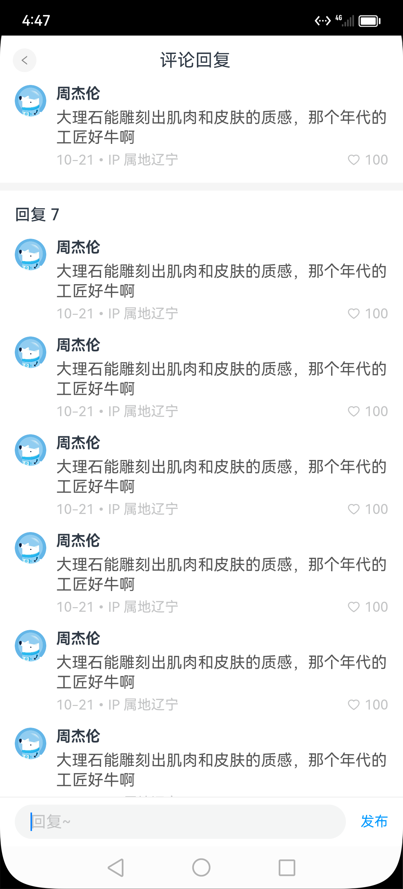

# 鸿蒙-组件基础

## 开发环境

### 1. 起步-鸿蒙简介

介绍：

- HarmonyOS 是新一代的智能终端操作系统，为不同设备的智能化、互联与协同提供了统一的语言。带来简洁，流畅，连续，安全可靠的全场景交互体验。

历程：

| 时间     | 事件                                                                                    |
| -------- | --------------------------------------------------------------------------------------- |
| 2019     | HarmonyOS 1.0，华为在东莞举行华为开发者大会，正式发布操作系统鸿蒙 OS，主要用于物联网    |
| 2020     | HarmonyOS 2.0，基于开源项目 OpenHarmony 开发的面向多种全场景智能设备的商用版本          |
| 2021     | HarmonyOS 3.0，先后优化游戏流畅度、地图三维体验、系统安全，另外系统的稳定性也得到了增强 |
| 2023.2   | HarmonyOS 3.1，系统纯净能力进一步提升，对后台弹窗、 隐藏应用、后台跳转等情况            |
| 2023.7   | 华为 Mate 50 系列手机获推 HarmonyOS 4.0                                                 |
| **2024** | **HarmonyOS Next 即将发布，将不在兼容安卓应用**                                         |

和我们有什么关系？

- 环境弱行业卷，怎么办？
- 纯鸿蒙应用开发潮，你跟不跟？
- 前端技术迁移鸿蒙开发易上手，你学不学？

### 2. 起步-DevEco Studio

    

安装 DevEco Studio 编辑器

1. 下载：https://developer.harmonyos.com/cn/develop/deveco-studio#download
   - Windows(64-bit)
   - Mac(X86)
   - Mac(ARM)
2. 安装：DevEco Studio → 一路 Next
3. 运行：
   - 基础安装：Node.js >= 16.9.1 + Install ohpm 鸿蒙包管理器
     
   - SDK 安装
     
   - 安装完毕
     

### 3. 起步-HelloWorld

创建一个空项目:

1. Create Project

   

2. 选择项目模板

   

3. 填写项目信息

   

4. Finish
   

### 4. 起步-效果预览

效果预览方法：

- Previewer 预览模式
- Local Emulator 本地模拟器
- Remote Emulator 远程模拟器
- Remote Device 远程真机
- Local Device 本地真机

::: tip 推荐使用

- Previewer 预览 和 Local Emulator 本地模拟器；
- 尤其推荐使用 `遥遥领先` 真机调试；

:::

1）Previewer 预览

> 场景：静态页面（没有组件间数据通信、不涉及到网络请求）  
> 条件：有 @Entry 或 @Preview 装饰器页面

- 预览和审查元素

  

- 多设备预览

  

2）Local Emulator 本地模拟器

> 场景：动态页面（几乎全场景，一些无法模拟的硬件功能）

- 新建模拟器

  
  一路 Next ...

- 启动模拟器

  

- 运行项目看效果

  

- 更改后每次需要（打包 → 卸载 → 安装 → 预览），有没有热更新或者刷新这种预览方式？

  
  调试静态页面可以，一旦有了数据变化也需要重启，体验一般~ （学习需要耐心，期待 Next 做的更好~）

::: tip 其他方式

- Remote Emulator 远程模拟器
- Remote Device 远程真机
- Local Device 本地真机

条件：
- 需要注册华为账号, 点这 https://developer.harmonyos.com/ 然后点击登录页面，去注册吧~
- 登录之后，需要自动生成签名信息，这个我们后面讲真机调试再给大家演示。

:::

### 5. 起步-工程结构

> 我们在哪里写代码？

    State 模型

    

了解App结构关系，等后面我们项目阶段来讲一些工程配置文件作用，现在你要知道：
- entry 是一个 Module 应用包
- entryability 是一个 UIAbility 包含用户界面的应用组件
- pages 是页面
- components 可以是组件

    


## 组件基础

### 1. 组件-什么是ArkTS

ArkTS是HarmonyOS优选的主力应用开发语言。ArkTS围绕应用开发在TypeScript（简称TS）生态基础上做了进一步扩展，继承了TS的所有特性，是TS的超集。

    

扩展能力如下：

1. 基本语法
    - 定义声明式UI、自定义组件、动态扩展UI元素；
    - 提供ArkUI系统组件，提供组件事件、方法、属性；
    - 共同构成 UI 开发主体
2. 状态管理
    - 组件状态、组件数据共享、应用数据共享、设备共享；
3. 渲染控制
    - 条件渲染、循环渲染、数据懒加载；

::: details 声明式UI？

问题？通过一段 `HTML` 标签展示出对应的页面方便，还是使用 `document.createElement('tag')`创建标签构建页面方便？
- 显然是 HTML , 其实 HTML 本身就是声明式的，通过描述的方式去声明 UI 界面。
- 一些前端框架也是声明式UI，如 `Vue` 使用的 `tempalte` 模板，如 `React` 使用的 `JSX`。
- 在例如现在的 `Jetpack Compose` `SwiftUI` `Flutter` 等APP开发技术也是声明式。

:::

### 2. 基础-组件结构

    

ArkTS通过装饰器 `@Component` 和 `@Entry` 装饰 `struct` 关键字声明的数据结构，构成一个自定义组件。
自定义组件中提供了一个 `build` 函数，开发者需在该函数内以链式调用的方式进行基本的 UI 描述，UI 描述的方法请参考 UI 描述规范。


1）页面组件

```typescript
@Entry
@Component
struct Index {
  // 工程默认显示 `Index` 页面组件
  // build 是声明UI的位置
  build() {
    Text('页面组件')
  }
}
```


2）自定义组件

```typescript

// 定义 `Footer` 组件
@Component
struct Footer {
  build() {
    Text('自定义组件')
  }
}

@Entry
@Component
struct Index {
  build() {
    // 使用 `Footer` 组件
    Footer()
  }
}
```

为了更好维护，自定义组件通常会新建一个文件 `Footer.ets`，通过模块化语法导出导入(默认|按需)使用。


```typescript title="components/Footer.ets"
@Component
export default struct Footer {
  build() {
    Text('自定义组件')
  }
}
```

```typescript title="Index.ets"
import Footer from './components/Footer.ets'

@Entry
@Component
struct Index {
  build() {
    // 使用 `Footer` 组件
    Footer()
  }
}
```

::: tip

- `@Entry @Component` 是页面组件，将来需要页面跳转就需要再定义一个页面。
- `@Component` 自定义组件，一个页面组件下可以有多个自定义组件。
- `build(){}` 只能有一个根元素

:::


### 3. 基础-系统组件(ArkUI)

常用系统组件 `Text` `Column` `Row` `Button` `TextInput`  [更多组件](https://developer.harmonyos.com/cn/docs/documentation/doc-references-V3/ts-components-summary-0000001478181369-V3)


- Text 文本组件
- Column 列组件，纵向排列，Flex布局主轴是Y
- Row 行组件，横向向排列，Flex布局主轴是X
- Button 按钮组件
- InputText 输入框组件

实现一个简易登录界面：

    

```typescript
@Entry
@Component
struct Index {

  build() {
    Column(){
      Row(){
        Text('手机号')
        TextInput()
      }
      Row(){
        Text('验证码')
        TextInput()
      }
      Row(){
        Button('重置').backgroundColor('#ccc')
        Button('登录')
      }
    }
  }
}
```

::: tip

- ArkUI 组件一般都是 Flex 模式，大部分布局可以由行和列组成。

:::


### 4. 基础-组件状态

> 如何使用 `@State` 定义一个状态变量？

1）组件变量，不具备驱动UI更新能力。

```typescript
@Entry
@Component
struct Index {
  count = 100

  build() {
    Text(this.count.toString())
      .onClick(() => this.count++)
  }
}
```

2）状态变量，指驱动UI更新的数据，加上 `@State` 装饰器即可，注意：加上**类型**和**初始值**。
```typescript
@Entry
@Component
struct Index {

  @State
  count: number = 100

  build() {
    Text(this.count.toString())
      .onClick(() => this.count++)
  }
}
```


::: tip

- 加上类型和初始值
- 状态变量不可设置的类型有：`any` `undefined` `null` `与复杂类型的联合类型`

其他：

- 绑定事件在系统组件后链式使用 `onXxxxx` 进行绑定即可
- 使用 `@ohos.promptAction` 可以进行轻提示 `promptAction.showToast({ message: 'Tip' })`

:::


📕📕📕 练习案例→实现登录表单数据收集、重置、模拟提交。

    

```typescript
import promptAction from '@ohos.promptAction'
@Entry
@Component
struct Index {

  @State
  mobile: string = ''
  @State
  code: string = ''

  build() {
    Column(){
      Row(){
        Text('手机号')
        TextInput({ text: this.mobile })
          .onChange((value)=>this.mobile = value)
      }
      Row(){
        Text('验证码')
        TextInput({ text: this.code })
          .onChange((value)=>this.code = value)
      }
      Row(){
        Button('重置')
          .backgroundColor('#ccc')
          .onClick(()=>{
            this.mobile = ''
            this.code = ''
          })
        Button('登录')
          .onClick(()=>{
            if (this.mobile && this.code) {
              promptAction.showToast({ message: `${this.mobile} 登录成功` })
            } else {
              promptAction.showToast({ message: `请输入手机号或验证码` })
            }
          })
      }
    }
  }
}
```

## 样式处理

### 1. 样式-语法(链式&枚举)

> ArkTS以声明方式组合和扩展组件来描述应用程序的UI；  
> 同时还提供了基本的属性、事件和子组件配置方法，帮助开发者实现应用交互逻辑。

1）样式属性

- 属性方法以 `.` 链式调用的方式配置系统组件的样式和其他属性，建议每个属性方法单独写一行。

```typescript
@Entry
@Component
struct Index {
  build() {
    Text('演示')
      .backgroundColor('red')
      .fontSize(50)
      .width('100%')
      .height(100)
  }
}
```

2）枚举值

- 对于系统组件，ArkUI还为其属性预定义了一些枚举类型。[文档链接](https://developer.harmonyos.com/cn/docs/documentation/doc-references-V3/ts-appendix-enums-0000001478061741-V3)

```typescript {9-11}
@Entry
@Component
struct Index {
  build() {
    Text('演示')
      .fontSize(50)
      .width('100%')
      .height(100)
      .backgroundColor(Color.Blue)
      .textAlign(TextAlign.Center)
      .fontColor(Color.White)
  }
}
```

::: tip

- 样式相关属性通过链式函数的方式进行设置
- 如果类型是枚举的，通过枚举传入对应的值

:::


### 2. 样式-单位vp和适配

> 知道 `vp` 单位，以及适配思想

1） `vp` 是什么？virtual pixel

- 屏幕密度相关像素，根据屏幕像素密度转换为屏幕物理像素，当数值不带单位时，默认单位 `vp`；在实际宽度为1440物理像素的屏幕上，`1vp` 约等于 `3px`（物理像素）

    

- 上图的意思是，使用这个单位在不同屏幕物理分辨率的实际尺寸一致(A设备1英寸，B设备1英寸)。


2）之前 `vw` 、`rem` 和 `rpx` 相对于屏幕宽度的单位，可以实现等比例适配，`vp` 可以吗？

```typescript
import promptAction from '@ohos.promptAction'

@Entry
@Component
struct Index {
  build() {
    Text('演示')
      .width('100%')
      .backgroundColor('red')
      .onAreaChange((oldArea, newArea) => {
        promptAction.showToast({
          // 1. onAreaChange改变尺寸后会触发
          // 2. newArea为现在元素尺寸
          message: newArea.width.toString()
        })
      })
  }
}
```
    我们发现：不同的设备屏幕的宽度 `vp` 是不一致的，那怎么适配呢？

3）根据官方的文档，结合自己的理解，采用：伸缩布局，网格系统，栅格系统进行布局适配。

伸缩 `layoutWeight(flex: number)` 占剩余空间多少份，可以理解成CSS的 `flex: 1`

```typescript
@Entry
@Component
struct Index {
  build() {
    Row(){
      Text('left')
        .layoutWeight(1)
        .backgroundColor('red')
      Text('right')
        .layoutWeight(2)
        .backgroundColor('green')
    }
    .width('100%')
  }
}
```

等比例，设置元素宽高比 `aspectRatio(ratio: number)`

```typescript
@Entry
@Component
struct Index {
  build() {
    Text('left')
      .width('50%')
        // 宽高比例
      .aspectRatio(1)
      .backgroundColor('red')
  }
}
```

::: tip

- vp 是鸿蒙默认单位，和屏幕像素有关，最终表现视觉大小在任何设备一致
- 鸿蒙一般以伸缩`layoutWeight`、网格、栅格进行布局适配，如要等比例缩放可以设置高宽比 `aspectRatio`

:::

📕📕📕 练习案例→实现知乎评论回复-评论区域

    

设计稿一般是1080px：(这里没有设计稿，提供了一些尺寸)

- Nav
    - 左侧返回按钮24vp高宽背景颜色`#f5f5f5`，图标12vp尺寸颜色`#848484`
    - 标题18vp
- commen
    - 头像尺寸32vp高宽，右侧间距10vp
    - 标题15vp，颜色默认
    - 内容16vp，颜色`#565656`
    - 底部12vp，颜色`#c3c4c5`

```typescript
@Entry
@Component
struct Index {
  build() {
    Column() {
      // nav
      Row() {
        Row() {
          Image($r('app.media.left'))
            .width(12)
            .aspectRatio(1)
            .fillColor('#848484')
        }
        .width(24)
        .height(24)
        .borderRadius(12)
        .backgroundColor('#f5f5f5')
        .justifyContent(FlexAlign.Center)
        .margin({ left: 13 })

        Text('评论回复')
          .padding({ right: 50 })
          .textAlign(TextAlign.Center)
          .fontSize(18)
          .layoutWeight(1)
      }
      .height(50)
      // comment
      Row() {
        Image($r('app.media.avatar'))
          .width(32)
          .aspectRatio(1)
          .borderRadius(16)
        Column() {
          Text('周杰伦')
            .fontSize(15)
            .fontWeight(FontWeight.Bold)
            .margin({ bottom: 5 })
          Text('大理石能雕刻出肌肉和皮肤的质感，那个年代的工匠好牛啊')
            .margin({ bottom: 5 })
            .fontColor('#565656')
            .lineHeight(20)
          Row() {
            Text('10-21•IP 属地辽宁')
              .layoutWeight(1)
              .fontSize(14)
              .fontColor('#c3c4c5')
            Row() {
              Image($r('app.media.heart'))
                .width(14)
                .aspectRatio(1)
                .fillColor('#c3c4c5')
                .margin({ right: 4 })
              Text('100')
                .fontSize(14)
                .fontColor('#c3c4c5')
            }
          }
        }
        .layoutWeight(1)
        .padding({ left: 10 })
        .alignItems(HorizontalAlign.Start)
      }
      .width('100%')
      .padding({ left: 15, right: 15, bottom: 15 })
      .alignItems(VerticalAlign.Top)
    }
  }
}
```

### 2. 样式-@Styles 复用

> 在开发过程中会出现大量代码在进行重复样式设置，`@Styles` 可以帮我们进行样式复用

- 当前@Styles仅支持 [通用属性](https://developer.harmonyos.com/cn/docs/documentation/doc-references-V3/ts-universal-attributes-size-0000001428061700-V3) 和 [通用事件](https://developer.harmonyos.com/cn/docs/documentation/doc-references-V3/ts-universal-events-click-0000001477981153-V3)。
- 支持 **全局** 定义和 **组件内** 定义，同时存在组件内覆盖全局生效。

```typescript {2,3,9,10,14}
// 全局
@Styles 
function functionName() { ... }

@Entry
@Component
sturt Index{
  // 组件内
  @Styles 
  functionName() { ... }

  build() {
    Text('Text')
      .functionName()
  }
}
```

    需求：文字和按钮相同背景，点击+1
    

1）全局

```typescript
@Styles function sameStyle() {
  .backgroundColor(Color.Green)
  .onClick(() => {
    this.count++
  })
}

@Entry
@Component
struct Index {
  @State
  count: number = 10

  build() {
    Column() {
      Text(this.count.toString())
        .width(100)
        .height(50)
        .margin({ bottom: 10 })
        .textAlign(TextAlign.Center)
        .sameStyle()

      Button('+1')
        .sameStyle()
    }
    .height('100%')
    .width('100%')
    .justifyContent(FlexAlign.Center)
  }
}
```

2）组件内

```typescript
@Entry
@Component
struct Index {
  @State
  count: number = 10

  // 不需要 `function` 关键字，覆盖全局
  @Styles
  sameStyle (){
    .backgroundColor(Color.Pink)
    .onClick(() => {
      this.count += 10
    })
  }

  build() {
    Column() {
      Text(this.count.toString())
        .width(100)
        .height(50)
        .margin({ bottom: 10 })
        .textAlign(TextAlign.Center)
        .sameStyle()

      Button('+1')
        .sameStyle()
    }
    .height('100%')
    .width('100%')
    .justifyContent(FlexAlign.Center)
  }
}
```


📕📕📕 练习案例-登录表单-样式优化

    

```typescript {12-18,34,51}
import promptAction from '@ohos.promptAction'
@Entry
@Component
struct Index {

  @State
  mobile: string = ''
  @State
  code: string = ''


  @Styles
  inputStyle () {
    .border({ width: 1, color: Color.Gray })
    .layoutWeight(1)
    .margin({ left: 10, bottom: 10, top: 10 })
    .backgroundColor(Color.White)
  }

  build() {
    Column(){
      Row(){
        Text('手机号')
        TextInput({ text: this.mobile })
          .inputStyle()
          .onChange((value)=>this.mobile = value)
      }
      Row(){
        Text('验证码')
        TextInput({ text: this.code })
          .inputStyle()
          .onChange((value)=>this.code = value)
      }
      Row({ space: 15 }){
        Button('重置')
          .backgroundColor('#ccc')
          .onClick(()=>{
            this.mobile = ''
            this.code = ''
          })
        Button('登录')
          .onClick(()=>{
            if (this.mobile && this.code) {
              promptAction.showToast({ message: `${this.mobile} 登录成功` })
            } else {
              promptAction.showToast({ message: `请输入手机号或验证码` })
            }
          })
      }
    }
    .padding({ left: 15, right: 15 })
  }
}
```

### 3. 样式-@Extends 复用

> `@Extend` 用于扩展原生组件样式，通过传参提供更灵活的样式复用

- 使用 `@Extend` 装饰器修饰的函数只能是 **全局**
- 函数可以进行 **传参**，如果参数是状态变量，状态更新后会刷新UI
- 且参数可以是一个函数，实现复用事件且可处理不同逻辑

```typescript
// 全局  原生组件                     参数
//  ↓     ↓                          ↓ 
@Extend(Text) function functionName(w: number) { 
  .width(w)
}
```

    需求：把 `Text` 改成按钮样式，且绑定 `click` 事件执行不同逻辑
    


```typescript {3-10,21-23,25-27}
import promptAction from '@ohos.promptAction'

@Extend(Text) function myClick(color: string, cb: () => void) {
  .backgroundColor(color)
  .width(100)
  .height(50)
  .textAlign(TextAlign.Center)
  .borderRadius(25)
  .onClick(() => cb())
}

@Entry
@Component
struct Other {
  @State
  color: string = '#ccc'

  build() {
    Column({ space: 20 }) {
      Text('Text1')
        .myClick(this.color, () => {
          this.color = '#069'
        })
      Text('Text2')
        .myClick('green', () => {
          promptAction.showToast({ message: '做其他事~' })
        })
    }
    .width('100%')
    .height('100%')
    .justifyContent(FlexAlign.Center)
  }
}
```


### 4. 样式-多态

> stateStyles可以依据组件的内部状态的不同，快速设置不同样式。

`stateStyles` 是属性方法，可以根据UI内部状态来设置样式，类似于 css 伪类，但语法不同。ArkUI 提供以下四种状态：
- focused：获焦态。
- normal：正常态。
- pressed：按压态。
- disabled：不可用态。


```typescript
import promptAction from '@ohos.promptAction'

// 胶囊按钮
@Extend(Text)
function capsule(){
  .height(40)
  .borderRadius(20)
  .backgroundColor(Color.Gray)
  .padding({ left: 15, right: 15 })
  .margin({ bottom: 15 })
}

@Entry
@Component
struct Index {
  @State
  disabled: boolean = false
  @State
  focused: boolean = false

  build() {
    Column() {

      // Button TextInput 默认开启获取焦点，页面中默认第一个这样的元素获取焦点
      // Button 比较多限制，一个是默认开启获取焦点能看，二是禁用状态下样式无法修改
      // Button('Button').focusable(false)

      Text('toggle disabled：' + this.disabled)
        .capsule()
        .onClick(()=>{
          this.disabled = !this.disabled
        })
      Text('toggle focused：' + this.focused)
        .capsule()
        .onClick(()=>{
          this.focused = !this.focused
        })
      Text('clickMe')
        .capsule()
        .enabled(!this.disabled)
        .focusable(this.focused)
        .onClick(() => {
          promptAction.showToast({ message: 'click' })
        })
        .fontColor('#fff')
        .stateStyles({
          normal: {
            .backgroundColor(Color.Blue)
          },
          focused: {
            .backgroundColor(Color.Red)
          },
          disabled: {
            .backgroundColor(Color.Black)
          },
          pressed: {
            .backgroundColor(Color.Orange)
          }
        })
    }
  }
}
```

::: tip

- 使用比较多的应该是 `normal` `pressed` 结合下的按压效果。

:::

## 组件状态

### 1. 状态-简单状态

### 2. 状态-复杂状态

## 界面渲染

### 1. 渲染-条件渲染

### 2. 渲染-循环渲染

## 今日案例

    

页面参考结构：

```typescript
@Entry
@Component
struct Index {

  build() {
    Stack() {
      Scroll() {
        Column() {
          // nav
          Row() {
            Row() {
              Image($r('app.media.left'))
                .width(12)
                .height(12)
                .fillColor('#848484')
            }
            .width(24)
            .height(24)
            .borderRadius(12)
            .backgroundColor('#f5f5f5')
            .justifyContent(FlexAlign.Center)
            .margin({ left: 13 })

            Text('评论回复')
              .padding({ right: 50 })
              .textAlign(TextAlign.Center)
              .fontSize(18)
              .layoutWeight(1)
          }
          .height(50)
          // comment
          Row() {
            Image($r('app.media.avatar'))
              .width(32)
              .height(32)
              .borderRadius(16)
            Column() {
              Text('周杰伦')
                .fontSize(15)
                .fontWeight(FontWeight.Bold)
                .margin({ bottom: 5 })
              Text('大理石能雕刻出肌肉和皮肤的质感，那个年代的工匠好牛啊')
                .margin({ bottom: 5 })
                .fontColor('#565656')
                .lineHeight(20)
              Row() {
                Text('10-21•IP 属地辽宁')
                  .layoutWeight(1)
                  .fontSize(14)
                  .fontColor('#c3c4c5')
                Row() {
                  Image($r('app.media.heart'))
                    .width(14)
                    .height(14)
                    .fillColor('#c3c4c5')
                    .margin({ right: 4 })
                  Text('100')
                    .fontSize(14)
                    .fontColor('#c3c4c5')
                }
              }
            }
            .layoutWeight(1)
            .padding({ left: 10 })
            .alignItems(HorizontalAlign.Start)
          }
          .width('100%')
          .padding({ left: 15, right: 15, bottom: 15 })
          .alignItems(VerticalAlign.Top)
          // space
          Divider()
            .strokeWidth(8)
            .color('#f5f5f5')
          // reply
          Column() {
            Text('回复 7')
              .width('100%')
              .margin({ bottom: 15 })
              .fontWeight(500)
            ForEach([1, 2, 3, 4, 5, 6, 7], () => {
              Row() {
                Image($r('app.media.avatar'))
                  .width(32)
                  .height(32)
                  .borderRadius(16)
                Column() {
                  Text('周杰伦')
                    .fontSize(15)
                    .fontWeight(FontWeight.Bold)
                    .margin({ bottom: 5 })
                  Text('大理石能雕刻出肌肉和皮肤的质感，那个年代的工匠好牛啊')
                    .margin({ bottom: 5 })
                    .fontColor('#565656')
                    .lineHeight(20)
                  Row() {
                    Text('10-21•IP 属地辽宁')
                      .layoutWeight(1)
                      .fontSize(14)
                      .fontColor('#c3c4c5')
                    Row() {
                      Image($r('app.media.heart'))
                        .width(14)
                        .height(14)
                        .fillColor('#c3c4c5')
                        .margin({ right: 4 })
                      Text('100')
                        .fontSize(14)
                        .fontColor('#c3c4c5')
                    }
                  }
                }
                .layoutWeight(1)
                .padding({ left: 10 })
                .alignItems(HorizontalAlign.Start)
              }
              .width('100%')
              .padding({ bottom: 15 })
              .alignItems(VerticalAlign.Top)
            })
          }
          .padding({ left: 15, right: 15, top: 15 })
        }
      }
      .padding({ bottom: 50 })

      Row() {
        TextInput({ placeholder: '回复~' })
          .placeholderColor('#c3c4c5')
          .layoutWeight(1)
        Text('发布')
          .fontSize(14)
          .fontColor('#09f')
          .margin({ left: 15 })
      }
      .width('100%')
      .height(50)
      .padding({ left: 15, right: 15 })
      .position({ y: '100%' })
      .translate({ y: -50 })
      .backgroundColor('#fff')
      .border({ width: { top: 0.5 }, color: '#e4e4e4' })
    }
  }
}
```
