# 鸿蒙-组件基础

## 开发环境

### 1. 起步-鸿蒙简介

介绍：

- HarmonyOS 是新一代的智能终端操作系统，为不同设备的智能化、互联与协同提供了统一的语言。带来简洁，流畅，连续，安全可靠的全场景交互体验。

历程：

| 时间     | 事件                                                                                    |
| -------- | --------------------------------------------------------------------------------------- |
| 2019     | HarmonyOS 1.0，华为在东莞举行华为开发者大会，正式发布操作系统鸿蒙 OS，主要用于物联网    |
| 2020     | HarmonyOS 2.0，基于开源项目 OpenHarmony 开发的面向多种全场景智能设备的商用版本          |
| 2021     | HarmonyOS 3.0，先后优化游戏流畅度、地图三维体验、系统安全，另外系统的稳定性也得到了增强 |
| 2023.2   | HarmonyOS 3.1，系统纯净能力进一步提升，对后台弹窗、 隐藏应用、后台跳转等情况            |
| 2023.7   | 华为 Mate 50 系列手机获推 HarmonyOS 4.0                                                 |
| **2024** | **HarmonyOS Next 即将发布，将不在兼容安卓应用**                                         |

和我们有什么关系？

- 环境弱行业卷，怎么办？
- 纯鸿蒙应用开发潮，你跟不跟？
- 前端技术迁移鸿蒙开发易上手，你学不学？

### 2. 起步-DevEco Studio

    

安装 DevEco Studio 编辑器

1. 下载：https://developer.harmonyos.com/cn/develop/deveco-studio#download
   - Windows(64-bit)
   - Mac(X86)
   - Mac(ARM)
2. 安装：DevEco Studio → 一路 Next
3. 运行：
   - 基础安装：Node.js >= 16.9.1 + Install ohpm 鸿蒙包管理器
     
   - SDK 安装
     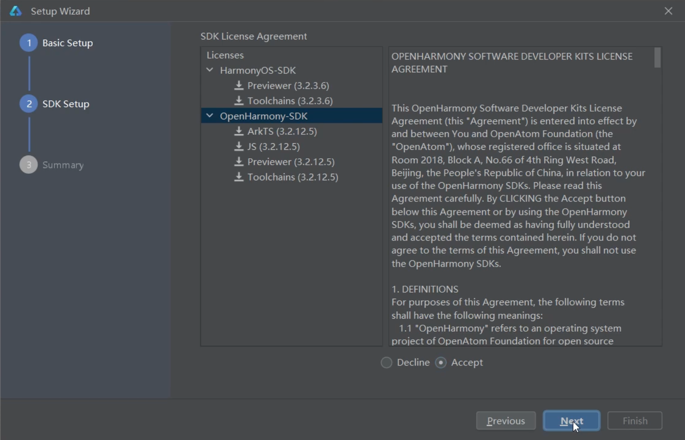
   - 安装完毕
     

### 3. 起步-HelloWorld

创建一个空项目:

1. Create Project

   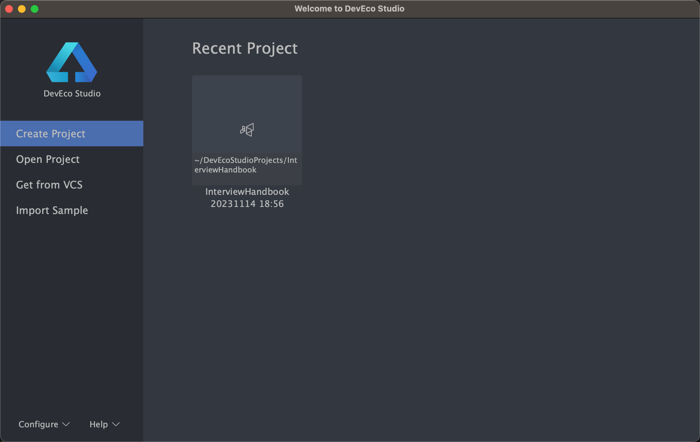

2. 选择项目模板

   

3. 填写项目信息

   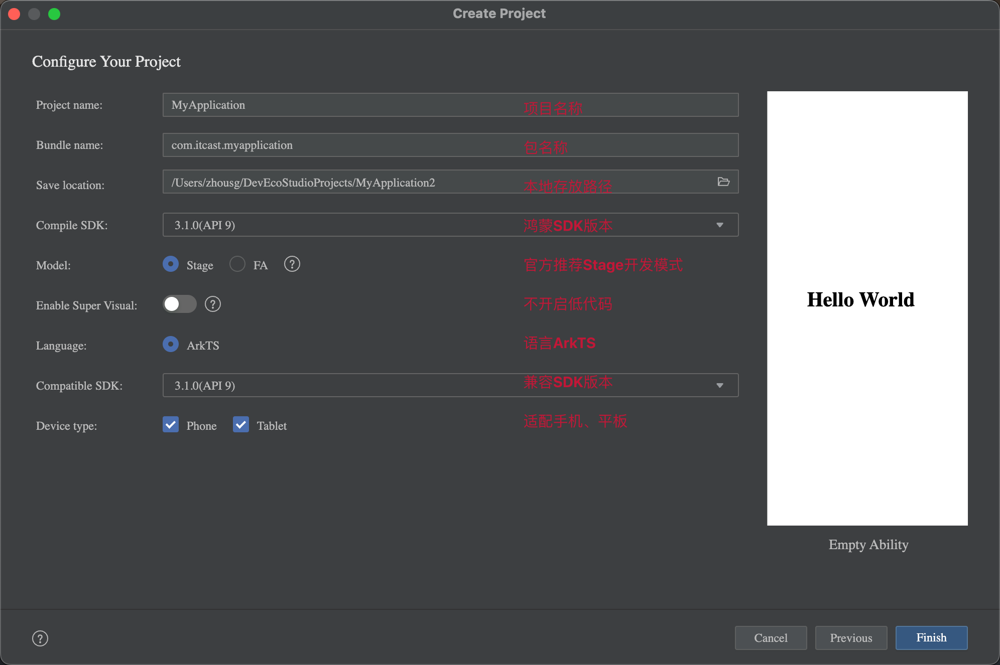

4. Finish
   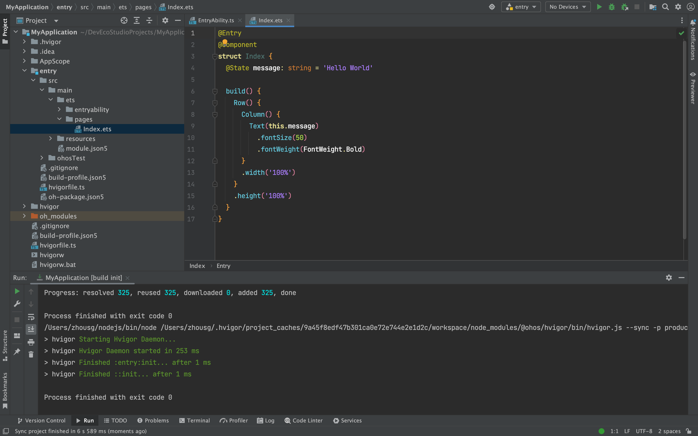

### 4. 起步-效果预览

效果预览方法：

- Previewer 预览模式
- Local Emulator 本地模拟器
- Remote Emulator 远程模拟器
- Remote Device 远程真机
- Local Device 本地真机

::: tip 推荐使用

- Previewer 预览 和 Local Emulator 本地模拟器；
- 尤其推荐使用 `遥遥领先` 真机调试；

:::

1）Previewer 预览

> 场景：静态页面（没有组件间数据通信、不涉及到网络请求）  
> 条件：有 @Entry 或 @Preview 装饰器页面

- 预览和审查元素

  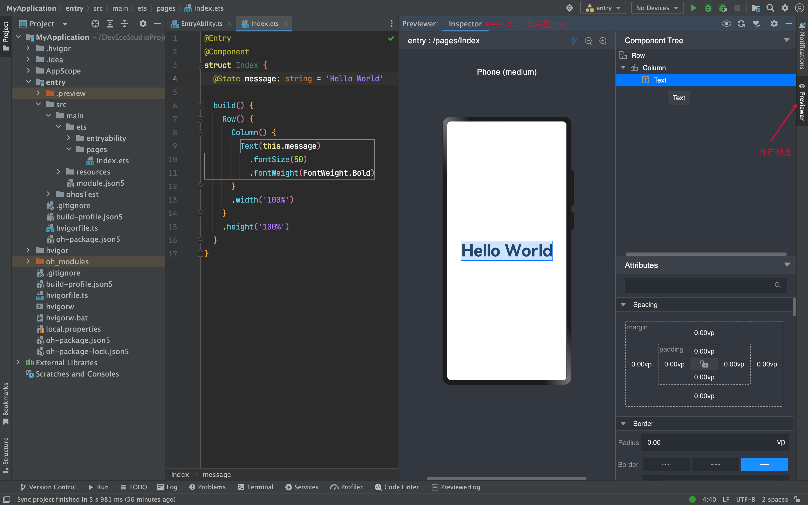

- 多设备预览

  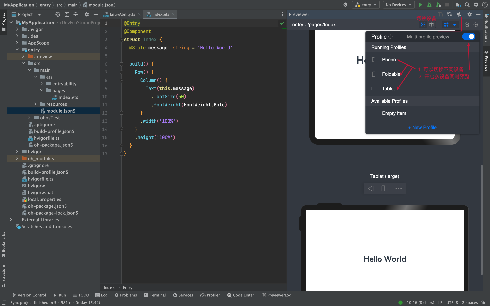

2）Local Emulator 本地模拟器

> 场景：动态页面（几乎全场景，一些无法模拟的硬件功能）

- 新建模拟器

  
  一路 Next ...

- 启动模拟器

  

- 运行项目看效果

  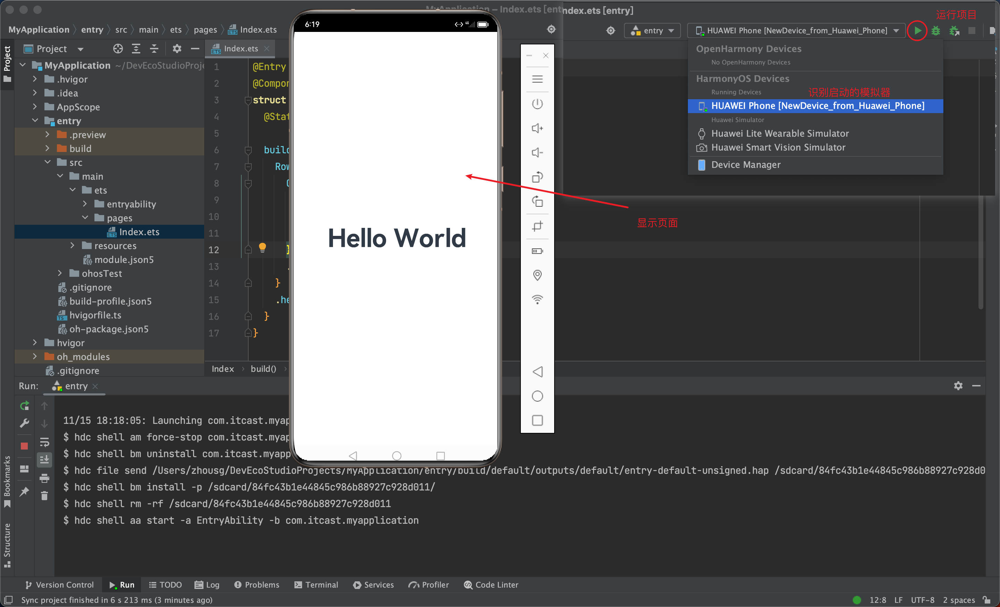

- 更改后每次需要（打包 → 卸载 → 安装 → 预览），有没有热更新或者刷新这种预览方式？

  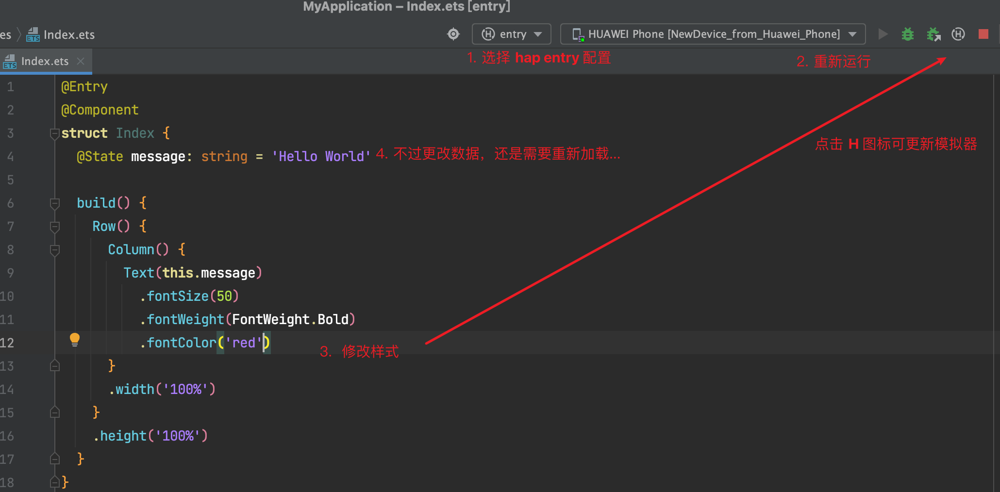
  调试静态页面可以，一旦有了数据变化也需要重启，体验一般~ （学习需要耐心，期待 Next 做的更好~）

::: tip 其他方式

- Remote Emulator 远程模拟器
- Remote Device 远程真机
- Local Device 本地真机

条件：
- 需要注册华为账号, 点这 https://developer.harmonyos.com/ 然后点击登录页面，去注册吧~
- 登录之后，需要自动生成签名信息，这个我们后面讲真机调试再给大家演示。

:::

### 5. 起步-工程结构

> 我们在哪里写代码？

    Stage 模型

    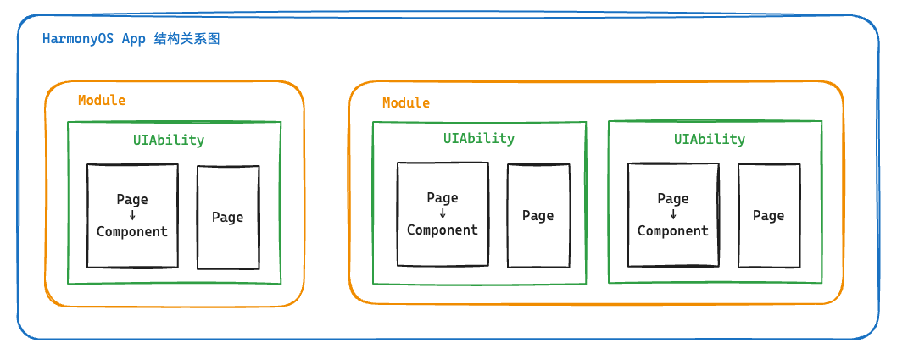

了解App结构关系，等后面我们项目阶段来讲一些工程配置文件作用，现在你要知道：
- entry 是一个 Module 应用包
- entryability 是一个 UIAbility 包含用户界面的应用组件
- pages 是页面
- components 可以是组件

    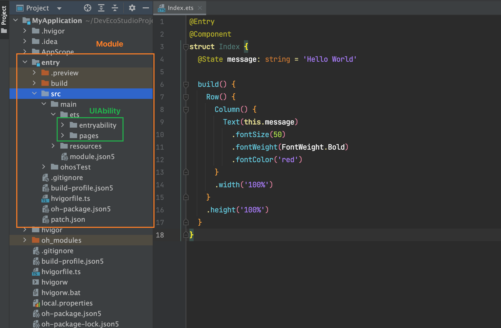


## 组件基础

### 1. 组件-什么是ArkTS

ArkTS是HarmonyOS优选的主力应用开发语言。ArkTS围绕应用开发在TypeScript（简称TS）生态基础上做了进一步扩展，继承了TS的所有特性，是TS的超集。

    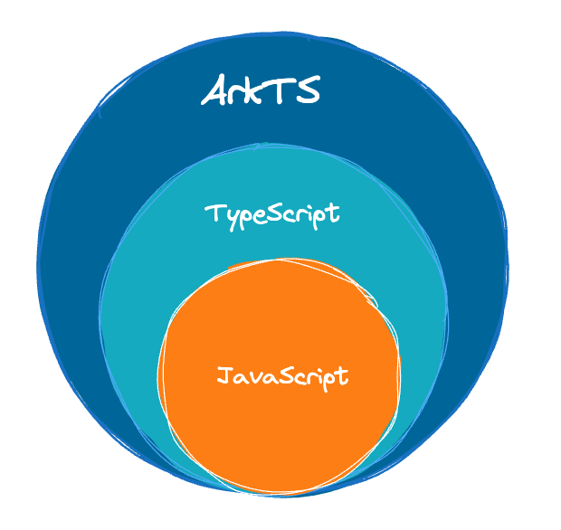

扩展能力如下：

1. 基本语法
    - 定义声明式UI、自定义组件、动态扩展UI元素；
    - 提供ArkUI系统组件，提供组件事件、方法、属性；
    - 共同构成 UI 开发主体
2. 状态管理
    - 组件状态、组件数据共享、应用数据共享、设备共享；
3. 渲染控制
    - 条件渲染、循环渲染、数据懒加载；

::: details 声明式UI？

问题？通过一段 `HTML` 标签展示出对应的页面方便，还是使用 `document.createElement('tag')`创建标签构建页面方便？
- 显然是 HTML , 其实 HTML 本身就是声明式的，通过描述的方式去声明 UI 界面。
- 一些前端框架也是声明式UI，如 `Vue` 使用的 `tempalte` 模板，如 `React` 使用的 `JSX`。
- 在例如现在的 `Jetpack Compose` `SwiftUI` `Flutter` 等APP开发技术也是声明式。

:::

### 2. 基础-组件结构

    

ArkTS通过装饰器 `@Component` 和 `@Entry` 装饰 `struct` 关键字声明的数据结构，构成一个自定义组件。
自定义组件中提供了一个 `build` 函数，开发者需在该函数内以链式调用的方式进行基本的 UI 描述，UI 描述的方法请参考 UI 描述规范。


1）页面组件

```typescript
@Entry
@Component
struct Index {
  // 工程默认显示 `Index` 页面组件
  // build 是声明UI的位置
  build() {
    Text('页面组件')
  }
}
```


2）自定义组件

```typescript

// 定义 `Footer` 组件
@Component
struct Footer {
  build() {
    Text('自定义组件')
  }
}

@Entry
@Component
struct Index {
  build() {
    Column(){
      // 使用 `Footer` 组件
      Footer()
    }
  }
}
```

为了更好维护，自定义组件通常会新建一个文件 `Footer.ets`，通过模块化语法导出导入(默认|按需)使用。


```typescript title="components/Footer.ets"
@Component
export default struct Footer {
  build() {
    Text('自定义组件')
  }
}
```

```typescript title="Index.ets"
import Footer from './components/Footer.ets'

@Entry
@Component
struct Index {
  build() {
    Column(){
      // 使用 `Footer` 组件
      Footer()
    }
  }
}
```

::: tip

- `@Entry @Component` 是页面组件，将来需要页面跳转就需要再定义一个页面。
- `@Component` 自定义组件，一个页面组件下可以有多个自定义组件。
- `build(){}` 只能有一个根元素

:::


### 3. 基础-系统组件(ArkUI)

常用系统组件 `Text` `Column` `Row` `Button` `TextInput`  [更多组件](https://developer.harmonyos.com/cn/docs/documentation/doc-references-V3/ts-components-summary-0000001478181369-V3)


- Text 文本组件
- Column 列组件，纵向排列，Flex布局主轴是Y
- Row 行组件，横向向排列，Flex布局主轴是X
- Button 按钮组件
- InputText 输入框组件

实现一个简易登录界面：

    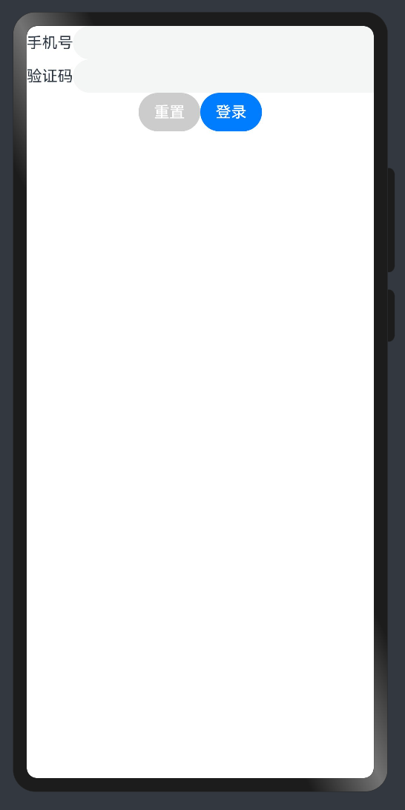

```typescript
@Entry
@Component
struct Index {

  build() {
    Column(){
      Row(){
        Text('手机号')
        TextInput()
      }
      Row(){
        Text('验证码')
        TextInput()
      }
      Row(){
        Button('重置').backgroundColor('#ccc')
        Button('登录')
      }
    }
  }
}
```

::: tip

- ArkUI 组件一般都是 Flex 模式，大部分布局可以由行和列组成。

:::


### 4. 基础-组件状态

> 如何使用 `@State` 定义一个状态变量？

1）组件变量，不具备驱动UI更新能力。

```typescript
@Entry
@Component
struct Index {
  count = 100

  build() {
    Text(this.count.toString())
      .onClick(() => this.count++)
  }
}
```

2）状态变量，指驱动UI更新的数据，加上 `@State` 装饰器即可，注意：加上**类型**和**初始值**。
```typescript
@Entry
@Component
struct Index {

  @State
  count: number = 100

  build() {
    Text(this.count.toString())
      .onClick(() => this.count++)
  }
}
```


::: tip

- 加上类型和初始值
- 状态变量不可设置的类型有：`any` `undefined` `null` `与复杂类型的联合类型`

其他：

- 绑定事件在系统组件后链式使用 `onXxxxx` 进行绑定即可
- 使用 `@ohos.promptAction` 可以进行轻提示 `promptAction.showToast({ message: 'Tip' })`

:::


📕📕📕 练习案例→实现登录表单数据收集、重置、模拟提交。

    

```typescript
import promptAction from '@ohos.promptAction'
@Entry
@Component
struct Index {

  @State
  mobile: string = ''
  @State
  code: string = ''

  build() {
    Column(){
      Row(){
        Text('手机号')
        TextInput({ text: this.mobile })
          .onChange((value)=>this.mobile = value)
      }
      Row(){
        Text('验证码')
        TextInput({ text: this.code })
          .onChange((value)=>this.code = value)
      }
      Row(){
        Button('重置')
          .backgroundColor('#ccc')
          .onClick(()=>{
            this.mobile = ''
            this.code = ''
          })
        Button('登录')
          .onClick(()=>{
            if (this.mobile && this.code) {
              promptAction.showToast({ message: `${this.mobile} 登录成功` })
            } else {
              promptAction.showToast({ message: `请输入手机号或验证码` })
            }
          })
      }
    }
  }
}
```

## 样式处理

### 1. 样式-语法(链式&枚举)

> ArkTS以声明方式组合和扩展组件来描述应用程序的UI；  
> 同时还提供了基本的属性、事件和子组件配置方法，帮助开发者实现应用交互逻辑。

1）样式属性

- 属性方法以 `.` 链式调用的方式配置系统组件的样式和其他属性，建议每个属性方法单独写一行。

```typescript
@Entry
@Component
struct Index {
  build() {
    Text('演示')
      .backgroundColor('red')
      .fontSize(50)
      .width('100%')
      .height(100)
  }
}
```

2）枚举值

- 对于系统组件，ArkUI还为其属性预定义了一些枚举类型。[文档链接](https://developer.harmonyos.com/cn/docs/documentation/doc-references-V3/ts-appendix-enums-0000001478061741-V3)

```typescript {9-11}
@Entry
@Component
struct Index {
  build() {
    Text('演示')
      .fontSize(50)
      .width('100%')
      .height(100)
      .backgroundColor(Color.Blue)
      .textAlign(TextAlign.Center)
      .fontColor(Color.White)
  }
}
```

::: tip

- 样式相关属性通过链式函数的方式进行设置
- 如果类型是枚举的，通过枚举传入对应的值

:::


### 2. 样式-单位vp和适配

> 知道 `vp` 单位，以及适配思想

1） `vp` 是什么？virtual pixel

- 屏幕密度相关像素，根据屏幕像素密度转换为屏幕物理像素，当数值不带单位时，默认单位 `vp`；在实际宽度为1440物理像素的屏幕上，`1vp` 约等于 `3px`（物理像素）

    

- 上图的意思是，使用这个单位在不同屏幕物理分辨率的实际尺寸一致(A设备1英寸，B设备1英寸)。


2）之前 `vw` 、`rem` 和 `rpx` 相对于屏幕宽度的单位，可以实现等比例适配，`vp` 可以吗？

```typescript
import promptAction from '@ohos.promptAction'

@Entry
@Component
struct Index {
  build() {
    Text('演示')
      .width('100%')
      .backgroundColor('red')
      .onAreaChange((oldArea, newArea) => {
        promptAction.showToast({
          // 1. onAreaChange改变尺寸后会触发
          // 2. newArea为现在元素尺寸
          message: newArea.width.toString()
        })
      })
  }
}
```
    我们发现：不同的设备屏幕的宽度 `vp` 是不一致的，那怎么适配呢？

3）根据官方的文档，结合自己的理解，采用：伸缩布局，网格系统，栅格系统进行布局适配。

伸缩 `layoutWeight(flex: number)` 占剩余空间多少份，可以理解成CSS的 `flex: 1`

```typescript
@Entry
@Component
struct Index {
  build() {
    Row(){
      Text('left')
        .layoutWeight(1)
        .backgroundColor('red')
      Text('right')
        .layoutWeight(2)
        .backgroundColor('green')
    }
    .width('100%')
  }
}
```

等比例，设置元素宽高比 `aspectRatio(ratio: number)`

```typescript
@Entry
@Component
struct Index {
  build() {
    Text('left')
      .width('50%')
        // 宽高比例
      .aspectRatio(1)
      .backgroundColor('red')
  }
}
```

::: tip

- vp 是鸿蒙默认单位，和屏幕像素有关，最终表现视觉大小在任何设备一致
- 鸿蒙一般以伸缩 `layoutWeight`、网格、栅格进行布局适配，如要等比例缩放可以设置高宽比 `aspectRatio`

:::

📕📕📕 练习案例→实现知乎评论回复-评论区域

    

设计稿一般是1080px：(这里没有设计稿，提供了一些尺寸)

- Nav
    - 左侧返回按钮24vp高宽背景颜色`#f5f5f5`，图标12vp尺寸颜色`#848484`
    - 标题18vp
- Comment
    - 头像尺寸32vp高宽，右侧间距10vp
    - 标题15vp，颜色默认
    - 内容16vp，颜色`#565656`
    - 底部12vp，颜色`#c3c4c5`

```typescript
@Entry
@Component
struct Index {
  build() {
    Column(){
      // 导航
      Row(){
        Row(){
          Image($r('app.media.ic_public_arrow_left'))
            .width(16)
            .aspectRatio(1)
            // svg 图标可以使用填充颜色
            // .fillColor('red')
        }
        .width(24)
        .aspectRatio(1)
        .backgroundColor('#f5f5f5')
        .borderRadius(12)
        .justifyContent(FlexAlign.Center)
        .margin({ left: 16 })

        Text('评论回复')
          .layoutWeight(1)
          .textAlign(TextAlign.Center)
          .padding({ right: 40 })
      }
      .height(40)
      .border({ width: { bottom: 0.5 }, color: '#e4e4e4' })
      // 评论
      Row(){
        Image($r('app.media.avatar'))
          .width(32)
          .aspectRatio(1)
          .borderRadius(16)
        Column({ space: 5 }){
          Text('周杰伦')
            .width('100%')
            .fontWeight(FontWeight.Bold)
            .fontSize(15)
          Text('大理石能雕刻出肌肉和皮肤的质感，那个年代的工匠好牛啊')
            .width('100%')
          Row(){
            Text('10-21 · IP属地北京')
              .fontSize(12)
              .fontColor('#c3c4c5')
            Row({ space: 4 }){
              Image($r('app.media.ic_public_heart'))
                .width(14)
                .aspectRatio(1)
                .fillColor('#c3c4c5')
              Text('100')
                .fontSize(12)
                .fontColor('#c3c4c5')
            }
          }
          .width('100%')
          .justifyContent(FlexAlign.SpaceBetween)
        }
        .layoutWeight(1)
        .padding({ left: 10 })
      }
      .padding(15)
      .alignItems(VerticalAlign.Top)
    }
  }
}
```

::: tip
- 华为官方图标下载 [链接](https://developer.harmonyos.com/cn/design/harmonyos-icon/)

:::


### 2. 样式-@Styles 复用

> 在开发过程中会出现大量代码在进行重复样式设置，`@Styles` 可以帮我们进行样式复用

- 当前 `@Styles` 仅支持 [通用属性](https://developer.harmonyos.com/cn/docs/documentation/doc-references-V3/ts-universal-attributes-size-0000001428061700-V3) 和 [通用事件](https://developer.harmonyos.com/cn/docs/documentation/doc-references-V3/ts-universal-events-click-0000001477981153-V3)。
- 支持 **全局** 定义和 **组件内** 定义，同时存在组件内覆盖全局生效。

```typescript {2,3,9,10,14}
// 全局
@Styles 
function functionName() { ... }

@Entry
@Component
sturt Index{
  // 组件内
  @Styles 
  functionName() { ... }

  build() {
    Text('Text')
      .functionName()
  }
}
```

    需求：文字和按钮相同背景，点击+1
    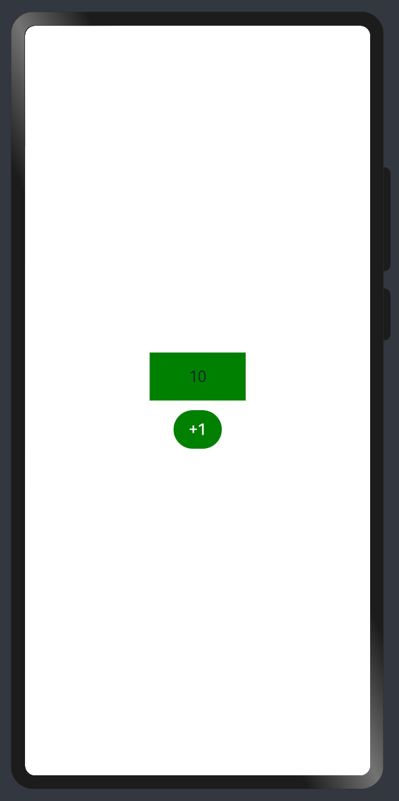

1）全局

```typescript
@Styles function sameStyle() {
  .backgroundColor(Color.Green)
  .onClick(() => {
    this.count++
  })
}

@Entry
@Component
struct Index {
  @State
  count: number = 10

  build() {
    Column() {
      Text(this.count.toString())
        .width(100)
        .height(50)
        .margin({ bottom: 10 })
        .textAlign(TextAlign.Center)
        .sameStyle()

      Button('+1')
        .sameStyle()
    }
    .height('100%')
    .width('100%')
    .justifyContent(FlexAlign.Center)
  }
}
```

2）组件内

```typescript
@Entry
@Component
struct Index {
  @State
  count: number = 10

  // 不需要 `function` 关键字，覆盖全局
  @Styles
  sameStyle (){
    .backgroundColor(Color.Pink)
    .onClick(() => {
      this.count += 10
    })
  }

  build() {
    Column() {
      Text(this.count.toString())
        .width(100)
        .height(50)
        .margin({ bottom: 10 })
        .textAlign(TextAlign.Center)
        .sameStyle()

      Button('+1')
        .sameStyle()
    }
    .height('100%')
    .width('100%')
    .justifyContent(FlexAlign.Center)
  }
}
```


📕📕📕 练习案例-登录表单-样式优化

    

```typescript {12-18,34,51}
import promptAction from '@ohos.promptAction'
@Entry
@Component
struct Index {

  @State
  mobile: string = ''
  @State
  code: string = ''


  @Styles
  inputStyle () {
    .border({ width: 1, color: Color.Gray })
    .layoutWeight(1)
    .margin({ left: 10, bottom: 10, top: 10 })
    .backgroundColor(Color.White)
  }

  build() {
    Column(){
      Row(){
        Text('手机号')
        TextInput({ text: this.mobile })
          .inputStyle()
          .onChange((value)=>this.mobile = value)
      }
      Row(){
        Text('验证码')
        TextInput({ text: this.code })
          .inputStyle()
          .onChange((value)=>this.code = value)
      }
      Row({ space: 15 }){
        Button('重置')
          .backgroundColor('#ccc')
          .onClick(()=>{
            this.mobile = ''
            this.code = ''
          })
        Button('登录')
          .onClick(()=>{
            if (this.mobile && this.code) {
              promptAction.showToast({ message: `${this.mobile} 登录成功` })
            } else {
              promptAction.showToast({ message: `请输入手机号或验证码` })
            }
          })
      }
    }
    .padding({ left: 15, right: 15 })
  }
}
```

### 3. 样式-@Extends 复用

> `@Extend` 用于扩展原生组件样式，通过传参提供更灵活的样式复用

- 使用 `@Extend` 装饰器修饰的函数只能是 **全局**
- 函数可以进行 **传参**，如果参数是状态变量，状态更新后会刷新UI
- 且参数可以是一个函数，实现复用事件且可处理不同逻辑

```typescript
// 全局  原生组件                     参数
//  ↓     ↓                          ↓ 
@Extend(Text) function functionName(w: number) { 
  .width(w)
}
```

    需求：把 `Text` 改成按钮样式，且绑定 `click` 事件执行不同逻辑
    


```typescript {3-10,21-23,25-27}
import promptAction from '@ohos.promptAction'

@Extend(Text) function myClick(color: string, cb: () => void) {
  .backgroundColor(color)
  .width(100)
  .height(50)
  .textAlign(TextAlign.Center)
  .borderRadius(25)
  .onClick(() => cb())
}

@Entry
@Component
struct Other {
  @State
  color: string = '#ccc'

  build() {
    Column({ space: 20 }) {
      Text('Text1')
        .myClick(this.color, () => {
          this.color = '#069'
        })
      Text('Text2')
        .myClick('green', () => {
          promptAction.showToast({ message: '做其他事~' })
        })
    }
    .width('100%')
    .height('100%')
    .justifyContent(FlexAlign.Center)
  }
}
```


### 4. 样式-多态

> `stateStyles()` 可以依据组件的内部状态的不同，快速设置不同样式。

`stateStyles` 是属性方法，可以根据UI内部状态来设置样式，类似于 css 伪类，但语法不同。ArkUI 提供以下四种状态：
- focused：获焦态。
- normal：正常态。
- pressed：按压态。
- disabled：不可用态。


```typescript {46-59}
import promptAction from '@ohos.promptAction'

// 胶囊按钮
@Extend(Text)
function capsule(){
  .height(40)
  .borderRadius(20)
  .backgroundColor(Color.Gray)
  .padding({ left: 15, right: 15 })
  .margin({ bottom: 15 })
}

@Entry
@Component
struct Index {
  @State
  disabled: boolean = false
  @State
  focused: boolean = false

  build() {
    Column() {

      // Button TextInput 默认开启获取焦点，页面中默认第一个这样的元素获取焦点
      // Button 比较多限制，一个是默认开启获取焦点能看，二是禁用状态下样式无法修改
      // Button('Button').focusable(false)

      Text('toggle disabled：' + this.disabled)
        .capsule()
        .onClick(()=>{
          this.disabled = !this.disabled
        })
      Text('toggle focused：' + this.focused)
        .capsule()
        .onClick(()=>{
          this.focused = !this.focused
        })
      Text('clickMe')
        .capsule()
        .enabled(!this.disabled)
        .focusable(this.focused)
        .onClick(() => {
          promptAction.showToast({ message: 'click' })
        })
        .fontColor('#fff')
        .stateStyles({
          normal: {
            .backgroundColor(Color.Blue)
          },
          focused: {
            .backgroundColor(Color.Red)
          },
          disabled: {
            .backgroundColor(Color.Black)
          },
          pressed: {
            .backgroundColor(Color.Orange)
          }
        })
    }
  }
}
```

::: tip

- 使用比较多的应该是 `normal` `pressed` 结合下的按压效果
- `enabled(true|false)` 开启|禁用 `focusable(true|false)` 开启获取焦点能力|关闭

注意：
- 页面初始化的时候，默认第一个能获取焦点的元素，会自动获取焦点

:::

## 组件状态

### 1. 状态-class语法

> 在鸿蒙开发中关于对象状态范式采用 `class` 方式，后续组件传值遇到深层对象嵌套需要利用 `class`

1）`class` 创建对象和 `class` 类型

```typescript
class Person {
  age: number;
  name: string;

  constructor(name: string, age: number) {
    this.name = name
    this.age = age
  }
}

// 当类型使用和构当造函数使用
const p: Person = new Person('jack', 18)
// 当类型使用这种使用后续居多，我们使用字面量对象居多，可以省略 constructor
const p1: Person = {
  name: 'tom',
  age: 20
}
```

2）`implements` 实现 `interface` 接口

```typescript
interface IPerson {
  name: string,
  age: number,
  say: () => void
}

// 实现 IPerson 接口，需要符合接口约定
class Person implements IPerson{
  age: number;
  name: string;

  constructor(name: string, age: number) {
    this.name = name
    this.age = age
  }

  say () {
    promptAction.showToast({ message: this.name })
  }
}
```

3）`extends` 继承

```typescript
class HmPerson extends Person {
  github: string = 'https://github.com/zhousg'

  coding () {
    promptAction.showToast({ message: this.name + ': coding' })
  }
}
```

::: tip

- 定义类 `class 类名 { 属性 + 构造器  + 方法  }`，类可以创建对象，也可以当**类型**使用。

扩展：
- class 可以实现 `implements` 接口，需要受到接口约束
- class 可以继承 `extends` 另外一个class的属性和方法

:::


### 2. 状态-复杂状态

> 当装饰的数据类型为class或者Object时，可以观察到自身的赋值的变化，和其属性赋值的变化，即Object.keys(observedObject)返回的所有属性。

1）对象类型状态

```typescript {1-5,11-12}
// 对象模型
class User {
  nickname: string
  age: number
}

@Entry
@Component
struct Index {

  @State
  user: User = { nickname: 'jack', age: 18 }

  build() {
    Column({ space: 20 }){
      Text(this.user.nickname)
      Text(this.user.age.toString())
      Button('age++')
        .onClick(() => {
          this.user.age ++
        })
    }
    .width('100%')
    .height('100%')
    .justifyContent(FlexAlign.Center)
  }
}
```

2）嵌套对象类型状态

```typescript
// 对象模型
class User {
  nickname: string
  age: number
}

class UserData {
  code: number
  message: string
  // 嵌套对象
  data: User
}

@Entry
@Component
struct Index {
  @State
  res: UserData = {
    code: 10000,
    message: '获取用户信息成功',
    // 嵌套对象
    data: { nickname: 'jack', age: 18 }
  }

  build() {
    Column({ space: 20 }) {
      Text(this.res.data.nickname)
      Text(this.res.data.age.toString())
      Button('age++')
        .onClick(() => {
          // ❌ this.res.data.age ++
          const user = this.res.data
          // 替换属性，触发UI更新
          this.res.data = { ...user, age: user.age + 1 }
        })
    }
    .width('100%')
    .height('100%')
    .justifyContent(FlexAlign.Center)
  }
}
```

3）对象数组类型状态

```typescript
// 对象模型
class User {
  nickname: string
  age: number
}

@Entry
@Component
struct Index {
  @State
  list: User[] = [
    { nickname: 'jack', age: 18 },
    { nickname: 'tom', age: 16 }
  ]
  build() {
    Column({ space: 20 }) {
      Text(JSON.stringify(this.list[0]))
      Text(JSON.stringify(this.list[1]))
      Button('age++')
        .onClick(() => {
          // ❌ this.list[1].age ++
          const user = this.list[1]
          this.list[1] = { ...user, age: user.age + 1 }
        })
    }
    .width('100%')
    .height('100%')
    .justifyContent(FlexAlign.Center)
  }
}
```

::: tip

- 使用 `class` 来约束对象类型，和嵌套对象和对象数组。
- 嵌套对象和对象数组，采用赋值的方式进行更新，可以更新UI。
- 🚦 后期如果学习组件传值，会给大家补充另外一种深层数据变更更新UI的方式

:::


## 界面渲染

### 1. 渲染-条件渲染

> 条件渲染可根据应用的不同状态，使用if、else和else if渲染对应状态下的UI内容。


- 条件渲染，是根据状态数据进行判断展示不同UI
- 条件渲染，是会销毁和创建组件，组件状态将不会保留

1）使用 `if` `else` 实现 loading 效果 

```typescript {10,14,18}
@Entry
@Component
struct Index {

  @State
  loading: boolean = false

  build() {
    Column({ space: 20 }){
      if (this.loading) {
        LoadingProgress()
          .width(100)
          .height(100)
      } else  {
        Text('后台数据')
        Text('后台数据')
        Text('后台数据')
      }
      Button('更新数据')
        .onClick(() => {
          this.loading = true
          setTimeout(() => {
            this.loading = false
          }, 2000)
        })
    }
    .width('100%')
    .height('100%')
    .justifyContent(FlexAlign.Center)
  }
}
```

2）添加渲染会销毁和重新创建组件，组件状态将不会保留。

```typescript {24,25}
@Component
struct CounterComp {
  @State
  count: number = 0

  build() {
    Text(this.count.toString())
      .onClick(() => {
        this.count ++
      })
  }
}

@Entry
@Component
struct Index {

  @State
  show: boolean = true

  build() {
    Column({ space: 20 }){
      if (this.show) {
        // 累计的 count 切换时候不会保留
        CounterComp()
      }
      Button('toggle')
        .onClick(() => {
          this.show = !this.show
        })
    }
    .width('100%')
    .height('100%')
    .justifyContent(FlexAlign.Center)
  }
}
```


### 2. 渲染-循环渲染

> `ForEach` 接口基于数组类型数据来进行循环渲染，需要与容器组件配合使用。

语法：

```typescript
ForEach(
  // 数据源
  arr: Array,
  // 组件生成函数
  itemGenerator: (item: Array, index?: number) => void,
  // 键值生成函数
  keyGenerator?: (item: Array, index?: number): string => string
)
```

应用：

```typescript {17-28}
class User {
  id: string
  name: string
  age: number
}


@Entry
@Component
struct Index {
  @State
  userList: User[] = []

  build() {
    Scroll() {
      Column({ space: 20 }) {
        // 循环渲染
        ForEach(
          // 1. 数据源
          this.userList,
          // 2. 组件生成函数
          (item: User) => {
            // 内容
            Text(`${item.name} 今年 ${item.age} 岁`)
          },
          // 3. 键值生成函数
          item => item.id
        )
        Button('加载更多')
          .onClick(() => {
            const arr: User[] = []
            for (let index = 0; index < 10; index++) {
              arr.push({ id: Math.random().toString(), name: 'jack', age: Math.ceil(Math.random() * 100) })
            }
            this.userList.push(...arr)
          })
      }
    }
    .width('100%')
  }
}
```


::: tip

关于 `keyGenerator` 键生成函数的一些建议：
- 不能缺省
- 避免最终生成的键包含 `index`
- 对象数组，建议使用对象中 `id` 唯一标识
- 基本数据数字，建议转换成具有 `id` 唯一标识的对象，再使用

:::


## 今日案例-知乎回复

    


### 1. 底部输入区域

- 抽离 `Nav` `Comment` 组件
- 使用 `Stack` 组件底部输入框固定在下方
- 加上 `Scroll` 将来页面内容可以滚动

```typescript
@Entry
@Component
struct Index {
  build() {
    Stack({ alignContent: Alignment.Bottom }) {
      Column() {
        Scroll() {
          Column() {
            // 导航
            NavComp()
            // 评论
            CommentComp()
            // 分割线
            Divider()
              .strokeWidth(8)
              .color('#f5f5f5')
            // 回复列表
            
          }
          .padding({ bottom: 50 })
        }
      }
      .width('100%')
      .height('100%')

      Row({ space: 15 }){
        TextInput({ placeholder: '回复~' })
          .layoutWeight(1)
        Text('发布')
          .fontColor('#069')
      }
      .padding({ left: 15, right: 15 })
      .width('100%')
      .height(50)
      .backgroundColor('#fff')
      .border({ width: { top: 0.5 }, color: '#e4e4e4' })
    }

  }
}

// 导航
@Component
struct NavComp {
  build() {
    Row() {
      Row() {
        Image($r('app.media.ic_public_arrow_left'))
          .width(16)
          .aspectRatio(1)
        // svg 图标可以使用填充颜色
        // .fillColor('red')
      }
      .width(24)
      .aspectRatio(1)
      .backgroundColor('#f5f5f5')
      .borderRadius(12)
      .justifyContent(FlexAlign.Center)
      .margin({ left: 16 })

      Text('评论回复')
        .layoutWeight(1)
        .textAlign(TextAlign.Center)
        .padding({ right: 40 })
    }
    .height(40)
    .border({ width: { bottom: 0.5 }, color: '#e4e4e4' })
  }
}

// 评论
@Component
struct CommentComp {
  build() {
    Row() {
      Image($r('app.media.avatar'))
        .width(32)
        .aspectRatio(1)
        .borderRadius(16)
      Column({ space: 5 }) {
        Text('周杰伦')
          .width('100%')
          .fontWeight(FontWeight.Bold)
          .fontSize(15)
        Text('大理石能雕刻出肌肉和皮肤的质感，那个年代的工匠好牛啊')
          .width('100%')
        Row() {
          Text('10-21 · IP属地北京')
            .fontSize(12)
            .fontColor('#c3c4c5')
          Row({ space: 4 }) {
            Image($r('app.media.ic_public_heart'))
              .width(14)
              .aspectRatio(1)
              .fillColor('#c3c4c5')
            Text('100')
              .fontSize(12)
              .fontColor('#c3c4c5')
          }
        }
        .width('100%')
        .justifyContent(FlexAlign.SpaceBetween)
      }
      .layoutWeight(1)
      .padding({ left: 10 })
    }
    .padding(15)
    .alignItems(VerticalAlign.Top)
  }
}
```


### 2. 静态回复列表

- 参考评论组件，使用 `ForEach` 循环相同的回复容器

```typescript
Column() {
  Text('回复 100')
    .width('100%')
    .fontWeight(600)
  ForEach([1, 2, 3, 4, 5, 6, 7], () => {
    Row() {
      Image($r('app.media.avatar'))
        .width(32)
        .aspectRatio(1)
        .borderRadius(16)
      Column({ space: 5 }) {
        Text('周杰伦')
          .width('100%')
          .fontWeight(FontWeight.Bold)
          .fontSize(15)
        Text('大理石能雕刻出肌肉和皮肤的质感，那个年代的工匠好牛啊')
          .width('100%')
        Row() {
          Text('10-21 · IP属地北京')
            .fontSize(12)
            .fontColor('#c3c4c5')
          Row({ space: 4 }) {
            Image($r('app.media.ic_public_heart'))
              .width(14)
              .aspectRatio(1)
              .fillColor('#c3c4c5')
            Text('100')
              .fontSize(12)
              .fontColor('#c3c4c5')
          }
        }
        .width('100%')
        .justifyContent(FlexAlign.SpaceBetween)
      }
      .layoutWeight(1)
      .padding({ left: 10 })
    }
    .padding({ top: 15, bottom: 15 })
    .alignItems(VerticalAlign.Top)
  })

}
.padding(15)
```

### 3. 实现渲染

- 使用 `class` 定义好回复数据模型 `ReplyItem`
- 初始化一些模拟数据
- 完成页面渲染

```typescript title="models/index.ets"
export class ReplyItem {
  id: number
  avatar: string
  author: string
  content: string
  time: string
  area: string
  likeNum: number
  likeFlag?: boolean
}

export const replyList: ReplyItem[] = [
  {
    id: 1,
    avatar: 'https://picx.zhimg.com/027729d02bdf060e24973c3726fea9da_l.jpg?source=06d4cd63',
    author: '偏执狂-妄想家',
    content: '更何况还分到一个摩洛哥[惊喜]',
    time: '11-30',
    area: '海南',
    likeNum: 34
  },
  {
    id: 2,
    avatar: 'https://pic1.zhimg.com/v2-5a3f5190369ae59c12bee33abfe0c5cc_xl.jpg?source=32738c0c',
    author: 'William',
    content: '当年希腊可是把1：0发挥到极致了',
    time: '11-29',
    area: '北京',
    likeNum: 58
  },
  {
    id: 3,
    avatar: 'https://picx.zhimg.com/v2-e6f4605c16e4378572a96dad7eaaf2b0_l.jpg?source=06d4cd63',
    author: 'Andy Garcia',
    content: '欧洲杯其实16队球队打正赛已经差不多，24队打正赛意味着正赛阶段在小组赛一样有弱队。',
    time: '11-28',
    area: '上海',
    likeNum: 10
  },
  {
    id: 4,
    avatar: 'https://picx.zhimg.com/v2-53e7cf84228e26f419d924c2bf8d5d70_l.jpg?source=06d4cd63',
    author: '正宗好鱼头',
    content: '确实眼红啊，亚洲就没这种球队，让中国队刷',
    time: '11-27',
    area: '香港',
    likeNum: 139
  },
  {
    id: 5,
    avatar: 'https://pic1.zhimg.com/v2-eeddfaae049df2a407ff37540894c8ce_l.jpg?source=06d4cd63',
    author: '柱子哥',
    content: '我是支持扩大的，亚洲杯欧洲杯扩到32队，世界杯扩到64队才是好的，世界上有超过200支队伍，欧洲区55支队伍，亚洲区47支队伍，即使如此也就六成出现率',
    time: '11-27',
    area: '旧金山',
    likeNum: 29
  },
  {
    id: 6,
    avatar: 'https://picx.zhimg.com/v2-fab3da929232ae911e92bf8137d11f3a_l.jpg?source=06d4cd63',
    author: '飞轩逸',
    content: '禁止欧洲杯扩军之前，应该先禁止世界杯扩军，或者至少把亚洲名额一半给欧洲。',
    time: '11-26',
    area: '里约',
    likeNum: 100
  }
]
```

```typescript title="pages/Index.ets"
import { ReplyItem, replyList } from '../models'
@Entry
@Component
struct Index {

  @State
  replyList: ReplyItem[] = replyList

  build() {
    Stack({ alignContent: Alignment.Bottom }) {
      Column() {
        Scroll() {
          Column() {
            // 导航
            NavComp()
            // 评论
            CommentComp()
            // 分割线
            Divider()
              .strokeWidth(8)
              .color('#f5f5f5')
            // 回复列表
            Column() {
              Text('回复 100')
                .width('100%')
                .fontWeight(600)
              ForEach(
                this.replyList, 
                (item: ReplyItem) => {
                  Row() {
                    Image(item.avatar)
                      .width(32)
                      .aspectRatio(1)
                      .borderRadius(16)
                    Column({ space: 5 }) {
                      Text(item.author)
                        .width('100%')
                        .fontWeight(FontWeight.Bold)
                        .fontSize(15)
                      Text(item.content)
                        .width('100%')
                      Row() {
                        Text(`${item.time} · IP属地${item.area}`)
                          .fontSize(12)
                          .fontColor('#c3c4c5')
                        Row({ space: 4 }) {
                          Image($r('app.media.ic_public_heart'))
                            .width(14)
                            .aspectRatio(1)
                            .fillColor('#c3c4c5')
                          Text(item.likeNum.toString())
                            .fontSize(12)
                            .fontColor('#c3c4c5')
                        }
                      }
                      .width('100%')
                      .justifyContent(FlexAlign.SpaceBetween)
                    }
                    .layoutWeight(1)
                    .padding({ left: 10 })
                  }
                  .padding({ top: 15, bottom: 15 })
                  .alignItems(VerticalAlign.Top)
                },
                // key 有默认你规则
                // key 为了元素复用
                // 如果没有写，会自动生成一个key，index_ + JSON.stringify(item)，不建议不写
                // (item: ReplyItem) => item.id.toString() 写一个ID做唯一标识，需要key也更新才能更新对应UI
                // item => id + likeNum + likeFlag 把需要更新的字段合在一起当做key
                // ({ id, likeNum, likeFlag }) => JSON.stringify({ id, likeNum, likeFlag })

                // 学习了 @Observed @ObjectLink 这样也可以更新~
                // (item: ReplyItem) => item.id.toString()
              )

            }
            .padding(15)
          }
          .padding({ bottom: 50 })
        }
      }
      .width('100%')
      .height('100%')

      Row({ space: 15 }){
        TextInput({ placeholder: '回复~' })
          .layoutWeight(1)
        Text('发布')
          .fontColor('#069')
      }
      .padding({ left: 15, right: 15 })
      .width('100%')
      .height(50)
      .backgroundColor('#fff')
      .border({ width: { top: 0.5 }, color: '#e4e4e4' })
    }

  }
}
```


### 4. 实现点赞

- 注册点赞区域点击事件
- 通过索引复制的方式完成数据的更新和UI的更新

```typescript
onLike(item: ReplyItem) {
  const reply = { ...item }
  if (reply.likeFlag) {
    reply.likeNum--
    reply.likeFlag = false
    promptAction.showToast({ message: '取消点赞' })
  } else {
    reply.likeNum++
    reply.likeFlag = true
    promptAction.showToast({ message: '点赞成功' })
  }
  const index = this.replyList.findIndex(rep => rep.id === reply.id)
  this.replyList[index] = reply
}
```

```typescript
Row({ space: 4 }) {
  Image($r('app.media.heart'))
    .width(14)
    .height(14)
    .fillColor(item.likeFlag ? '#ff6600' : '#c3c4c5')
    .margin({ right: 4 })
  Text(item.likeNum.toString())
    .fontSize(14)
    .fontColor(item.likeFlag ? '#ff6600' : '#c3c4c5')
}
.onClick(() => {
  this.onLike(item)
})
```


### 6. 进行回复

- 收集输入框数据
- 发布评论内容，和情况输入内容
- 需要扩展头像类型兼容 `Resource` 类型

```diff title="models/Index.ets"
export class ReplyItem {
  id: number
+  avatar: string | Resource
  author: string
  content: string
  time: string
  area: string
  likeNum: number
  likeFlag?: boolean
}
```


```typescript title="pages/Index.ets"
onReply () {
  const reply: ReplyItem = {
    id: Math.random(),
    content: this.content,
    author: 'Zhousg',
    avatar: $r('app.media.avatar'),
    time: '12-01',
    likeNum: 0,
    area: '北京'
  }
  this.replyList.unshift(reply)
  this.content = ''
  promptAction.showToast({ message: '回复成功' })
}
```

```typescript title="pages/Index.ets"
Row({ spcae: 15 }) {
  TextInput({ placeholder: '回复~', text: this.content })
    .placeholderColor('#c3c4c5')
    .layoutWeight(1)
    .onChange((value) => {
      this.content = value
    })
  Text('发布')
    .fontSize(14)
    .fontColor('#09f')
    .onClick(()=>{
      this.onReply()
    })
}
```