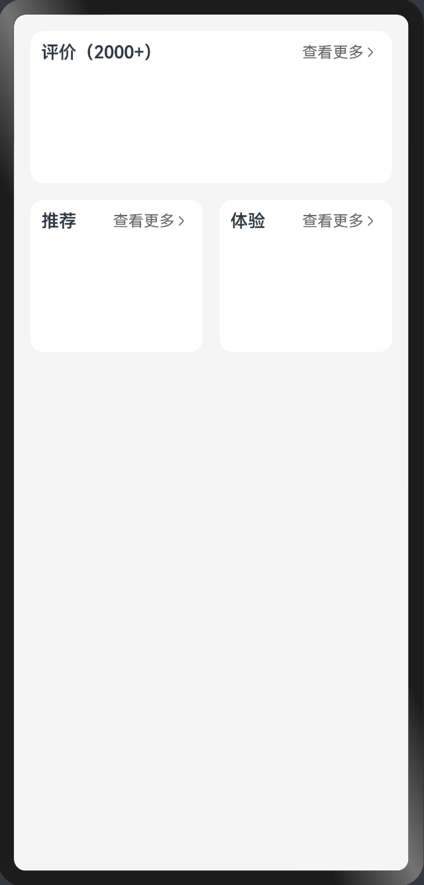
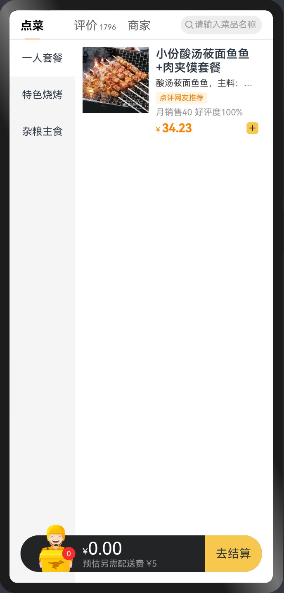

# 鸿蒙-状态管理

## 自定义构建函数

### 1. 构建函数-@Builder 
> ArkUI还提供了一种更**轻量**的UI元素复用机制 `@Builder`，可以将重复使用的UI元素抽象成一个方法，在 `build` 方法里调用。

- 组件内定义 
- 全局定义

1）组件内定义

```typescript
@Builder MyBuilderFunction() {}
```
```typescript
this.MyBuilderFunction()
```

2）全局定义

```typescript
@Builder function MyGlobalBuilderFunction() {}
```
```typescript
MyGlobalBuilderFunction()
```

📕📕📕 练习案例→商品详情-更多按钮

    

- 待实现页面

```typescript
@Entry
@Component
struct Index {
  build() {
    Column() {
      GridRow({ columns: 2, gutter: 15 }) {
        GridCol({ span: 2 }) {
          Column() {
            Row() {
              Text('评价（2000+）')
                .layoutWeight(1)
                .fontWeight(600)
              // TODO
            }
            .padding(10)

            Row()
              .height(100)
          }
          .borderRadius(12)
          .backgroundColor('#fff')
        }

        GridCol() {
          Column() {
            Row() {
              Text('推荐')
                .layoutWeight(1)
                .fontWeight(600)
              // TODO
            }
            .padding(10)

            Row()
              .height(100)
          }
          .borderRadius(12)
          .backgroundColor('#fff')
        }

        GridCol() {
          Column() {
            Row() {
              Text('体验')
                .layoutWeight(1)
                .fontWeight(600)
              // TODO
            }
            .padding(10)

            Row()
              .height(100)
          }
          .borderRadius(12)
          .backgroundColor('#fff')
        }
      }
    }
    .height('100%')
    .padding(15)
    .backgroundColor('#f5f5f5')
  }
}
```
- 使用 @Builder 提取UI结构

```typescript {5-15,26,43,60}
@Entry
@Component
struct Index {

  @Builder
  MoreBuilder () {
    Row() {
      Text('查看更多')
        .fontSize(14)
        .fontColor('#666666')
      Image($r('app.media.ic_public_arrow_right'))
        .width(16)
        .fillColor('#666666')
    }
  }

  build() {
    Column() {
      GridRow({ columns: 2, gutter: 15 }) {
        GridCol({ span: 2 }) {
          Column() {
            Row() {
              Text('评价（2000+）')
                .layoutWeight(1)
                .fontWeight(600)
              this.MoreBuilder()
            }
            .padding(10)

            Row()
              .height(100)
          }
          .borderRadius(12)
          .backgroundColor('#fff')
        }

        GridCol() {
          Column() {
            Row() {
              Text('推荐')
                .layoutWeight(1)
                .fontWeight(600)
              this.MoreBuilder()
            }
            .padding(10)

            Row()
              .height(100)
          }
          .borderRadius(12)
          .backgroundColor('#fff')
        }

        GridCol() {
          Column() {
            Row() {
              Text('体验')
                .layoutWeight(1)
                .fontWeight(600)
              this.MoreBuilder()
            }
            .padding(10)

            Row()
              .height(100)
          }
          .borderRadius(12)
          .backgroundColor('#fff')
        }
      }
    }
    .height('100%')
    .padding(15)
    .backgroundColor('#f5f5f5')
  }
}
```

::: tip

小结：
- 遇到非遍历情况下，一个组件分散着相同的UI结构，可以使用 `@Builder` 更轻量

其他：
- `GridRow` `GridCol` 栅格布局

:::


### 2. 构建函数-传参传递


1）按值传递（场景：构建不同的UI）

```typescript
@Builder MyBuilderFunction( title: string ) {}
```
```typescript
this.MyBuilderFunction('Title')
```

需求：不同板块查看更多文案不一样

- 评价 好评率 98%
- 推荐 查看全部
- 体验 4 条测评

    

```typescript
  @Builder
  MoreBuilder (title: string) {
    Row() {
      Text(title)
        .fontSize(14)
        .fontColor('#666666')
      Image($r('app.media.ic_public_arrow_right'))
        .width(16)
        .fillColor('#666666')
    }
  }
```

```typescript
this.MoreBuilder('好评率 98%')
this.MoreBuilder('查看全部')
this.MoreBuilder('4 条测评')
```


2）引用传递（场景：当传递的数据更新，需要更新UI）


需求：
- 点击按钮后模拟加载好评率数据

    

```typescript {7-17,33,50,67}
@Entry
@Component
struct Index {
  @State
  rate: number = 0

  @Builder
  MoreBuilder(params: { title: string }) {
    Row() {
      Text(params.title)
        .fontSize(14)
        .fontColor('#666666')
      Image($r('app.media.ic_public_arrow_right'))
        .width(16)
        .fillColor('#666666')
    }
  }

  build() {
    Column() {
      Button('获取数据')
        .margin({ bottom: 15 })
        .onClick(() => {
          this.rate = 99
        })
      GridRow({ columns: 2, gutter: 15 }) {
        GridCol({ span: 2 }) {
          Column() {
            Row() {
              Text('评价（2000+）')
                .layoutWeight(1)
                .fontWeight(600)
              this.MoreBuilder({ title: `好评率 ${this.rate} %` })
            }
            .padding(10)

            Row()
              .height(100)
          }
          .borderRadius(12)
          .backgroundColor('#fff')
        }

        GridCol() {
          Column() {
            Row() {
              Text('推荐')
                .layoutWeight(1)
                .fontWeight(600)
              this.MoreBuilder({ title: '查看全部' })
            }
            .padding(10)

            Row()
              .height(100)
          }
          .borderRadius(12)
          .backgroundColor('#fff')
        }

        GridCol() {
          Column() {
            Row() {
              Text('体验')
                .layoutWeight(1)
                .fontWeight(600)
              this.MoreBuilder({ title: '4 条测评' })
            }
            .padding(10)

            Row()
              .height(100)
          }
          .borderRadius(12)
          .backgroundColor('#fff')
        }
      }
    }
    .height('100%')
    .padding(15)
    .backgroundColor('#f5f5f5')
  }
}
```

::: tip

- 使用 `@Builder` 复用逻辑的时候，支持传参可以更灵活的渲染UI
- 参数可以使用`状态数据`，不过建议通过对象的方式传入 `@Builder`

:::

### 3. 构建函数-@BuilderParam 传递UI

> `@BuilderParam` 该装饰器用于声明任意UI描述的一个元素，类似 slot 占位符

::: details 前置知识

组件属性初始化：
- 定义组件声明属性  `title: string`
- 使用组件初始化属性 `Comp({ title: string })`

:::

- 尾随闭包初始化组件
    - 组件内有且仅有一个使用 `@BuilderParam` 装饰的属性

- 参数初始化组件
    - 组件内有多个使用 `@BuilderParam` 装饰器属性


1）尾随闭包初始化组件(默认插槽)

需求：
- 标题文字和更多文案通过属性传入
- 内容结构需要传入

    

```typescript {5-13,31,47,51-53,57-59}
@Component
struct PanelComp {
  title: string
  more: string
  @BuilderParam
  panelContent: () => void = this.DefaultPanelContent

  // 备用 Builder
  @Builder
  DefaultPanelContent () {
    Text('默认内容')
  }

  build() {
    Column() {
      Row() {
        Text(this.title)
          .layoutWeight(1)
          .fontWeight(600)
        Row() {
          Text(this.more)
            .fontSize(14)
            .fontColor('#666666')
          Image($r('app.media.ic_public_arrow_right'))
            .width(16)
            .fillColor('#666666')
        }
      }
      .padding(10)

      Row() {
        this.panelContent()
      }
      .height(100)
    }
    .borderRadius(12)
    .backgroundColor('#fff')
  }
}

@Entry
@Component
struct Index {
  build() {
    Column() {
      GridRow({ columns: 2, gutter: 15 }) {
        GridCol({ span: 2 }) {
          PanelComp({ title: '评价（2000+）', more: '好评率98%' })
        }

        GridCol() {
          PanelComp({ title: '推荐', more: '查看全部' }){
            Text('推荐内容')
          }
        }

        GridCol() {
          PanelComp({ title: '体验', more: '4 条测评' }){
            Text('体验内容')
          }
        }
      }
    }
    .height('100%')
    .padding(15)
    .backgroundColor('#f5f5f5')
  }
}
```

2）参数初始化组件（具名插槽）

需求：需要传入内容结构和底部结构

    

```typescript {5-8,28,32,44-51,57-62}
@Component
struct PanelComp {
  title: string
  more: string
  @BuilderParam
  panelContent: () => void
  @BuilderParam
  panelFooter: () => void

  build() {
    Column() {
      Row() {
        Text(this.title)
          .layoutWeight(1)
          .fontWeight(600)
        Row() {
          Text(this.more)
            .fontSize(14)
            .fontColor('#666666')
          Image($r('app.media.ic_public_arrow_right'))
            .width(16)
            .fillColor('#666666')
        }
      }
      .padding(10)

      Row() {
        this.panelContent()
      }
      .height(100)
      Row() {
        this.panelFooter()
      }
      .height(50)
    }
    .borderRadius(12)
    .backgroundColor('#fff')
  }
}

@Entry
@Component
struct Index {
  @Builder
  ContentBuilderA() {
    Text('评价内容')
  }
  @Builder
  FooterBuilderA() {
    Text('评价底部')
  }

  build() {
    Column() {
      GridRow({ columns: 2, gutter: 15 }) {
        GridCol({ span: 2 }) {
          PanelComp({
            title: '评价（2000+）',
            more: '好评率98%',
            panelFooter: this.FooterBuilderA,
            panelContent: this.ContentBuilderA
          })
        }

        // GridCol() {
        //   PanelComp({ title: '推荐', more: '查看全部' }){
        //     Text('推荐内容')
        //   }
        // }
        //
        // GridCol() {
        //   PanelComp({ title: '体验', more: '4 条测评' }){
        //     Text('体验内容')
        //   }
        // }
      }
    }
    .height('100%')
    .padding(15)
    .backgroundColor('#f5f5f5')
  }
}
```

::: tip

- 当子组件使用一个 `@BuilderParam` 的时候，使用组件的时候在尾随 `{}` 插入UI结构
- 当子组件使用多个 `@BuilderParam` 的时候，使用组件的时候 `Comp({ xxx: this.builderFn })` 传入
- 子组件本身可以提供一个默认的 `@Builder` 函数作为 `@BuilderParam` 备用函数，当做备用内容使用

:::


### 4. 构建函数-系统组件自定义UI

> 在一些系统组件中，根据配置无法达到预期UI，可以使用 @Builder 构建函数自定义UI，前提该组件支持自定义。

    

需求：自定义 `Tabs` 组件的 `TabBar` UI结构

```typescript
class ToolBarItem {
  defaultIcon: string | Resource
  activeIcon: string | Resource
  label: string
}

@Entry
@Component
struct Index {
  @State
  activeIndex: number = 0
  toolBars: ToolBarItem[] = [
    { defaultIcon: $r('app.media.home'), activeIcon: $r('app.media.home_select'), label: '首页' },
    { defaultIcon: $r('app.media.project'), activeIcon: $r('app.media.project_select'), label: '项目' },
    { defaultIcon: $r('app.media.interview'), activeIcon: $r('app.media.interview_select'), label: '面经' },
    { defaultIcon: $r('app.media.mine'), activeIcon: $r('app.media.mine_select'), label: '我的' }
  ]

  @Builder
  TabBarBuilder(item: ToolBarItem, index: number) {
    Column() {
      Image(this.activeIndex === index ? item.activeIcon : item.defaultIcon)
        .width(24)
      Text(item.label)
        .fontSize(12)
        .margin({ top: 4 })
        .lineHeight(12)
        .fontColor(this.activeIndex === index ? '#000' : '#aaa')
    }
  }

  build() {
    Tabs() {
      ForEach(this.toolBars, (item: ToolBarItem, index: number) => {
        TabContent() {
          Text(index.toString())
        }
        .tabBar(this.TabBarBuilder(item, index))
      })
    }
    .barPosition(BarPosition.End)
    .onChange(index => this.activeIndex = index)
  }
}
```


## 组件状态共享

### 1. 状态共享-父子单向

> `@Prop` 装饰的变量可以和父组件建立单向的同步关系。`@Prop` 装饰的变量是可变的，但是变化不会同步回其父组件。


```typescript {26,27}
@Entry
@Component
struct Index {

  @State
  money: number = 0

  build() {
    Column({ space: 20 }){
      Text('父组件：' + this.money)
        .onClick(() => {
          this.money ++
        })
      Child({ money: this.money })
    }
    .width('100%')
    .height('100%')
    .alignItems(HorizontalAlign.Center)
    .justifyContent(FlexAlign.Center)
  }
}

@Component
struct Child {

  @Prop
  money: number

  build() {
    Text('子组件：' + this.money)
      .onClick(() => {
        this.money ++
      })
  }
}
```

::: tip

- 支持类型 `string、number、boolean、enum` 类型
- 子组件可修改 `Prop` 数据值，但不同步到父组件，父组件更新后覆盖子组件 `Prop` 数据
- 子组件可以初始化默认值，**注意：目前编译器会提示错误，请忽略，下个版本将修复**

:::


### 2. 状态共享-父子双向

> 子组件中被@Link装饰的变量与其父组件中对应的数据源建立双向数据绑定。


1）简单类型 `string、number、boolean、enum`

```typescript {14,26,27}
@Entry
@Component
struct Index {

  @State
  money: number = 0

  build() {
    Column({ space: 20 }){
      Text('父组件：' + this.money)
        .onClick(() => {
          this.money ++
        })
      Child({ money: $money })
    }
    .width('100%')
    .height('100%')
    .alignItems(HorizontalAlign.Center)
    .justifyContent(FlexAlign.Center)
  }
}

@Component
struct Child {

  @Link
  money: number

  build() {
    Text('子组件：' + this.money)
      .onClick(() => {
        this.money ++
      })
  }
}
```

2）复杂类型 `Object、class`

```typescript {1-4,10-11,19,31-32}
class Person {
  name: string
  age: number
}

@Entry
@Component
struct Index {

  @State
  person: Person = { name: 'jack', age: 18 }

  build() {
    Column({ space: 20 }){
      Text('父组件：' + `${this.person.name} 今年 ${ this.person.age } 岁`)
        .onClick(() => {
          this.person.age ++
        })
      Child({ person: $person })
    }
    .width('100%')
    .height('100%')
    .alignItems(HorizontalAlign.Center)
    .justifyContent(FlexAlign.Center)
  }
}

@Component
struct Child {

  @Link
  person: Person

  build() {
    Text('子组件：' +  `${this.person.name} 今年 ${ this.person.age } 岁`)
      .onClick(() => {
        this.person.age ++
      })
  }
}
```


::: tip

- 父组件传值的时候需要 `this.` 改成 `$`，子组件 `@Link` 修饰数据

:::


### 3. 状态共享-后代组件


> `@Provide` 和 `@Consume`，应用于与后代组件的双向数据同步，应用于状态数据在多个层级之间传递的场景。


1）通过相同的变量名绑定

```typescript {4-5,24-25,40-41}
@Entry
@Component
struct Index {
  @Provide
  money: number = 0

  build() {
    Column({ space: 20 }) {
      Text('父组件：' + this.money)
        .onClick(() => {
          this.money++
        })
      Parent()
    }
    .width('100%')
    .height('100%')
    .justifyContent(FlexAlign.Center)
  }
}

@Component
struct Parent {
  @Consume
  money: number

  build() {
    Column({ space: 20 }) {
      Text('父组件：' + this.money)
        .onClick(() => {
          this.money++
        })
      Child()
    }
  }
}

@Component
struct Child {
  @Consume
  money: number

  build() {
    Text('子组件：' + this.money)
      .onClick(() => {
        this.money++
      })
  }
}
```


::: tip

- `Object、class、string、number、boolean、enum` 类型均支持
- 通过相同的变量别名绑定 `@Provide('key')` 和 `@Consume('key')` key需要保持一致

:::


### 4. 状态共享-状态监听器

> 如果开发者需要关注某个状态变量的值是否改变，可以使用 `@Watch` 为状态变量设置回调函数。

- `@State、@Prop、@Link` 等装饰器在 `@Watch` 装饰之前


```typescript {5-7}
import promptAction from '@ohos.promptAction'

@Component
struct Child {
  @Prop
  @Watch('onActiveIndex')
  activeIndex: number

  onActiveIndex() {
    promptAction.showToast({ message: '监听变化' })
  }

  build() {
    Column() {
      Text('Child' + this.activeIndex)
    }
  }
}

@Entry
@Component
struct Index {
  @State activeIndex: number = 0

  onChange (index: number) {
    this.activeIndex = index
    promptAction.showToast({ message: '点击' })
  }

  build() {
    Navigation() {
      Child({ activeIndex: this.activeIndex })
    }.toolBar({
      items: [
        { value: '首页', action: () => this.onChange(0) },
        { value: '我的', action: () => this.onChange(1) },
      ]
    })
  }
}
```

::: tip

- 在第一次初始化的时候，@Watch装饰的方法不会被调用

:::


### 5. @Observed与@ObjectLink

> 之前我们通过 **赋值的方式** 修改嵌套对象或对象数组这类复杂数据来更新UI，会影响对象对应所有UI更新；
> 通过 `@Observed `与 `@ObjectLink` 可以优化这个问题；

使用步骤：
- 类 `class` 数据模拟需要定义通过构造函数，使用 `@Observed` 修饰这个类
- 初始化数据：需要通过初始化构造函数的方式添加
- 通过 `@ObjectLink` 关联对象，可以直接修改被关联对象来更新UI


需求：改造下知乎评论案例

1）定义构造函数和使用`@Observed` 修饰符，以及初始化数据

```typescript {1,12-16,20,29,38,47,56,65} title="models/index.ets"
@Observed
export class ReplyItem {
  id: number
  avatar: string | Resource
  author: string
  content: string
  time: string
  area: string
  likeNum: number
  likeFlag?: boolean

  constructor(item: ReplyItem) {
    for (const key in item) {
      this[key] = item[key]
    }
  }
}

export const replyList: ReplyItem[] = [
  new ReplyItem({
    id: 1,
    avatar: 'https://picx.zhimg.com/027729d02bdf060e24973c3726fea9da_l.jpg?source=06d4cd63',
    author: '偏执狂-妄想家',
    content: '更何况还分到一个摩洛哥[惊喜]',
    time: '11-30',
    area: '海南',
    likeNum: 34
  }),
  new ReplyItem({
    id: 2,
    avatar: 'https://pic1.zhimg.com/v2-5a3f5190369ae59c12bee33abfe0c5cc_xl.jpg?source=32738c0c',
    author: 'William',
    content: '当年希腊可是把1：0发挥到极致了',
    time: '11-29',
    area: '北京',
    likeNum: 58
  }),
  new ReplyItem({
    id: 3,
    avatar: 'https://picx.zhimg.com/v2-e6f4605c16e4378572a96dad7eaaf2b0_l.jpg?source=06d4cd63',
    author: 'Andy Garcia',
    content: '欧洲杯其实16队球队打正赛已经差不多，24队打正赛意味着正赛阶段在小组赛一样有弱队。',
    time: '11-28',
    area: '上海',
    likeNum: 10
  }),
  new ReplyItem({
    id: 4,
    avatar: 'https://picx.zhimg.com/v2-53e7cf84228e26f419d924c2bf8d5d70_l.jpg?source=06d4cd63',
    author: '正宗好鱼头',
    content: '确实眼红啊，亚洲就没这种球队，让中国队刷',
    time: '11-27',
    area: '香港',
    likeNum: 139
  }),
  new ReplyItem({
    id: 5,
    avatar: 'https://pic1.zhimg.com/v2-eeddfaae049df2a407ff37540894c8ce_l.jpg?source=06d4cd63',
    author: '柱子哥',
    content: '我是支持扩大的，亚洲杯欧洲杯扩到32队，世界杯扩到64队才是好的，世界上有超过200支队伍，欧洲区55支队伍，亚洲区47支队伍，即使如此也就六成出现率',
    time: '11-27',
    area: '旧金山',
    likeNum: 29
  }),
  new ReplyItem({
    id: 6,
    avatar: 'https://picx.zhimg.com/v2-fab3da929232ae911e92bf8137d11f3a_l.jpg?source=06d4cd63',
    author: '飞轩逸',
    content: '禁止欧洲杯扩军之前，应该先禁止世界杯扩军，或者至少把亚洲名额一半给欧洲。',
    time: '11-26',
    area: '里约',
    likeNum: 100
  })
]
```

2）嵌套的对象，或者数组中的对象，传入子组件，组件使用 `@ObjectLink` 修饰符获取数据

```typescript {14,82-95} title="pages/Index.ets"
import promptAction from '@ohos.promptAction'
import { ReplyItem, replyList } from '../models'


@Entry
@Component
struct Index {
  @State
  replyList: ReplyItem[] = replyList
  @State
  content: string = ''

  onReply() {
    const reply: ReplyItem = new ReplyItem({
      id: Math.random(),
      content: this.content,
      author: 'Zhousg',
      avatar: $r('app.media.avatar'),
      time: '12-01',
      likeNum: 0,
      area: '北京'
    })
    this.replyList.unshift(reply)
    this.content = ''
    promptAction.showToast({ message: '回复成功' })
  }

  build() {
    Stack() {
      Scroll() {
        Column() {
          NavComp()
          CommentComp()
          // space
          Divider()
            .strokeWidth(8)
            .color('#f5f5f5')
          // reply
          Column() {
            Text('回复 7')
              .width('100%')
              .margin({ bottom: 15 })
              .fontWeight(500)
            ForEach(this.replyList, (item: ReplyItem) => {
              ReplyComp({ item })
            })
          }
          .padding({ left: 15, right: 15, top: 15 })
        }
      }
      .padding({ bottom: 50 })

      Row() {
        TextInput({ placeholder: '回复~', text: this.content })
          .placeholderColor('#c3c4c5')
          .layoutWeight(1)
          .onChange((value) => {
            this.content = value
          })
        Text('发布')
          .fontSize(14)
          .fontColor('#09f')
          .margin({ left: 15 })
          .onClick(() => {
            this.onReply()
          })
      }
      .width('100%')
      .height(50)
      .padding({ left: 15, right: 15 })
      .position({ y: '100%' })
      .translate({ y: -50 })
      .backgroundColor('#fff')
      .border({ width: { top: 0.5 }, color: '#e4e4e4' })
    }

  }
}

@Component
struct ReplyComp {
  @ObjectLink
  item: ReplyItem

  onLike() {
    if (this.item.likeFlag) {
      this.item.likeNum--
      this.item.likeFlag = false
      promptAction.showToast({ message: '取消点赞' })
    } else {
      this.item.likeNum++
      this.item.likeFlag = true
      promptAction.showToast({ message: '点赞成功' })
    }
  }

  build() {
    Row() {
      Image(this.item.avatar)
        .width(32)
        .height(32)
        .borderRadius(16)
      Column() {
        Text(this.item.author)
          .fontSize(15)
          .fontWeight(FontWeight.Bold)
          .margin({ bottom: 5 })
        Text(this.item.content)
          .margin({ bottom: 5 })
          .fontColor('#565656')
          .lineHeight(20)
        Row() {
          Text(`${this.item.time}•IP 属地${this.item.area}`)
            .layoutWeight(1)
            .fontSize(14)
            .fontColor('#c3c4c5')
          Row() {
            Image($r('app.media.heart'))
              .width(14)
              .height(14)
              .fillColor(this.item.likeFlag ? '#ff6600' : '#c3c4c5')
              .margin({ right: 4 })
            Text(this.item.likeNum.toString())
              .fontSize(14)
              .fontColor(this.item.likeFlag ? '#ff6600' : '#c3c4c5')
          }
          .onClick(() => {
            this.onLike()
          })
        }
      }
      .layoutWeight(1)
      .padding({ left: 10 })
      .alignItems(HorizontalAlign.Start)
    }
    .width('100%')
    .padding({ bottom: 15 })
    .alignItems(VerticalAlign.Top)
  }
}

@Component
struct NavComp {
  build() {
    // nav
    Row() {
      Row() {
        Image($r('app.media.ic_public_arrow_left'))
          .width(12)
          .height(12)
          .fillColor('#848484')
      }
      .width(24)
      .height(24)
      .borderRadius(12)
      .backgroundColor('#f5f5f5')
      .justifyContent(FlexAlign.Center)
      .margin({ left: 13 })

      Text('评论回复')
        .padding({ right: 50 })
        .textAlign(TextAlign.Center)
        .fontSize(18)
        .layoutWeight(1)
    }
    .height(50)

  }
}

@Component
struct CommentComp {
  build() {
    // comment
    Row() {
      Image('https://picx.zhimg.com/1754b6bd9_xl.jpg?source=c885d018')
        .width(32)
        .height(32)
        .borderRadius(16)
      Column() {
        Text('欧洲足球锦标赛')
          .fontSize(15)
          .fontWeight(FontWeight.Bold)
          .margin({ bottom: 5 })
        Text('14-0！欧洲杯超级惨案+刷爆纪录！姆巴佩帽子戏法，法国7连胜，怎么评价这场比赛？')
          .margin({ bottom: 5 })
          .fontColor('#565656')
          .lineHeight(20)
        Row() {
          Text('10-21•IP 属地辽宁')
            .layoutWeight(1)
            .fontSize(14)
            .fontColor('#c3c4c5')
          Row() {
            Image($r('app.media.heart'))
              .width(14)
              .height(14)
              .fillColor('#c3c4c5')
              .margin({ right: 4 })
            Text('100')
              .fontSize(14)
              .fontColor('#c3c4c5')
          }
        }
      }
      .layoutWeight(1)
      .padding({ left: 10 })
      .alignItems(HorizontalAlign.Start)
    }
    .width('100%')
    .padding({ left: 15, right: 15, bottom: 15 })
    .alignItems(VerticalAlign.Top)
  }
}
```

::: tip 注意：

- 对象需要通过构造函数初始化
- 需要嵌套组件，因为需要使用 `@ObjectLink`

:::


## 应用状态

::: tip

关于应用状态相关的内容需要使用模拟器或真机调试

:::

### 1. UIAbility内状态-LocalStorage

> `LocalStorage` 是页面级的UI状态存储，通过 `@Entry` 装饰器接收的参数可以在页面内共享同一个 `LocalStorage` 实例。 `LocalStorage` 也可以在 `UIAbility` 内，页面间共享状态。


1）页面内共享

- 创建 `LocalStorage` 实例：`const storage = new LocalStorage({ key: value })`
- 单向 `@LocalStorageProp('user')` 组件内可变
- 双向 `@LocalStorageLink('user')` 全局均可变

```typescript {5-7,9,12-13,32-33,48-49}
class User {
  name?: string
  age?: number
}
const storage = new LocalStorage({
  user: { name: 'jack', age: 18 }
})

@Entry(storage)
@Component
struct Index {
  @LocalStorageProp('user')
  user: User = {}

  build() {
    Column({ space: 15 }){
      Text('Index：')
      Text(this.user.name + this.user.age)
      Divider()
      ChildA()
      Divider()
      ChildB()
    }
    .width('100%')
    .height('100%')
    .justifyContent(FlexAlign.Center)
  }
}

@Component
struct ChildA {
  @LocalStorageProp('user')
  user: User = {}

  build() {
    Column({ space: 15 }){
      Text('ChildA：')
      Text(this.user.name + this.user.age)
        .onClick(()=>{
          this.user.age ++
        })
    }
  }
}

@Component
struct ChildB {
  @LocalStorageLink('user')
  user: User = {}

  build() {
    Column({ space: 15 }){
      Text('ChildB：')
      Text(this.user.name + this.user.age)
        .onClick(()=>{
          this.user.age ++
        })
    }
  }
}
```

2）页面间共享

- 在 `UIAbility` 创建 `LocalStorage` 通过 `loadContent` 提供给加载的窗口
- 在页面使用 `const storage = LocalStorage.GetShared()` 得到实例，通过 `@Entry(storage)` 传入页面


```diff title="entryAbility/EntryAbility.ts"
+  storage = new LocalStorage({
+    user: { name: 'jack', age: 18 }
+  })

  onWindowStageCreate(windowStage: window.WindowStage) {
    // Main window is created, set main page for this ability
    hilog.info(0x0000, 'testTag', '%{public}s', 'Ability onWindowStageCreate');

+    windowStage.loadContent('pages/Index', this.storage , (err, data) => {
      if (err.code) {
        hilog.error(0x0000, 'testTag', 'Failed to load the content. Cause: %{public}s', JSON.stringify(err) ?? '');
        return;
      }
      hilog.info(0x0000, 'testTag', 'Succeeded in loading the content. Data: %{public}s', JSON.stringify(data) ?? '');
    });
  }
```

```typescript title="models/index.ets"
export class User {
  name?: string
  age?: number
}
```

```typescript {2,4} title="pages/Index.ets"
import { User } from '../models'
const storage = LocalStorage.GetShared()

@Entry(storage)
@Component
struct Index {
  @LocalStorageProp('user')
  user: User = {}

  build() {
    Column({ space: 15 }) {
      Text('Index：')
      Text(this.user.name + this.user.age)
        .onClick(()=>{
          this.user.age ++
        })
      Navigator({ target: 'pages/OtherPage' }){
        Text('Go Other Page')
      }
    }
    .width('100%')
    .height('100%')
    .justifyContent(FlexAlign.Center)
  }
}
```

```typescript {2,4} title="pages/OtherPage.ets"
import { User } from '../models'
const storage = LocalStorage.GetShared()

@Entry(storage)
@Component
struct OtherPage {
  @LocalStorageLink('user')
  user: User = {}

  build() {
    Column({ space: 15 }) {
      Text('OtherPage：')
      Text(this.user.name + this.user.age)
        .onClick(()=>{
          this.user.age ++
        })
    }
    .width('100%')
    .height('100%')
    .justifyContent(FlexAlign.Center)
  }
}
```

::: tip

- 页面间共享需要要模拟器测试
- 应用逻辑中使用参考 [链接](https://developer.harmonyos.com/cn/docs/documentation/doc-guides-V3/arkts-localstorage-0000001524537149-V3#section614118685518)

:::


### 2. 应用状态-AppStorage

> `AppStorage` 是应用全局的UI状态存储，是和应用的进程绑定的，由UI框架在应用程序启动时创建，为应用程序UI状态属性提供中央存储。

- 如果是初始化使用 `AppStorage.SetOrCreate(key,value)`
- 单向 `@StorageProp('user')` 组件内可变
- 双向 `@StorageLink('user')` 全局均可变

1）通过UI装饰器使用

```typescript {3,8-10,30-31}
import { User } from '../models'

AppStorage.SetOrCreate<User>('user', { name: 'jack', age: 18 })

@Entry
@Component
struct Index {
  @StorageProp('user')
  // 可忽略，编辑器类型错误
  user: User = {}

  build() {
    Column({ space: 15 }) {
      Text('Index：')
      Text(this.user.name + this.user.age)
        .onClick(() => {
          this.user.age++
        })
      Divider()
      ChildA()
    }
    .width('100%')
    .height('100%')
    .justifyContent(FlexAlign.Center)
  }
}

@Component
struct ChildA {
  @StorageLink('user')
  user: User = {}

  build() {
    Column({ space: 15 }){
      Text('ChildA：')
      Text(this.user.name + this.user.age)
        .onClick(()=>{
          this.user.age ++
        })
    }
  }
}
```

2）通过逻辑使用

- `AppStorage.Get<ValueType>(key)` 获取数据
- `AppStorage.Set<ValueType>(key,value)` 覆盖数据
- `const link: SubscribedAbstractProperty<ValueType> = AppStorage.Link(key)` 覆盖数据
    - `link.set(value)` 修改
    - `link.get()` 获取

```typescript {23,31,40}
import promptAction from '@ohos.promptAction'
import { User } from '../models'

AppStorage.SetOrCreate<User>('user', { name: 'jack', age: 18 })

@Entry
@Component
struct Index {
  @StorageLink('user')
  user: User = {}

  build() {
    Column({ space: 15 }) {
      Text('Index：')
      Text(this.user.name + this.user.age)
        .onClick(() => {
          this.user.age++
        })
      Divider()
      Text('Get()')
        .onClick(() => {
          // 仅获取
          const user = AppStorage.Get<User>('user')
          promptAction.showToast({
            message: JSON.stringify(user)
          })
        })
      Text('Set()')
        .onClick(() => {
          // 直接设置
          AppStorage.Set<User>('user', {
            name: 'tom',
            age: 100
          })
          // 观察页面更新没
        })
      Text('Link()')
        .onClick(() => {
          // 获取user的prop
          const user: SubscribedAbstractProperty<User> = AppStorage.Link('user')
          user.set({
            name: user.get().name,
            // 获取后修改
            age: user.get().age + 1
          })
        })
    }
    .width('100%')
    .height('100%')
    .justifyContent(FlexAlign.Center)
  }
}
```

### 3. 状态持久化-PersistentStorage

> `PersistentStorage` 将选定的 `AppStorage` 属性保留在设备磁盘上。  

::: details
UI和业务逻辑不直接访问 `PersistentStorage` 中的属性，所有属性访问都是对 `AppStorage` 的访问，`AppStorage` 中的更改会自动同步到 `PersistentStorage`。
:::

::: warning
- 支持：number, string, boolean, enum 等简单类型; 
- 如果：要支持对象类型，可以转换成json字符串
- 持久化变量最好是小于2kb的数据，如果开发者需要存储大量的数据，建议使用数据库api。

:::


1）简单数据类型的持久化，和获取和修改


```typescript
import { User } from '../models'

PersistentStorage.PersistProp('count', 100)

@Entry
@Component
struct Index {
  @StorageLink('count')
  count: number = 0

  build() {
    Column({ space: 15 }) {
      Text(this.count.toString())
        .onClick(() => {
          this.count++
        })
    }
    .width('100%')
    .height('100%')
    .justifyContent(FlexAlign.Center)
  }
}
```

2）复杂数据类型的持久化，和获取和修改

```typescript
import promptAction from '@ohos.promptAction'
import { User } from '../models'

PersistentStorage.PersistProp('userJson', `{ "name": "jack", "age": 18 }`)

@Entry
@Component
struct Index {
  @StorageProp('userJson')
  @Watch('onUpdateUser')
  userJson: string = '{}'
  @State
  user: User = JSON.parse(this.userJson)

  onUpdateUser() {
    this.user = JSON.parse(this.userJson)
  }

  build() {
    Column({ space: 15 }) {
      Text('Index：')
      Text(this.user.name + this.user.age)
        .onClick(() => {
          this.user.age++
          // 修改
          AppStorage.Set('userJson', JSON.stringify(this.user))
        })
      Divider()
      Text('Get()')
        .onClick(() => {
          // 获取
          const user = AppStorage.Get<string>('userJson')
          promptAction.showToast({ message: user })
        })
    }
    .width('100%')
    .height('100%')
    .justifyContent(FlexAlign.Center)
  }
}
```

::: tip

- 测试：需要在真机或模拟器调试

:::

### 4. 设备环境-Environment

> 开发者如果需要应用程序运行的设备的环境参数，以此来作出不同的场景判断，比如多语言，暗黑模式等，需要用到 `Environment` 设备环境查询。

- `Environment` 的所有属性都是不可变的（即应用不可写入），所有的属性都是简单类型。

```typescript {5,10-11}
import i18n from '@ohos.i18n';
// 获取系统语言
const lang = i18n.getSystemLanguage()
// 设置环境状态
Environment.EnvProp('lang', lang);

@Entry
@Component
struct Index{
  @StorageProp('lang')
  lang: string = ''

  build() {
    Column() {
      Text(this.lang)
        .onClick(()=>{
          // 不能修改
          // Environment.EnvProp('lang', 'en');
        })
    }
    .width('100%')
    .height('100%')
    .justifyContent(FlexAlign.Center)
  }
}
```

## 网络管理

### 1. 应用权限

> ATM (AccessTokenManager) 是HarmonyOS上基于AccessToken构建的统一的应用权限管理能力。

应用权限保护的对象可以分为数据和功能：

- 数据包含了个人数据（如照片、通讯录、日历、位置等）、设备数据（如设备标识、相机、麦克风等）、应用数据。
- 功能则包括了设备功能（如打电话、发短信、联网等）、应用功能（如弹出悬浮框、创建快捷方式等）等。


根据授权方式的不同，权限类型可分为system_grant（系统授权）和user_grant（用户授权）。
- 配置文件权限声明
- 向用户申请授权


例如：访问网络需要联网权限

    

```json title="module.json5"
{
  "module" : {
    // ...
    "requestPermissions":[
      {
        "name" : "ohos.permission.INTERNET"
      }
    ]
  }
}
```

::: tip
- 应用权限[列表](https://developer.harmonyos.com/cn/docs/documentation/doc-guides-V3/permission-list-0000001544464017-V3)

:::


### 2. HTTP请求


1）启动 `json-server` 服务，`npm i json-server -g` 全局安装。

- 新建 `data.json` 文件在任意目录，比如 `server` 文件夹

```json
{
  "takeaway": [
    {
      "tag": "318569657",
      "name": "一人套餐",
      "foods": [
        {
          "id": 8078956697,
          "name": "烤羊肉串(10串)",
          "like_ratio_desc": "好评度100%",
          "month_saled": 40,
          "unit": "10串",
          "food_tag_list": [
            "点评网友推荐"
          ],
          "price": 90,
          "picture": "https://zqran.gitee.io/images/waimai/8078956697.jpg",
          "description": "",
          "tag": "318569657",
          "count": 1
        },
        {
          "id": 7384994864,
          "name": "腊味煲仔饭",
          "like_ratio_desc": "好评度81%",
          "month_saled": 100,
          "unit": "1人份",
          "food_tag_list": [],
          "price": 39,
          "picture": "https://zqran.gitee.io/images/waimai/7384994864.jpg",
          "description": "",
          "tag": "318569657",
          "count": 1
        },
        {
          "id": 2305772036,
          "name": "鸡腿胡萝卜焖饭",
          "like_ratio_desc": "好评度91%",
          "month_saled": 300,
          "unit": "1人份",
          "food_tag_list": [],
          "price": 34.32,
          "picture": "https://zqran.gitee.io/images/waimai/2305772036.jpg",
          "description": "主料：大米、鸡腿、菜心、胡萝卜",
          "tag": "318569657",
          "count": 1
        },
        {
          "id": 2233861812,
          "name": "小份酸汤莜面鱼鱼+肉夹馍套餐",
          "like_ratio_desc": "好评度73%",
          "month_saled": 600,
          "unit": "1人份",
          "food_tag_list": [
            "“口味好,包装很好～点赞”"
          ],
          "price": 34.32,
          "picture": "https://zqran.gitee.io/images/waimai/2233861812.jpg",
          "description": "酸汤莜面鱼鱼，主料：酸汤、莜面 肉夹馍，主料：白皮饼、猪肉",
          "tag": "318569657",
          "count": 1
        }
      ]
    },
    {
      "tag": "82022594",
      "name": "特色烧烤",
      "foods": [
        {
          "id": 3823780596,
          "name": "藤椒鸡肉串",
          "like_ratio_desc": "",
          "month_saled": 200,
          "unit": "10串",
          "food_tag_list": [
            "点评网友推荐"
          ],
          "price": 6,
          "picture": "https://zqran.gitee.io/images/waimai/3823780596.jpg",
          "description": "1串。藤椒味，主料：鸡肉",
          "tag": "82022594",
          "count": 1
        },
        {
          "id": 6592009498,
          "name": "烤羊排",
          "like_ratio_desc": "",
          "month_saled": 50,
          "unit": "1人份",
          "food_tag_list": [],
          "price": 169,
          "picture": "https://zqran.gitee.io/images/waimai/6592009498.jpg",
          "description": "6-8个月草原羔羊肋排，烤到皮脆肉香",
          "tag": "82022594",
          "count": 1
        }
      ]
    },
    {
      "tag": "98147100",
      "name": "杂粮主食",
      "foods": [
        {
          "id": 4056954171,
          "name": "五常稻花香米饭",
          "like_ratio_desc": "",
          "month_saled": 1000,
          "unit": "约300克",
          "food_tag_list": [],
          "price": 5,
          "picture": "https://zqran.gitee.io/images/waimai/4056954171.jpg",
          "description": "浓浓的稻米清香，软糯Q弹有嚼劲",
          "tag": "98147100",
          "count": 1
        },
        {
          "id": 740430262,
          "name": "小米发糕(3个)",
          "like_ratio_desc": "好评度100%",
          "month_saled": 100,
          "unit": "3块",
          "food_tag_list": [],
          "price": 13,
          "picture": "https://zqran.gitee.io/images/waimai/740430262.jpg",
          "description": "柔软蓬松，葡萄干和蔓越莓酸甜适口",
          "tag": "98147100",
          "count": 1
        },
        {
          "id": 7466390504,
          "name": "沙枣玉米窝头(3个)",
          "like_ratio_desc": "好评度100%",
          "month_saled": 100,
          "unit": "3个",
          "food_tag_list": [],
          "price": 13,
          "picture": "https://zqran.gitee.io/images/waimai/7466390504.jpg",
          "description": "",
          "tag": "98147100",
          "count": 1
        }
      ]
    }
  ]
}
```

- 进入 `server` 文件夹，按照下面命令启动接口服务器，查看本机IP `ipconfig | ifconfig`

```bash
json-server data.json --host 192.168.0.1
```

2）使用 `@ohos.net.http` 模块发请求

```typescript
const req = http.createHttp()

req.request('http://192.168.0.1:3000/takeaway')
  .then(res => {
    const data = JSON.parse(res.result as string)
    console.log(data.length)  // === 3  注意：字符长度大于1024字节，控制台不可见。
  })
  .catch(err => {
    console.error('MEITUAN', err.message)
  })
```


## 今日案例-美团外卖

|商品页|购物车|
|----|----|
|||


### 1. 页面结构-入口页面


```typescript title="pages/Index.ets"
import { Cart } from '../components/Cart'
import { Footer } from '../components/Footer'
import { MenuWrapper } from '../components/MenuWrapper'
import { Nav } from '../components/Nav'

@Entry
@Component
struct Index {

  @State
  showCart: boolean = false

  build() {
    Stack({ alignContent: Alignment.Bottom }) {
      Column() {
        Nav()
        MenuWrapper()
      }
      .width('100%')
      .height('100%')
      if (this.showCart) {
        Cart()
      }
      Footer({ showCart: $showCart })
    }
  }
}
```

### 2. 页面结构-底部组件

```typescript title="components/Footer.ets"
@Component
export struct Footer {
  @Link
  showCart: boolean

  build() {
    Row() {
      Row() {
        Badge({
          value: '0',
          position: BadgePosition.Right,
          style: { badgeSize: 18 }
        }) {
          Image('https://zqran.gitee.io/images/waimai/cart-2.png')
            .width(47)
            .height(69)
            .position({ y: -19 })
        }
        .width(50)
        .height(50)
        .margin({ left: 25, right: 10 })
        .onClick(() => {
          this.showCart = !this.showCart
        })

        Column() {
          Text() {
            Span('¥')
              .fontColor('#fff')
              .fontSize(12)
            Span('0.00')
              .fontColor('#fff')
              .fontSize(24)
          }

          Text('预估另需配送费 ¥5')
            .fontSize(12)
            .fontColor('#999')
        }
        .layoutWeight(1)
        .alignItems(HorizontalAlign.Start)

        Text('去结算')
          .backgroundColor('#f8c74e')
          .alignSelf(ItemAlign.Stretch)
          .padding(15)
          .borderRadius({
            topRight: 25,
            bottomRight: 25
          })
      }
      .height(50)
      .layoutWeight(1)
      .backgroundColor('#222426')
      .borderRadius(25)
    }
    .padding(15)
    .height(80)
  }
}
```


### 3. 页面结构-导航组件

```typescript  title="components/Nav.ets"
@Component
export struct Nav {
  @Builder
  NavItem(active: boolean, title: string, subTitle?: string) {
    Column() {
      Text() {
        Span(title)
        if (subTitle) {
          Span(' ' + subTitle)
            .fontSize(10)
            .fontColor(active ? '#000' : '#666')
        }
      }.layoutWeight(1)
      .fontColor(active ? '#000' : '#666')
      .fontWeight(active ? FontWeight.Bold : FontWeight.Normal)

      Text()
        .height(1)
        .width(20)
        .margin({ left: 6 })
        .backgroundColor(active ? '#fa0' : 'transparent')
    }
    .width(73)
    .alignItems(HorizontalAlign.Start)
    .padding({ top: 3 })
  }

  build() {
    Row() {
      this.NavItem(true, '点菜')
      this.NavItem(false, '评价', '1796')
      this.NavItem(false, '商家')

      Row() {
        Image($r('app.media.ic_public_input_search'))
          .width(14)
          .aspectRatio(1)
          .fillColor('#999')
        Text('请输入菜品名称')
          .fontSize(12)
          .fontColor('#999')
      }
      .backgroundColor('#eee')
      .height(25)
      .borderRadius(13)
      .padding({ left: 5, right: 5 })
      .layoutWeight(1)
    }
    .padding({ left: 15, right: 15 })
    .height(40)
    .border({ width: { bottom: 0.5 }, color: '#e4e4e4' })
  }
}
```

### 4. 页面结构-商品菜单和商品列表

```typescript title="components/MenuWrapper.ets"

import { MenuWrapperItem } from './MenuWrapperItem'

@Component
export struct MenuWrapper {
  list: string[] = ['一人套餐', '特色烧烤', '杂粮主食']
  @State
  activeIndex: number = 0

  build() {
    Row() {
      Column() {
        ForEach(this.list, (item: string, index: number) => {
          Text(item)
            .height(50)
            .width('100%')
            .textAlign(TextAlign.Center)
            .fontSize(14)
            .backgroundColor(this.activeIndex === index ? '#fff' : '#f5f5f5')
            .onClick(() => {
              this.activeIndex = index
            })
        })
      }
      .width(90)

      List() {
        ListItem(){
          MenuWrapperItem()
        }
      }
      .layoutWeight(1)
      .height('100%')
      .backgroundColor('#fff')
    }
    .layoutWeight(1)
    .alignItems(VerticalAlign.Top)
    .backgroundColor('#f5f5f5')
  }
}
```

```typescript title="components/MenuWrapperItem.ets"
import { CalcBtn } from './CalcBtn'

@Component
export struct MenuWrapperItem {
  build() {
    Row() {
      Image('https://zqran.gitee.io/images/waimai/8078956697.jpg')
        .width(90)
        .aspectRatio(1)
      Column({ space: 5 }) {
        Text('小份酸汤莜面鱼鱼+肉夹馍套餐')
          .textOverflow({
            overflow: TextOverflow.Ellipsis,
          })
          .maxLines(2)
          .fontWeight(600)
        Text('酸汤莜面鱼鱼，主料：酸汤、莜面 肉夹馍，主料：白皮饼、猪肉')
          .textOverflow({
            overflow: TextOverflow.Ellipsis,
          })
          .maxLines(1)
          .fontSize(12)
          .fontColor('#333')
        Text('点评网友推荐')
          .fontSize(10)
          .backgroundColor('#fff5e2')
          .fontColor('#ff8000')
          .padding({ top: 2, bottom: 2, right: 5, left: 5 })
          .borderRadius(2)
        Text() {
          Span('月销售40')
          Span(' ')
          Span('好评度100%')
        }
        .fontSize(12)
        .fontColor('#999')

        Row() {
          Text() {
            Span('¥ ')
              .fontColor('#ff8000')
              .fontSize(10)
            Span('34.23')
              .fontColor('#ff8000')
              .fontWeight(FontWeight.Bold)
          }

          CalcBtn({ icon: $r('app.media.ic_public_add_filled') })
        }
        .justifyContent(FlexAlign.SpaceBetween)
        .width('100%')
      }
      .layoutWeight(1)
      .alignItems(HorizontalAlign.Start)
      .padding({ left: 10, right: 10 })
    }
    .padding(10)
    .alignItems(VerticalAlign.Top)
  }
}
```

```typescript title="components/CalcBtn.ets"
@Component
export struct CalcBtn {

  icon: Resource

  plain?: boolean

  build() {
    Row() {
      Image(this.icon)
        .width(10)
        .aspectRatio(1)
    }
    .width(16)
    .aspectRatio(1)
    .backgroundColor(this.plain ? '#fff' : '#f8c74e')
    .border(this.plain ? { width: 0.5 , color: '#f8c74e'}: {})
    .borderRadius(4)
    .justifyContent(FlexAlign.Center)
  }
}
```


### 5. 页面结构-购物车

```typescript title="components/Cart.ets"
import { CartItemComp } from './CartItemComp'

@Component
export struct Cart {
  build() {
    Column() {
      Column() {
        Row() {
          Text('购物车')
            .fontSize(12)
            .fontWeight(600)
          Text('清空购物车')
            .fontSize(12)
            .fontColor('#999')
        }
        .width('100%')
        .height(40)
        .justifyContent(FlexAlign.SpaceBetween)
        .border({ width: { bottom: 0.5 }, color: '#f5f5f5' })
        .margin({ bottom: 10 })
        .padding({ left: 15, right: 15 })

        List({ space: 30 }) {
          ListItem() {
            CartItemComp()
          }

          ListItem() {
            CartItemComp()
          }

          ListItem() {
            CartItemComp()
          }
        }
        .divider({
          strokeWidth: 0.5,
          color: '#f5f5f5'
        })
        .padding({ left: 15, right: 15, bottom: 100 })
      }
      .backgroundColor('#fff')
      .borderRadius({
        topLeft: 16,
        topRight: 16
      })
    }
    .justifyContent(FlexAlign.End)
    .height('100%')
    .backgroundColor('rgba(0,0,0,0.5)')
  }
}
```

```typescript title="components/CartItem.ets"
import { CalcBtn } from './CalcBtn'

@Component
export struct CartItemComp {
  build() {
    Row() {
      Image('https://zqran.gitee.io/images/waimai/7384994864.jpg')
        .width(60)
        .aspectRatio(1)
        .borderRadius(8)
      Column({ space: 5 }) {
        Text('小份酸汤莜面鱼鱼+肉夹馍套餐')
          .fontSize(14)
          .textOverflow({
            overflow: TextOverflow.Ellipsis
          })
          .maxLines(2)
        Row() {
          Text() {
            Span('¥ ')
              .fontColor('#ff8000')
              .fontSize(10)
            Span('34.23')
              .fontColor('#ff8000')
              .fontWeight(FontWeight.Bold)
          }

          Row() {
            CalcBtn({ icon: $r('app.media.ic_screenshot_line'), plain: true })
            Text('0')
              .padding(10)
              .fontSize(12)
            CalcBtn({ icon: $r('app.media.ic_public_add_filled') })
          }
        }
        .justifyContent(FlexAlign.SpaceBetween)
        .width('100%')
      }
      .layoutWeight(1)
      .alignItems(HorizontalAlign.Start)
      .padding({ left: 10, right: 10 })
    }
    .alignItems(VerticalAlign.Top)
  }
}
```

### 6. 业务逻辑-渲染商品菜单和列表


1）定义 model 数据模型

```typescript title="models/index.ets"
@Observed
export class FoodItem {
  id: number
  name: string
  like_ratio_desc: string
  food_tag_list: string[]
  price: number
  picture: string
  description: string
  tag: string
  month_saled: number
}

@Observed
export class Category {
  tag: string
  name: string
  foods: FoodItem[]
}
```

2）使用 `http` 发送请求，获取数据


```typescript {1,6,16,17,19-28,34} title="pages/Index.ets"
import http from '@ohos.net.http'
import { Cart } from '../components/Cart'
import { Footer } from '../components/Footer'
import { MenuWrapper } from '../components/MenuWrapper'
import { Nav } from '../components/Nav'
import { Category } from '../models'

const req = http.createHttp()

@Entry
@Component
struct Index {
  @State
  showCart: boolean = false

  @State
  categoryList: Category[] = []

  aboutToAppear() {
    req.request('http://172.16.39.26:3000/takeaway')
      .then(res => {
        const data = JSON.parse(res.result as string) as Category[]
        this.categoryList = data
      })
      .catch(err => {
        console.error('MEITU', err.message)
      })
  }

  build() {
    Stack({ alignContent: Alignment.Bottom }) {
      Column() {
        Nav()
        MenuWrapper({ categoryList: $categoryList })
      }
      .width('100%')
      .height('100%')

      if (this.showCart) {
        Cart()
      }
      Footer({ showCart: $showCart })
    }
  }
}
```

3）传入列表数据给，商品菜单组件，进行渲染

```typescript {1,6,7,24-34,39-43} title="components/MenuWrapper.ets"
import { Category, FoodItem } from '../models'
import { MenuWrapperItem } from './MenuWrapperItem'

@Component
export struct MenuWrapper {
  @Link
  categoryList: Category[]
  @State
  activeIndex: number = 0

  build() {
    Row() {
      Column() {
        ForEach(this.categoryList, (item: Category, index: number) => {
          Text(item.name)
            .height(50)
            .width('100%')
            .textAlign(TextAlign.Center)
            .fontSize(14)
            .backgroundColor(this.activeIndex === index ? '#fff' : '#f5f5f5')
            .onClick(() => {
              this.activeIndex = index
            })
        })
      }
      .width(90)

      List() {
        ForEach(this.categoryList[this.activeIndex]?.foods, (item: FoodItem) => {
          ListItem() {
            MenuWrapperItem({ food: item })
          }
        })
      }
      .layoutWeight(1)
      .height('100%')
      .backgroundColor('#fff')
    }
    .layoutWeight(1)
    .alignItems(VerticalAlign.Top)
    .backgroundColor('#f5f5f5')
  }
}
```


```typescript {1,7,8,12,16,22,29,30,38,40,50} title="components/MenuWrapperItem.ets"
import { FoodItem } from '../models'
import { CalcBtn } from './CalcBtn'

@Component
export struct MenuWrapperItem {

  @ObjectLink
  food: FoodItem

  build() {
    Row() {
      Image(this.food.picture)
        .width(90)
        .aspectRatio(1)
      Column({ space: 5 }) {
        Text(this.food.name)
          .textOverflow({
            overflow: TextOverflow.Ellipsis,
          })
          .maxLines(2)
          .fontWeight(600)
        Text(this.food.description)
          .textOverflow({
            overflow: TextOverflow.Ellipsis,
          })
          .maxLines(1)
          .fontSize(12)
          .fontColor('#333')
        ForEach(this.food.food_tag_list, (tag) => {
          Text(tag)
            .fontSize(10)
            .backgroundColor('#fff5e2')
            .fontColor('#ff8000')
            .padding({ top: 2, bottom: 2, right: 5, left: 5 })
            .borderRadius(2)
        })
        Text() {
          Span('月销售'+this.food.month_saled)
          Span(' ')
          Span(this.food.like_ratio_desc)
        }
        .fontSize(12)
        .fontColor('#999')

        Row() {
          Text() {
            Span('¥ ')
              .fontColor('#ff8000')
              .fontSize(10)
            Span(this.food.price.toFixed(2))
              .fontColor('#ff8000')
              .fontWeight(FontWeight.Bold)
          }

          CalcBtn({ icon: $r('app.media.ic_public_add_filled') })
        }
        .justifyContent(FlexAlign.SpaceBetween)
        .width('100%')
      }
      .layoutWeight(1)
      .alignItems(HorizontalAlign.Start)
      .padding({ left: 10, right: 10 })
    }
    .padding(10)
    .alignItems(VerticalAlign.Top)
  }
}
```

### 7. 业务逻辑-加入购物车


1）购物车数据模型

```typescript title="models/index.ets"
@Observed
export class CartItem {
  id: number
  name: string
  price: number
  picture: string
  count: number
}
```

2）购物车添加逻辑

```typescript title="utils/index.ets"
import { CartItem, FoodItem } from '../models'

export const CART_KEY = 'CART_KEY'

export const getCart = () => {
  return JSON.parse(AppStorage.Get(CART_KEY) || '[]') as CartItem[]
}

export const addCart = (food: FoodItem) => {
  const cart = getCart()
  const f = cart.find(f => f.id === food.id)
  if (f) {
    f.count++
  } else {
    const { id, price, picture, name } = food
    cart.unshift({
      id,
      price,
      picture,
      name,
      count: 1
    })
  }
  AppStorage.Set(CART_KEY, JSON.stringify(cart))
}
```

3）购物车状态持久化

```typescript title="pages/Index.ets"
import { CART_KEY } from '../utils'


PersistentStorage.PersistProp(CART_KEY, '[]')
```


4）监听购物车数据变化，设置购物车状态，底部组件显示数量和总价

```typescript title="pages/Index.ets"
  @StorageProp(CART_KEY)
  @Watch('onUpdateCart')
  cartJson: string = '[]'
  @State
  cart: CartItem[] = JSON.parse(this.cartJson)
  onUpdateCart () {
    this.cart = JSON.parse(this.cartJson)
  }
```

```typescript title="pages/Index.ets"
Footer({ showCart: $showCart, cart: $cart })
```

```typescript title="components/Footer.ets"
@Link
cart: CartItem[]

  // ...
          Badge({
          value: this.cart.reduce((p, c) => p + c.count, 0) + '',
          })

  // ...
          Span(this.cart.reduce((p, c) => p + (c.count * c.price * 100) / 100, 0).toFixed(2))
          .fontColor('#fff')
          .fontSize(24)

```


5）添加购物车

```typescript title="components/MenuWrapperItem.ets"
          CalcBtn({ icon: $r('app.media.ic_public_add_filled') })
            .onClick(() => {
              addCart(this.food)
              promptAction.showToast({ message: '添加购物车成功' })
            })
```


### 7. 业务逻辑-购物车管理

1）渲染购物车

```typescript title="pages/Index.ets"
      if (this.showCart) {
        Cart({ cart: $cart })
      }
```

```typescript title="components/Cart.ets"
@Component
export struct Cart {
  @Link
  cart: CartItem[]

  // ...

          List({ space: 30 }) {
          ForEach(this.cart, (item:CartItem) => {
            ListItem() {
              CartItemComp({ item })
            }
          })
        }
```

```typescript title="components/CartItem.ets"
import { CartItem } from '../models'
import { CalcBtn } from './CalcBtn'

@Component
export struct CartItemComp {

  @ObjectLink
  item: CartItem

  build() {
    Row() {
      Image(this.item.picture)
        .width(60)
        .aspectRatio(1)
        .borderRadius(8)
      Column({ space: 5 }) {
        Text(this.item.name)
          .fontSize(14)
          .textOverflow({
            overflow: TextOverflow.Ellipsis
          })
          .maxLines(2)
        Row() {
          Text() {
            Span('¥ ')
              .fontColor('#ff8000')
              .fontSize(10)
            Span(this.item.price.toFixed(2))
              .fontColor('#ff8000')
              .fontWeight(FontWeight.Bold)
          }

          Row() {
            CalcBtn({ icon: $r('app.media.ic_screenshot_line'), plain: true })
            Text(this.item.count+'')
              .padding(10)
              .fontSize(12)
            CalcBtn({ icon: $r('app.media.ic_public_add_filled') })
          }
        }
        .justifyContent(FlexAlign.SpaceBetween)
        .width('100%')
      }
      .layoutWeight(1)
      .alignItems(HorizontalAlign.Start)
      .padding({ left: 10, right: 10 })
    }
    .alignItems(VerticalAlign.Top)
  }
}
```


2）购物车数量修改

```typescript title="utils/index.ets"
export const addCart = (food: FoodItem | CartItem) => { ... }

export const delCart = (id: number) => {
  const cart = getCart()
  const f = cart.find(f => f.id === id)
  if (f && f.count > 0) {
    f.count--
  }
  AppStorage.Set(CART_KEY, JSON.stringify(cart))
}
```

```typescript title="components/CartItem.ets"
            CalcBtn({ icon: $r('app.media.ic_screenshot_line'), plain: true })
              .onClick(() => {
                delCart(this.item.id)
              })
            Text(this.item.count+'')
              .padding(10)
              .fontSize(12)
            CalcBtn({ icon: $r('app.media.ic_public_add_filled') })
              .onClick(()=>{
                addCart(this.item)
              })
```


3）清空购物车


```typescript title="utils/index.ets"
export const clearCart  = () => {
  AppStorage.Set(CART_KEY, '[]')
}
```

```typescript title="components/Cart.ets"
          Text('清空购物车')
            .fontSize(12)
            .fontColor('#999')
            .onClick(() => {
              clearCart()
            })
```

