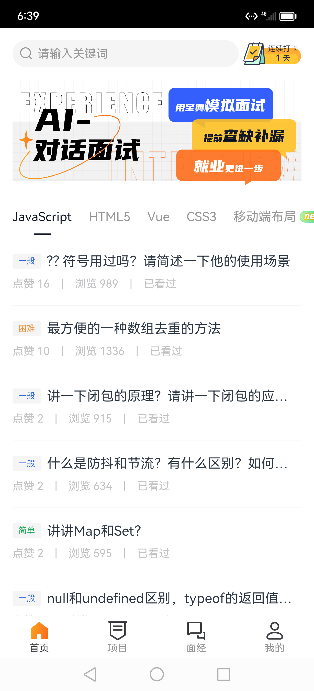
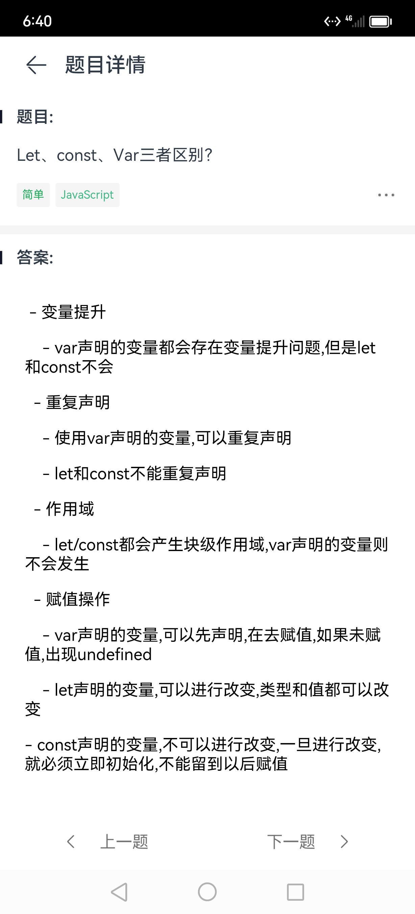
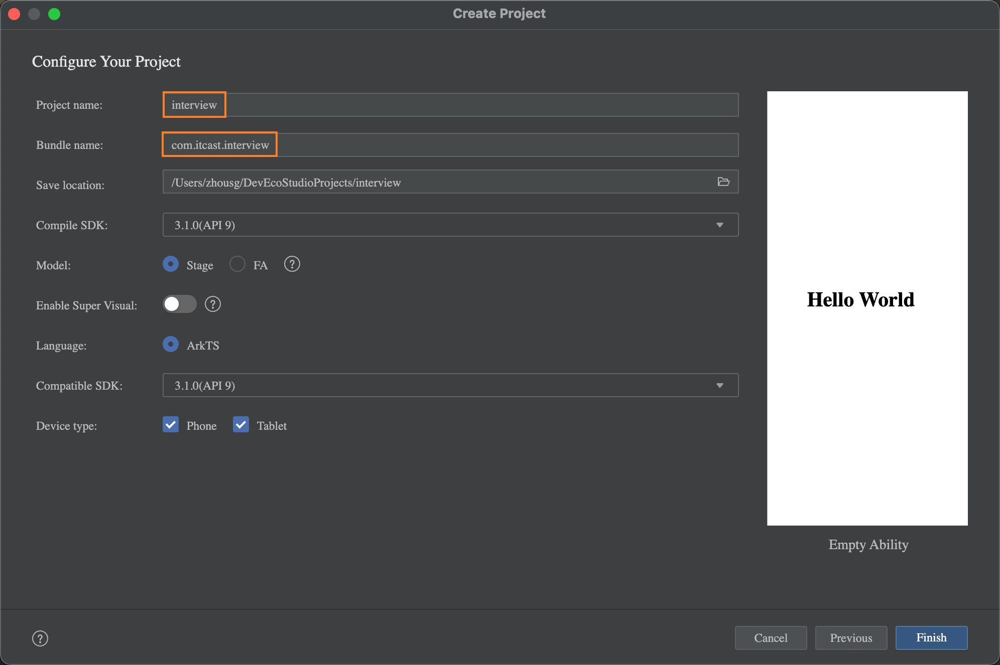
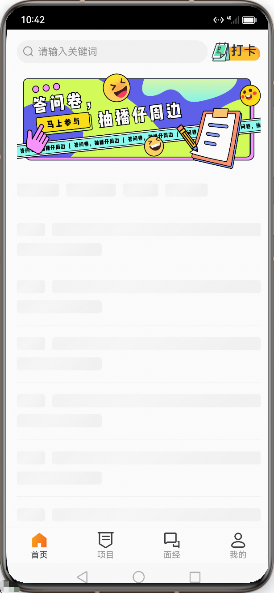

# 面试宝典APP-通用设施

## 项目物料

- 参考设计

【腾讯 CoDesign】面试宝典 https://codesign.qq.com/s/2kY5j3LVeb9ExNd 访问密码：2YDD

- 接口文档

【apifox】面试宝典 https://apifox.com/apidoc/shared-31e6a8d7-316a-4c5a-83c1-e5c7a2c343bf

- 效果例图

|登录|首页|
|----|----|
|||

|我的|打卡|
|----|----|
|||

|面试题|学习时间|
|----|----|
|||


## 基础能力


### 1. 创建项目

> 创建项目，参考华为 Codelabs 优秀案例结合项目自身情况对项目结构进行维护
 
1）创建项目

    


2）准备好项目结构

```
ets
├── common                      // 通用模块
│   ├── components              // - 通用组件
│   ├── constants               // - 常量数据
│   ├── images                  // - 图片资源
│   └── utils                   // - 工具类
├── entryability                // 入口UIAbility
│   └── EntryAbility.ts
├── models                      // - 数据模型
├── pages                       // - 页面组件
│   └── Index.ets
└── views                       // - 页面对应自定义组件
    └── Index
```

### 2. 日志工具类


1）封装 logger 工具类

```typescript title="common/utils/Logger.ts"
import hilog from '@ohos.hilog'

const DOMAIN = 0xFF00
const PREFIX = 'INTERVIEW'
const FORMAT = '%{public}s, %{public}s'

export class Logger {
  static debug(...args: string[]) {
    hilog.debug(DOMAIN, PREFIX, FORMAT, args)
  }

  static info(...args: string[]) {
    hilog.info(DOMAIN, PREFIX, FORMAT, args)
  }

  static warn(...args: string[]) {
    hilog.warn(DOMAIN, PREFIX, FORMAT, args)
  }

  static error(...args: string[]) {
    hilog.error(DOMAIN, PREFIX, FORMAT, args)
  }

  static fatal(...args: string[]) {
    hilog.fatal(DOMAIN, PREFIX, FORMAT, args)
  }

  static isLoggable(level: hilog.LogLevel) {
    return hilog.isLoggable(DOMAIN, PREFIX, level)
  }
}
```

2）修改 entryAbility 的日志打印

```typescript title="entryAbility.ts"
import UIAbility from '@ohos.app.ability.UIAbility';
import window from '@ohos.window';
import { Logger } from '../common/utils/Logger';

export default class EntryAbility extends UIAbility {
  onCreate(want, launchParam) {
    Logger.info('Ability onCreate')
  }

  onDestroy() {
    Logger.info('Ability onDestroy')
  }

  onWindowStageCreate(windowStage: window.WindowStage) {
    // Main window is created, set main page for this ability
    Logger.info('Ability onWindowStageCreate')

    windowStage.loadContent('pages/Index', (err, data) => {
      if (err.code) {
        Logger.info('Failed to load the content', JSON.stringify(err) ?? '')
        return;
      }
      Logger.info('Succeeded in loading the content', JSON.stringify(data) ?? '');
    });
  }

  onWindowStageDestroy() {
    // Main window is destroyed, release UI related resources
    Logger.info( 'Ability onWindowStageDestroy');
  }

  onForeground() {
    // Ability has brought to foreground
    Logger.info('Ability onForeground');
  }

  onBackground() {
    // Ability has back to background
    Logger.info('Ability onBackground');
  }
} 
```


### 3. 访问权限工具类


1）用户信息持久化，获取用户，设置用户，删除用户以及用户访问页面控制

```typescript title="models/UserModel.ts"
export class UserModel {
  id: string;
  username: string;
  avatar: string;
  refreshToken: string;
  token: string;
  totalTime: number;
  nickName: string;
}
```

```typescript title="common/utils/Auth.ts"
import router from '@ohos.router'
import { UserModel } from '../../models/User'

const USER_KEY = 'interview-user'
const PASS_LIST = ['pages/LoginPage']

export class Auth {
  static initLocalUser() {
    PersistentStorage.PersistProp(USER_KEY, '{}')
  }

  static setUser(user: UserModel) {
    AppStorage.Set(USER_KEY, JSON.stringify(user))
  }

  static getUser() {
    const str = AppStorage.Get<string>(USER_KEY) || '{}'
    return JSON.parse(str) as UserModel
  }

  static delUser() {
    AppStorage.Set(USER_KEY, '{}')
  }

  // 需要登录页面使用
  static pushUrl(options: router.RouterOptions) {
    const user = this.getUser()
    if (!PASS_LIST.includes(options.url) && !user.token) {
      return router.pushUrl({
        url: 'pages/LoginPage',
        params: {
          ...options.params,
          return_url: options.url
        }
      })
    }
    return router.pushUrl(options)
  }
}
```

2）在 entryAbility 初始化持久化用户

```typescript title="entryAbility.ts"
  onCreate(want, launchParam) {
    Logger.info('Ability onCreate')
    Auth.initLocalUser()
  }
```

### 4. 请求工具类-请求处理


- 维护基准地址
- get 传参拼接地址上，其他请求方式在 extraData 上
- 提供快捷调用静态方法

```typescript tilte="common/utils/Request.ts"
import http from '@ohos.net.http'
import { Auth } from './Auth'

const BASE_URL = 'https://api-harmony-teach.itheima.net/hm/'

const req = http.createHttp()

const request = <T = unknown>(
  url: string,
  method: http.RequestMethod = http.RequestMethod.GET,
  params: object = {}
) => {
  let fullUrl = BASE_URL + url
  const options: http.HttpRequestOptions = {
    header: {
      'Content-Type': 'application/json',
    },
    readTimeout: 30000,
    method,
  }

  // 如果是对象数据拼接URL，如果是其他则携带在 extraData
  if (method === http.RequestMethod.GET) {
    const urlParams = Object.keys(params).map(key => `${key}=${params[key]}`)
    fullUrl += `?${urlParams.join('&')}`
  } else {
    options.extraData = params
  }

  // 携带 token
  const user = Auth.getUser()
  if (user.token) {
    options.header['Authorization'] = `Bearer ${user.token}`
  }

  return req.request(fullUrl, options)

}

export class Request {
  static get<T>(url: string, params?: object) {
    return request<T>(url, http.RequestMethod.GET, params)
  }

  static post<T>(url: string, params?: object) {
    return request<T>(url, http.RequestMethod.POST, params)
  }

  static put<T>(url: string, params?: object) {
    return request<T>(url, http.RequestMethod.PUT, params)
  }

  static delete<T>(url: string, params?: object) {
    return request<T>(url, http.RequestMethod.DELETE, params)
  }
}
```


### 5. 请求工具类-响应处理

- 处理业务失败
- 处理登录失效
- 添加日志行为

```typescript tilte="common/utils/Request.ts"
  return req.request(fullUrl, options)
    .then(res => {
      if (res.result) {
        // 1. 处理响应
        const response = JSON.parse(res.result as string) as {
          code: number
          message: string
          data: T
        }
        if (response.code === 10000) {
          return response
        }
        // 2. 处理 token 失效
        if (response.code === 401) {
          Auth.delUser()
          router.pushUrl({
            url: 'pages/Login'
          }, router.RouterMode.Single)
        }
      }
      return Promise.reject(res.result)
    })
    .catch(err => {
      promptAction.showToast({ message: '网络错误' })
      return Promise.reject(err)
    })
    .finally(() => {
      // 销毁请求释放资源
      req.destroy()
    })
```


```diff 
  // 请求日志：
+  Logger.info(`REQUEST→${url}→${method}`, JSON.stringify(params))

  return req.request(fullUrl, options)
    .then(res => {
      if (res.result) {
        // 响应日志：
+        Logger.info(`RESPONSE→${url}→${method}`, res.result.toString().substring(0, 250))
        // 1. 处理响应
        const response = JSON.parse(res.result as string) as {
          code: number
          message: string
          data: T
        }
        if (response.code === 10000) {
          return response
        }
        // 2. 处理 token 失效
        if (response.code === 401) {
          Auth.delUser()
          router.pushUrl({
            url: 'pages/Login'
          }, router.RouterMode.Single)
        }
      }
      return Promise.reject(res.result)
    })
    .catch(err => {
      promptAction.showToast({ message: '网络错误' })
      // 错误日志：
+      Logger.error(`RESPONSE→${url}→${method}`, JSON.stringify(err).substring(0, 250))
      return Promise.reject(err)
    })
    .finally(() => {
      // 销毁请求释放资源
      req.destroy()
    })

```

## UI 管理

### 1. 界面一多

> 一个界面适配多类终端

手机-竖屏

pad-横屏


- 媒体查询 tablet 且横屏
-  tabs 的横竖模式
- 设置 bar 的位置和高度

```typescript {14,15,17,19-23,56-58} title="Index.ets"
import mediaquery from '@ohos.mediaquery'
class ToolBarItem {
  defaultIcon: string | Resource
  activeIcon: string | Resource
  label: string
}

@Entry
@Component
struct Index {
  @State
  activeIndex: number = 0

  @State
  isLandscape: boolean = false

  listenerScreen = mediaquery.matchMediaSync('(orientation: landscape) and (device-type: tablet)')

  aboutToAppear() {
    this.listenerScreen.on('change', (mediaQueryResult) => {
      this.isLandscape = mediaQueryResult.matches
    })
  }

  toolBars: ToolBarItem[] = [
    { defaultIcon: $r('app.media.home'), activeIcon: $r('app.media.home_select'), label: '首页' },
    { defaultIcon: $r('app.media.project'), activeIcon: $r('app.media.project_select'), label: '项目' },
    { defaultIcon: $r('app.media.interview'), activeIcon: $r('app.media.interview_select'), label: '面经' },
    { defaultIcon: $r('app.media.mine'), activeIcon: $r('app.media.mine_select'), label: '我的' }
  ]

  @Builder
  TabBarBuilder(item: ToolBarItem, index: number) {
    Column({ space: 4 }) {
      Image(this.activeIndex === index ? item.activeIcon : item.defaultIcon)
        .width(24)
      Text(item.label)
        .fontSize(12)
        .fontColor(this.activeIndex === index ? '#000' : '#aaa')
    }
  }

  build() {
    Tabs({
      index: this.activeIndex,
    }) {
      ForEach(this.toolBars, (item: ToolBarItem, index: number) => {
        TabContent() {
          Text(index.toString())
        }
        .tabBar(this.TabBarBuilder(item, index))
      })
    }
    .barPosition(this.isLandscape ? BarPosition.Start : BarPosition.End)
    .vertical(this.isLandscape)
    .barHeight(this.isLandscape ? 400 : 50)
    .onChange(index => this.activeIndex = index)
  }
}
```

### 2. 手机侧适配

> 手机端等比例缩放适配设备

- 知道等比例缩放原理

```typescript
// 安卓一般 360 设计稿 1080，面试宝典是 375
const designWidth = 375
// 书写尺寸 = 设备宽度 / 设计稿宽度 * 测量尺寸
const useSize =  deviceWidth / designWidth * measureSize
```

- 封装等比例缩放函数

```typescript type="common/utils/Basic.ets"
import display from '@ohos.display'
import deviceInfo from '@ohos.deviceInfo'

const designWidth = 375
const devicePhysics = display.getDefaultDisplaySync().width

export const vp2vp = (originSize: number) => {
  // 不是PAD是手机等比例缩放
  if ( deviceInfo.deviceType !== 'tablet' ) {
    return px2vp(devicePhysics) / designWidth * originSize
  }
  return originSize
}
```

- 修改 Tabs 相关尺寸

```typescript
 @Builder
  TabBarBuilder(item: ToolBarItem, index: number) {
    Column({ space: vp2vp(4) }) {
      Image(this.activeIndex === index ? item.activeIcon : item.defaultIcon)
        .width(vp2vp(24))
      Text(item.label)
        .fontSize(vp2vp(12))
        .fontColor(this.activeIndex === index ? '#000' : '#aaa')
    }
  }

  build() {
    Tabs({
      index: this.activeIndex,
    }) {
      ForEach(this.toolBars, (item: ToolBarItem, index: number) => {
        TabContent() {
          Text(index.toString())
        }
        .tabBar(this.TabBarBuilder(item, index))
      })
    }
    .barPosition(this.isLandscape ? BarPosition.Start : BarPosition.End)
    .vertical(this.isLandscape)
    .barHeight(this.isLandscape ? vp2vp(400) : vp2vp(50))
    .onChange(index => this.activeIndex = index)
  }
```


### 3. 配置文件

- 应用名称
- 主题颜色


1）应用名称

```json title="resources/zh_CN/element/string.json"
{
  "string": [
    {
      "name": "module_desc",
      "value": "模块描述"
    },
    {
      "name": "EntryAbility_desc",
      "value": "前端面试宝典，包含常见面试题，和企业真实面经"
    },
    {
      "name": "EntryAbility_label",
      "value": "面试通"
    },
    {
      "name": "reason",
      "value": "获取通知权限"
    }
  ]
}
```


2）主题颜色

```json title="resources/base/element/color.json"
{
  "color": [
    {
      "name": "start_window_background",
      "value": "#FFFFFF"
    },
    {
      "name": "green",
      "value": "#27AE60"
    },
    {
      "name": "gray",
      "value": "#979797"
    },
    {
      "name": "black",
      "value": "#121826"
    },
    {
      "name": "gray_bg",
      "value": "#F6F7F9"
    },
    {
      "name": "orange",
      "value": "#F2994A"
    },
    {
      "name": "blue",
      "value": "#3266EE"
    },
    {
      "name": "blue_bg",
      "value": "#EDF2FF"
    }
  ]
}
```

### 4. 准备页面

- 准备首页、项目、面经、我的四个 tabs 页面
- 使用 页面组件


1）准备组件

```typescript title="views/Index/Home.ets"
@Component
export struct Home {
  build() {
    Column(){
      Text('首页')
    }
    .width('100%')
    .height('100%')
  }
}
```

```typescript title="views/Index/Project.ets"
@Component
export struct Project {
  build() {
    Column(){
      Text('项目')
    }
    .width('100%')
    .height('100%')
  }
}
```

```typescript title="views/Index/Interview.ets"
@Component
export struct Interview {
  build() {
    Column(){
      Text('面经')
    }
    .width('100%')
    .height('100%')
  }
}
```

```typescript title="views/Index/Mine.ets"
@Component
export struct Mine {
  build() {
    Column(){
      Text('我的')
    }
    .width('100%')
    .height('100%')
  }
}
```

2）使用组件

```typescript title="pages/Index.ets"
import { Home } from '../views/Index/Home'
import { Project } from '../views/Index/Project'
import { Interview } from '../views/Index/Interview'
import { Mine } from '../views/Index/Mine'

// ...

        TabContent() {
          if (index === 0) Home()
          else if (index === 1) Project()
          else if (index === 2) Interview()
          else Mine()
        }
        .tabBar(this.TabBarBuilder(item, index))
```


### 5. 通用展示型组件



- 搜索框组件
- 打卡组件
- 骨架屏组件


1）搜索框组件

```typescript tilte="common/components/IvSearch.ets"
import { vp2vp } from '../utils/Basic'

@Component
export struct IvClock {

  textAlign: FlexAlign = FlexAlign.Start

  build() {
    Row() {
      Image($r('app.media.icon_public_search'))
        .width(vp2vp(15))
        .aspectRatio(1)
        .fillColor($r('app.color.gray'))

      Text('请输入关键词')
        .fontSize(vp2vp(14))
        .fontColor($r('app.color.gray'))
        .margin({ left: vp2vp(3) })
    }
    .layoutWeight(1)
    .height(vp2vp(28))
    .backgroundColor($r('app.color.gray_bg'))
    .borderRadius(vp2vp(14))
    .padding({ left: vp2vp(10), right: vp2vp(10) })
    .justifyContent(this.textAlign)
  }
}
```

2）打卡组件

```typescript tilte="common/components/IvClock.ets"
import { vp2vp } from '../utils/Basic'

@Component
export struct IvClock {
  @Prop
  clockCount: number = 0

  build() {
    Stack({ alignContent: Alignment.End }) {
      Image(this.clockCount > 0 ? $r('app.media.clocked') : $r('app.media.unclock'))
        .objectFit(ImageFit.Fill)
      if (this.clockCount > 0) {
        Column() {
          Text('已连续打卡')
            .fontSize(8)
          Text() {
            Span(this.clockCount.toString())
              .fontWeight(600)
              .fontSize(12)
            Span(' 天')
              .fontSize(10)
          }
        }
        .width('50')
      } else {
        Text('打卡')
          .width('50')
          .textAlign(TextAlign.Center)
          .fontSize(vp2vp(18))
          .fontWeight(500)
          .fontColor('#333C4F')
          .margin({ bottom: vp2vp(4) })
      }
    }
    .width(vp2vp(74))
    .height(vp2vp(28))
  }
}
```

```typescript title="views/Index/Home.ets"
import { IvClock } from '../../common/components/IvClock'
import { IvSearch } from '../../common/components/IvSearch'

@Component
export struct Home {
  build() {
    Column() {
      Row({ space: 15 }) {
        IvSearch()
        IvClock()
      }
      .padding(15)

      Text('首页')
    }
    .width('100%')
    .height('100%')
  }
}
```

3）骨架屏组件

- 背景渐变 linearGradient

```typescript
linearGradient({
// 角度，默认 180
angle?: number | string,
// 颜色，比例
colors: Array<[ResourceColor, number]>,
})
```

- 组件结构

```typescript tilte="common/components/IvSkeleton.ets"
import { vp2vp } from '../utils/Basic'

@Component
export struct IvSkeleton {
  widthValue: number | string = 100
  heightValue: number | string = 20
  @State
  translateValue: string = '-100%'

  build() {
    Stack() {
      Text()
        .backgroundColor($r('app.color.gray_bg'))
        .height('100%')
        .width('100%')
      Text()
        .linearGradient({
          angle: 90,
          colors: [
            ['rgba(255,255,255,0)', 0],
            ['rgba(255,255,255,0.5)', 0.5],
            ['rgba(255,255,255,0)', 1]
          ]
        })
        .height('100%')
        .width('100%')
        .translate({
          x: this.translateValue,
        })
        .animation({
          duration: 1500,
          iterations: -1
        })
    }
    .height(this.heightValue)
    .width(this.widthValue)
    .borderRadius(vp2vp(4))
    .clip(true)
    .onAppear(() => {
      this.translateValue = '100%'
    })
  }
}
```