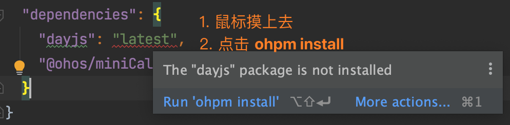
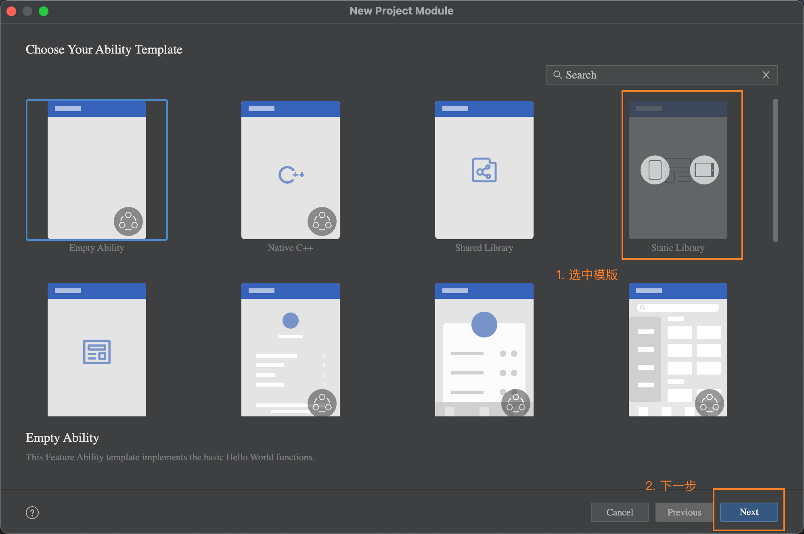

# 面试宝典APP-我的模块


## 个人中心

### 1. 我的-页面结构

```typescript title="views/Index/Mine.ets"
import { IvClock } from '../../common/components/IvClock'
import { vp2vp } from '../../common/utils/Basic'

@Preview
@Component
export struct Mine {
  @Builder
  NavBuilder(icon: Resource, title: string,) {
    Column({ space: vp2vp(8) }) {
      Image(icon)
        .width(vp2vp(30))
        .height(vp2vp(30))
        .objectFit(ImageFit.Fill)
      Text(title)
        .fontColor($r('app.color.gray'))
        .fontSize(vp2vp(13))
    }
  }

  @Builder
  CellBuilder(title: string, cb?: () => void) {
    Row() {
      Text(title)
        .fontSize(vp2vp(15))
        .fontColor($r('app.color.black'))
      Image($r('app.media.icon_my_arrow'))
        .fillColor('#C3C3C5')
        .width(vp2vp(18))
        .height(vp2vp(18))
    }
    .width('100%')
    .height(vp2vp(40))
    .justifyContent(FlexAlign.SpaceBetween)
    .padding({ left: vp2vp(15), right: vp2vp(15) })
    .onClick(()=>{
      cb && cb()
    })
  }

  build() {
    Column({ space: vp2vp(15) }) {
      // 头部
      Row() {
        Image('/common/images/avatar.png')
          .alt('/common/images/avatar.png')
          .width(vp2vp(55))
          .aspectRatio(1)
          .borderRadius(vp2vp(30))
          .border({ width: 0.5, color: '#e4e4e4' })
        Column({ space: vp2vp(5) }) {
          Text('黑马程序员')
            .fontSize(vp2vp(18))
            .fontWeight(FontWeight.Bold)
          Row() {
            Text('编辑资料')
              .fontSize(vp2vp(12))
              .fontColor($r('app.color.gray'))
            Image($r('app.media.icon_edit'))
              .width(vp2vp(12))
              .aspectRatio(1)
              .fillColor($r('app.color.gray'))
          }
        }
        .padding({ left: vp2vp(12) })
        .alignItems(HorizontalAlign.Start)
        .layoutWeight(1)

        IvClock({ clockCount: 0 })
      }
      .height(vp2vp(80))

      // 导航
      GridRow({ columns: 4 }) {
        GridCol() {
          this.NavBuilder($r('app.media.icon_my_history'), '历史记录')
        }

        GridCol() {
          this.NavBuilder($r('app.media.icon_my_favo'), '我的收藏')
        }

        GridCol() {
          this.NavBuilder($r('app.media.icon_my_zan'), '我的点赞')
        }

        GridCol() {
          Column() {
            this.NavBuilder($r('app.media.icon_my_time'), '累计学时')
            Row() {
              Text('10分钟')
                .fontColor('#C3C3C5')
                .fontSize(vp2vp(11))
              Image($r('app.media.icon_my_arrow'))
                .fillColor('#C3C3C5')
                .width(vp2vp(13))
                .height(vp2vp(13))
            }
            .margin({ top: vp2vp(3) })
          }
        }
      }
      .backgroundColor('#fff')
      .padding({ top: vp2vp(15), bottom: vp2vp(15) })
      .borderRadius(vp2vp(8))

      Row() {
        Text()
          .width(vp2vp(3))
          .height(vp2vp(12))
          .backgroundColor($r('app.color.green'))
        Text('前端常用词')
          .fontSize(vp2vp(15))
          .fontColor($r('app.color.black'))
          .layoutWeight(1)
          .padding({ left: vp2vp(12) })
        Image($r('app.media.icon_my_new'))
          .width(vp2vp(53))
          .height(vp2vp(22))
          .margin({ right: vp2vp(10) })
      }
      .backgroundColor('#fff')
      .padding({ top: vp2vp(15), bottom: vp2vp(15) })
      .borderRadius(vp2vp(8))

      List() {
        ListItem() {
          this.CellBuilder('推荐分享')
        }

        ListItem() {
          this.CellBuilder('意见反馈')
        }

        ListItem() {
          this.CellBuilder('关于我们')
        }

        if (this.user.token) {
          ListItem() {
            this.CellBuilder('退出登录', () => {
              // 退出登录
            })
          }
        }
      }
      .padding({ top: vp2vp(10), bottom: vp2vp(10) })
      .borderRadius(vp2vp(8))
      .backgroundColor('#fff')
      .divider({ strokeWidth: 0.5, color: $r('app.color.gray_bg') })

    }
    .padding(vp2vp(15))
    .width('100%')
    .height('100%')
    .backgroundColor($r('app.color.gray_bg'))
  }
}
```

### 2. 我的-页面逻辑

1）在 Index 初始化持久化用户

```typescript title="pages/Index.ets"
  Auth.initLocalUser()
```

2）获取 AppStorage 用户数据

```typescript title="views/Index/Mine.ets"
  @StorageProp(USER_KEY)
  @Watch('updateUser')
  userJson: string = '{}'
  @State
  user: UserModel = JSON.parse(this.userJson)

  updateUser() {
    this.user = JSON.parse(this.userJson)
  }
```

3）进行展示

```typescript {3,10,11,23-32,38} title="views/Index/Mine.ets"
      // 头部
      Row() {
        Image(this.user.avatar || '/common/images/avatar.png')
          .alt('/common/images/avatar.png')
          .width(vp2vp(55))
          .aspectRatio(1)
          .borderRadius(vp2vp(30))
          .border({ width: 0.5, color: '#e4e4e4' })
        Column({ space: vp2vp(5) }) {
          if (this.user.token) {
            Text(this.user.nickName || this.user.username)
              .fontSize(vp2vp(18))
              .fontWeight(FontWeight.Bold)
            Row() {
              Text('编辑资料')
                .fontSize(vp2vp(12))
                .fontColor($r('app.color.gray'))
              Image($r('app.media.icon_edit'))
                .width(vp2vp(12))
                .aspectRatio(1)
                .fillColor($r('app.color.gray'))
            }
          } else {
            Text('点击登录')
              .fontSize(vp2vp(18))
              .fontWeight(FontWeight.Bold)
              .onClick(() => {
                router.pushUrl({
                  url: 'pages/LoginPage'
                })
              })
          }
        }
        .padding({ left: vp2vp(12) })
        .alignItems(HorizontalAlign.Start)
        .layoutWeight(1)

        IvClock({ clockCount: this.user.clockinNumbers || 0  })
      }
      .height(vp2vp(80))
```

```typescript {4} title="views/Index/Mine.ets"
          Column() {
            this.NavBuilder($r('app.media.icon_my_time'), '累计学时')
            Row() {
              Text(formatTime(this.user.totalTime))
                .fontColor('#C3C3C5')
                .fontSize(vp2vp(11))
              Image($r('app.media.icon_my_arrow'))
                .fillColor('#C3C3C5')
                .width(vp2vp(13))
                .height(vp2vp(13))
            }
            .margin({ top: vp2vp(3) })
          }
```

```typescript title="views/Index/Mine.ets"
        if (this.user.token) {
          this.CellBuilder('退出登录')
        }
```


4）Basic 封装时间转换函数

```typescript title="common/utils/Basic.ets"
export const formatTime = (time: number = 0, hasUnit: boolean = true) => {
  if (time < 3600) {
    return String(Math.floor(time / 60)) + (hasUnit ? ' 分钟' : '')
  } else {
    return String(Math.round(time / 3600 * 10) / 10) + (hasUnit ? ' 小时' : '')
  }
}
```

```typescript title="views/Index/Mine.ets"
              Text(formatTime(this.user.totalTime))
                .fontColor('#C3C3C5')
                .fontSize(vp2vp(11))
```

### 3. 登录-页面结构

```typescript title="pages/LoginPage.ets"
import { vp2vp } from '../common/utils/Basic'

@Extend(TextInput) function customStyle() {
  .height(vp2vp(44))
  .borderRadius(vp2vp(2))
  .backgroundColor('#ffffff')
  .border({ width: { bottom: 0.5 }, color: '#e4e4e4' })
  .padding({ left: 0 })
  .placeholderColor('#C3C3C5')
  .caretColor('#fa711d')
}

@Entry
@Component
struct LoginPage {
  @State
  username: string = 'hmheima'
  @State
  password: string = 'Hmheima%123'
  @State
  isAgree: boolean = false
  @State
  loading: boolean = false

  build() {
    Navigation() {
      Scroll() {
        Column() {
          Column() {
            Image($r('app.media.icon'))
              .width(vp2vp(120))
              .aspectRatio(1)
            Text('面试宝典')
              .fontSize(vp2vp(28))
              .margin({ bottom: vp2vp(15) })
            Text('搞定企业面试真题，就用面试宝典')
              .fontSize(vp2vp(14))
              .fontColor($r('app.color.gray'))
          }

          Column({ space: vp2vp(15) }) {
            TextInput({ placeholder: '请输入用户名', text: this.username })
              .customStyle()
              .onChange(val => this.username = val)
            TextInput({ placeholder: '请输入密码', text: this.password, })
              .type(InputType.Password)
              .showPasswordIcon(false)
              .customStyle()
              .onChange(val => this.password = val)
            Row() {
              Checkbox()
                .selectedColor('#fa711d')
                .width(vp2vp(14))
                .aspectRatio(1)
                .select(this.isAgree)
                .onChange((val) => {
                  this.isAgree = val
                })
              Row({ space: vp2vp(4) }) {
                Text('已阅读并同意')
                  .fontSize(vp2vp(14))
                  .fontColor($r('app.color.gray'))
                Text('用户协议')
                  .fontSize(vp2vp(14))
                Text('和')
                  .fontSize(vp2vp(14))
                  .fontColor($r('app.color.gray'))
                Text('隐私政策')
                  .fontSize(vp2vp(14))
              }
            }
            .width('100%')

            Button({ type: ButtonType.Normal   }) {
              Row() {
                if (this.loading) {
                  LoadingProgress()
                    .color('#ffffff')
                    .width(vp2vp(24))
                    .height(vp2vp(24))
                    .margin({ right: vp2vp(10) })
                }
                Text('立即登录').fontColor('#ffffff')
              }
            }
            .width('100%')
            .backgroundColor('transparent')
            .stateEffect(false)
            .borderRadius(vp2vp(4))
            .height(vp2vp(44))
            .linearGradient({
              direction: GradientDirection.Right,
              colors: [['#fc9c1c', 0], ['#fa711d', 1]]
            })
          }
          .padding(vp2vp(30))

          Column() {
            Text('其他登录方式')
              .fontSize(vp2vp(14))
              .fontColor($r('app.color.gray'))
          }
          .padding({ top: vp2vp(70), bottom: vp2vp(100) })
        }
      }
    }
    .titleMode(NavigationTitleMode.Mini)
    .mode(NavigationMode.Stack)
  }
}
```

### 4. 登录-页面逻辑

1）控制按钮，禁用|启用状态，点击事件
```typescript title="pages/Index.ets"
Button({ type: ButtonType.Normal }) {
  Row() {
    if (this.loading) {
      LoadingProgress()
        .color('#ffffff')
        .width(vp2vp(24))
        .height(vp2vp(24))
        .margin({ right: vp2vp(10) })
    }
    Text('立即登录')
      .fontColor('#ffffff')
  }
}
.width('100%')
.backgroundColor('transparent')
.borderRadius(vp2vp(4))
.height(vp2vp(44))
.stateEffect(false)
.linearGradient({
  direction: GradientDirection.Right,
  colors: [['#fc9c1c', 0], ['#fa711d', 1]]
})
.enabled(!this.loading)
.onClick(() => {
  this.login()
})
```

2）实现登录，非空校验、登录跳转
```typescript title="pages/LoginPage.ets"
login() {
  if (!this.username) {
    return promptAction.showToast({ message: '请输入用户名' })
  }
  if (!this.password) {
    return promptAction.showToast({ message: '请输入密码' })
  }
  if (!this.isAgree) {
    return promptAction.showToast({ message: '请勾选已阅读并同意' })
  }

  this.loading = true
  Request.post<UserModel>('login', {
    username: this.username,
    password: this.password
  }).then(res => {
    Auth.setUser(res.data)

    const params = router.getParams()
    if (params && params['return_url']) {
      const url = params['return_url']
      delete params['return_url']
      router.replaceUrl({ url, params })
    } else {
      router.back()
    }
    this.loading = false
    return promptAction.showToast({ message: '登录成功' })
  }).catch(e => {
    this.loading = false
    return promptAction.showToast({ message: '登录失败' })
  })

}
```


### 5. 我的-退出登录


1）退出登录

```typescript title="pages/Mine.ets"
if (this.user.token) {
  this.CellBuilder('退出登录', async () => {
    const ok = await promptAction.showDialog({
      title: '温馨提示',
      message: '您确认要退出面试宝典APP吗？',
      buttons: [
        { text: '取消', color: '#c3c4c5' },
        { text: '确认', color: '#333333', }
      ]
    })
    if (ok.index === 1) {
      Auth.delUser()
    }
  })
}
```

2）退出和登录，使用 `emitter` 通知 `Home` 更新页面

基本语法：

```typescript
on(event: InnerEvent, callback: Callback<EventData>): void

emit(event: InnerEvent, data?: EventData): void

interface InnerEvent {
  eventId: number
}
```

- Home 注册事件

```typescript title="views/Index/Home.ets"
aboutToAppear() {
  this.getQuestionTypeList()

  emitter.on(LOGIN_EVENT, () => this.getQuestionTypeList())
}
```

- 登录触发事件

```typescript title="pages/LoginPage.ets"
Auth.setUser(res.data)
// 通知 Home 更新页面
emitter.emit(LOGIN_EVENT)
```

- 退出触发事件

```typescript title="views/Index/Mine.ets"
if (ok.index === 1) {
  Auth.delUser()
  // 通知 Home 更新页面
  emitter.emit(LOGIN_EVENT)
}
```

## 打卡日历

### 1. 实现打卡

1）首页打开数量显示

```typescript tilte="views/Index/Home.ets"
  @StorageProp(USER_KEY)
  @Watch('updateUser')
  userJson: string = '{}'
  @State
  user: UserModel = JSON.parse(this.userJson)

  updateUser() {
    this.user = JSON.parse(this.userJson)
  }
```

```diff tilte="views/Index/Home.ets"
      Row({ space: vp2vp(10) }) {
        IvSearch()
+        IvClock({ clockCount: this.user.clockinNumbers || 0 })
      }
```

2）打卡功能实现

```typescript tilte="common/components/IvClock.ets"
.onClick(() => {
  const user = Auth.getUser()
  if (user.token) {
    if (user.clockinNumbers > 0) {
      // 跳转打卡日历页面
      return router.pushUrl({ url: 'pages/ClockPage' })
    } else {
      // 进行打卡
      Request.post<{ clockinNumbers: number }>('clockin').then(res => {
        Auth.setUser({ ...user, clockinNumbers: res.data.clockinNumbers })
        promptAction.showToast({ message: '打卡成功' })
      })
    }
  } else {
    router.pushUrl({ url: 'pages/LoginPage' })
  }
})
```

3）更新打卡信息（用户信息）重新登录系统的时候

```typescript tilte="views/Index/Mine.ets"

// 获取用户信息
aboutToAppear(){
  if (this.user.token) {
    Request.get<UserModel>('userInfo')
      .then(res => {
        const { avatar, nickName, clockinNumbers, totalTime } = res.data
        Auth.setUser({ ...this.user, avatar, nickName, clockinNumbers, totalTime })
      })
  }
}

```


### 2. 打卡日历-页面结构

```typescript title="pages/ClockPage.ets"
import { vp2vp } from '../common/utils/Basic'

@Entry
@Component
struct ClockPage {
  @Builder
  dayBuilder(params: {
    day: number,
    text: string
  }) {
    Column() {
      Row() {
        Text(params.day.toString())
          .fontSize(vp2vp(40))
          .fontWeight(FontWeight.Bold)
        Text('天')
          .fontSize(vp2vp(10))
          .fontColor($r('app.color.gray'))
          .margin({ bottom: vp2vp(8), left: vp2vp(10) })
      }
      .alignItems(VerticalAlign.Bottom)

      Text(params.text)
        .fontSize(vp2vp(10))
        .fontColor($r('app.color.gray'))
    }.margin({ right: vp2vp(36) })
  }

  build() {
    Column() {
      Navigation() {
        Column() {
          Row() {
            Text('今日已打卡')
              .fontSize(vp2vp(20))
              .margin({ right: vp2vp(5) })
            Image($r('app.media.icon_clock_card'))
              .width(vp2vp(20))
              .aspectRatio(1)
              .objectFit(ImageFit.Fill)
          }
          .width('100%')

          Row() {
            this.dayBuilder({ day: 10, text: '累计打卡' })
            this.dayBuilder({ day: 10, text: '连续打卡' })
          }
          .padding({ top: vp2vp(10), bottom: vp2vp(25) })
          .width('100%')
          .justifyContent(FlexAlign.Start)

          Row() {

          }
          .height(300)
          .margin({ bottom: vp2vp(50) })

          Image('/common/images/clock_btn.png')
            .width(vp2vp(145))
            .height(vp2vp(38))
            .objectFit(ImageFit.Fill)

        }
        .padding(vp2vp(15))
        .layoutWeight(1)
      }
      .title('每日打卡')
      .titleMode(NavigationTitleMode.Mini)
      .mode(NavigationMode.Stack)
      .backgroundImage('/common/images/clock_bg.png')
      .backgroundImageSize(ImageSize.Contain)
      .backgroundImagePosition(Alignment.Top)
    }.backgroundColor($r('app.color.gray_bg'))
  }
}
```

### 3. 打卡日历-第三方库


1）方式1：使用 ohpm 命令行，参考：[链接](https://developer.harmonyos.com/cn/docs/documentation/doc-guides-V3/ide-command-line-ohpm-0000001490235312-V3)

2）方式2：

```json title="entry/oh-package.json5"
  "dependencies": {
    "dayjs": "latest"
  }
```



3）查找支持的第三方包 [链接](https://ohpm.openharmony.cn/)


### 4. 打卡日历-共享日历本地库


1）创建本地包

- 创建模块

- 包名称 miniCalendar


2）修改日历文件，名称 `MainPage.ets` 改成 `MiniCalendar.ets`

```typescript title="miniCalendar/src/main/ets/utils/index.ets"
// 设计稿宽度
import display from '@ohos.display'
import deviceInfo from '@ohos.deviceInfo'
const designWidth = 375
// 物理像素
const devicePhysics = display.getDefaultDisplaySync().width

export const vp2vp = (originSize: number) => {
  // useSize =  deviceWidth / designWidth * measureSize
  // 只有 手机 才需要
  if (deviceInfo.deviceType !== 'tablet') {
    return px2vp(devicePhysics) / designWidth * originSize
  }
  return originSize
}
```

```typescript  title="miniCalendar/src/main/ets/components/MiniCalendar.ets"
import dayjs from 'dayjs'
import { vp2vp } from '../utils'

const img = 'data:image/png;base64,iVBORw0KGgoAAAANSUhEUgAAAEQAAABECAYAAAA4E5OyAAAACXBIWXMAABYlAAAWJQFJUiTwAAAAAXNSR0IArs4c6QAAAARnQU1BAACxjwv8YQUAAAF5SURBVHgB7drLUcMwFIXhGzvOMKwoJXSAO0gJ0BkdECoQJaQT2II1MTo8NiZsmLm6R+R8mzjJIuN/Yo0tyUxERERERERE/rmVOUopXa3Xm4dyeFN+ap/z6904ji9GrDNHfT/s7CMGzLsSJyGSEXMNMs+2PPktexTXIMfjdF9eDouPqaO4jiHwNY6kcrhdfHXI+W1kG1Pcg0BLUaoEgVaiVAsCLUSpGgTYo1QPAsxRQoIAa5SwIMAYJTQIsEUJDwJMUSiCAEsUmiDAEIUqCERHoQsCkVFcH///CieME7cTUwddN9yaI8og31Yn/r993z+bI8oguGSGYZPKjNuPS2aaLh7NEeWg+luMnC/L1XR9PoNqdAygujGLjgE0t+4MMYDi4Y4lBoQ//jPFgNAJIrYYEDaFyBgDQiaZWWNA9WUI5hhQdaGKPQZUW8psIQZUWexuJQa47yBqKQa47yBqKQbU3kFEHQNq7CDaf76bn9hjiIiIiIiIiMhZeAeOPE1Nm7TnTQAAAABJRU5ErkJggg=='

class DayItem {
  public date: number
  public month: number
  public year: number
  public isSelected?: boolean
}

@Component
export struct MiniCalendar {
  // 内部属性
  private weeks: string[] = ['日', '一', '二', '三', '四', '五', '六']
  private selectedText: string = '已打卡'
  private format: string = 'YYYY-MM-DD'
  // 当前时间
  @Prop
  @Watch('onCurrentDateUpdate')
  currentDate: string
  // 选中时间
  @Link
  @Watch('onCurrentDateUpdate')
  selectedDays: string[]
  @State
  days: DayItem[] = []
  onClickDate: (date: string) => void
  onChangeMonth: (date: string) => void

  onCurrentDateUpdate() {
    this.days = this.getDays(this.currentDate)
  }

  aboutToAppear() {
    this.days = this.getDays(this.currentDate)
  }

  getDays(originDate?: string) {
    const date = originDate ? dayjs(originDate) : dayjs()
    const days: DayItem[] = []
    const len = 42

    // 当前月
    const currDays = date.daysInMonth()
    for (let index = 1; index <= currDays; index++) {
      days.push({
        date: index,
        month: date.month() + 1,
        year: date.year(),
        isSelected: this.selectedDays.some(item => date.date(index).isSame(item))
      })
    }
    // 上个月
    const prevMonth = date.date(0)
    const prevMonthLastDate = prevMonth.date()
    const prevDays = prevMonth.day()
    if (prevDays < 6) {
      for (let index = 0; index <= prevDays; index++) {
        days.unshift({
          date: prevMonthLastDate - index,
          month: prevMonth.month() + 1,
          year: prevMonth.year()
        })
      }
    }
    // 下个月
    const nextMonth = date.date(currDays + 1)
    const start = days.length
    for (let index = 1; index <= len - start; index++) {
      days.push({
        date: index,
        month: nextMonth.month() + 1,
        year: nextMonth.year()
      })
    }

    return days
  }

  isTheMonth(month: number) {
    return dayjs(this.currentDate).month() === month - 1
  }

  @Styles
  btnStyle() {
    .width(vp2vp(20))
    .height(vp2vp(20))
    .backgroundColor('#f6f7f9')
    .borderRadius(vp2vp(4))
  }

  build() {
    Column() {
      Row() {
        Column() {
          Image(img)
            .width(vp2vp(14))
            .aspectRatio(1)
            .rotate({ angle: 180 })
        }
        .btnStyle()
        .justifyContent(FlexAlign.Center)
        .onClick(() => {
          const date = dayjs(this.currentDate).subtract(1, 'month')
          this.currentDate = date.format(this.format)
          this.onChangeMonth && this.onChangeMonth(date.format('YYYY-MM'))
        })

        Text(dayjs(this.currentDate).format('YYYY年MM月'))
          .fontColor('#6B7897')
          .margin({ right: vp2vp(20), left: vp2vp(20) })
          .width(vp2vp(110))
          .textAlign(TextAlign.Center)

        Column() {
          Image(img)
            .width(vp2vp(14))
            .aspectRatio(1)
        }
        .btnStyle()
        .justifyContent(FlexAlign.Center)
        .onClick(() => {
          const date = dayjs(this.currentDate).add(1, 'month')
          this.currentDate = date.format(this.format)
          this.onChangeMonth && this.onChangeMonth(date.format('YYYY-MM'))
        })
      }
      .padding(15)

      GridRow({ columns: 7 }) {
        ForEach(this.weeks, (item) => {
          GridCol() {
            Column() {
              Text(item)
                .fontColor('#6E7B8A')
            }
          }.height(vp2vp(40))
        })
        ForEach(this.days, (item: DayItem) => {
          GridCol() {
            Column() {
              if (item.isSelected) {
                Text(item.date.toString())
                  .fontColor('#fff')
                  .width(vp2vp(32))
                  .height(vp2vp(32))
                  .borderRadius(vp2vp(16))
                  .backgroundColor('#FFC531')
                  .textAlign(TextAlign.Center)
                  .fontSize(vp2vp(14))
                Text(this.selectedText)
                  .fontColor('#FFC531')
                  .fontSize(vp2vp(10))
                  .margin({ top: vp2vp(2) })

              } else {
                Text(item.date.toString())
                  .width(vp2vp(32))
                  .height(vp2vp(32))
                  .fontSize(vp2vp(14))
                  .textAlign(TextAlign.Center)
                  .fontColor(this.isTheMonth(item.month) ? '#6E7B8A' : '#E1E4E7')
              }
            }.onClick(() => {
              const date = `${item.year}-${item.month.toString().padStart(2, '0')}-${item.date.toString()
                .padStart(2, '0')}`
              this.onClickDate && this.onClickDate(date)
            })
          }.height(vp2vp(48))
        })
      }
      .padding({ top: vp2vp(15) })
      .border({ width: { top: 0.5 }, color: '#f6f7f9' })
    }
    .width('100%')
    .backgroundColor('#fff')
    .borderRadius(vp2vp(8))
  }
}
```

3）导出组件

```typescript title="index.ets"
export { MiniCalendar } from './src/main/ets/components/MiniCalendar'
export { vp2vp } from './src/main/ets/utils'
```

4）使用组件

```json title="entry/oh-package.json5"
  "dependencies": {
    "@ohos/miniCalendar": "file:../miniCalendar"
  }
```

```typescript
import { MiniCalendar } from '@ohos/miniCalendar'
```

```typescript
            MiniCalendar({
              currentDate: '2023-12-9',
              selectedDays: $selectedDays,
              onChangeMonth: (date: string) => {
                promptAction.showToast({ message: date })
              },
              selectedText: '已签到'
            })
```


### 3. 打卡日历-显示签到

1）数据模型
```typescript title="models/ClockModel.ets"
export class ClockModel {
  flag?: boolean
  clockinNumbers?: number
  totalClockinNumber?: number
  clockins?: ClockInModel[]
}

export class ClockInModel {
  id: string
  createdAt: string
}
```

2）获取数据

```typescript title="pages/ClockPage.ets"
  @State
  clockData: ClockModel = {
    totalClockinNumber: 0,
    clockinNumbers: 0
  }

  aboutToAppear() {
    this.getData()
  }

  async getData(date?: {
    year: string,
    month: string
  }) {
    const res = await Request.get<ClockModel>('clockinInfo', date || {})
    this.clockData = res.data
    this.selectedDays = res.data.clockins.map(item => item.createdAt)
  }
```

3）渲染页面

```typescript title="pages/ClockPage.ets"
          Row() {
            this.dayBuilder({ day: this.clockData.totalClockinNumber, text: '累计打卡' })
            this.dayBuilder({ day: this.clockData.clockinNumbers, text: '连续打卡' })
          }
```

4）切换月份查询打卡数据

```typescript title="pages/ClockPage.ets"
            MiniCalendar({
              currentDate: '2023-12-9',
              selectedDays: $selectedDays,
              onChangeMonth: (date: string) => {
                const [year, month] = date.split('-')
                this.getData({ year, month })
              }
            })
```

## 编辑资料

### 1. 资料页面

```typescript title="views/Index/Mine.ets"
            Row() {
              Text('编辑资料')
                .fontSize(vp2vp(12))
                .fontColor($r('app.color.gray'))
              Image($r('app.media.icon_edit'))
                .width(vp2vp(12))
                .aspectRatio(1)
                .fillColor($r('app.color.gray'))
            }
            .onClick(() => {
              router.pushUrl({
                url: 'pages/ProfilePage'
              })
            })
```

```typescript title="pages/ProfilePage.ets"
import { USER_KEY } from '../common/utils/Auth'
import { vp2vp } from '../common/utils/Basic'
import { UserModel } from '../models/UserModel'

@Entry
@Component
struct ProfilePage {
  @StorageProp(USER_KEY)
  @Watch('updateUser')
  userJson: string = '{}'
  @State
  user: UserModel = JSON.parse(this.userJson)

  updateUser() {
    this.user = JSON.parse(this.userJson)
  }

  pickerAvatar() {
    // TODO
  }

  updateNickName() {
    // TODO
  }

  build() {
    Navigation() {
      List() {
        ListItem() {
          Row() {
            Text('头像')
            Image(this.user.avatar)
              .alt('/common/images/avatar.png')
              .width(vp2vp(40))
              .aspectRatio(1)
              .borderRadius(vp2vp(20))
              .border({ width: 0.5, color: '#e4e4e4' })
              .onClick(() => {
                this.pickerAvatar()
              })
          }
          .width('100%')
          .height(vp2vp(60))
          .justifyContent(FlexAlign.SpaceBetween)
        }

        ListItem() {
          Row() {
            Text('昵称')
            TextInput({ text: this.user.nickName })
              .textAlign(TextAlign.End)
              .layoutWeight(1)
              .padding(0)
              .height(vp2vp(60))
              .backgroundColor(Color.White)
              .borderRadius(0)
              .onChange((value) => this.user.nickName = value)
              .onSubmit(() => {
                this.updateNickName()
              })
          }
          .width('100%')
          .justifyContent(FlexAlign.SpaceBetween)
        }
      }
      .width('100%')
      .height('100%')
      .padding({ left: vp2vp(30), right: vp2vp(30), top: vp2vp(15), bottom: vp2vp(15) })
      .divider({ strokeWidth: 0.5, color: '#f5f5f5' })
    }
    .title('完善个人信息')
    .titleMode(NavigationTitleMode.Mini)
    .mode(NavigationMode.Stack)
  }
}
```

### 2. 修改昵称


1）实现更新

```typescript
  updateNickName() {
    Request.put('userInfo/profile', {
      nickName: this.user.nickName
    }).then(res => {
      promptAction.showToast({ message: '更新昵称成功' })
      Auth.setUser(this.user)
    })
  }
```

2）自定义弹窗

```typescript title="common/components/IvLoadingDialog.ets"
import { vp2vp } from '../utils/Basic'

@CustomDialog
export struct IvLoadingDialog {
  message: string = ''
  controller: CustomDialogController

  build() {
    Column() {
      LoadingProgress()
        .width(vp2vp(48))
        .aspectRatio(1)
        .color('#fff')
      if (this.message) {
        Text(this.message)
          .fontSize(vp2vp(14))
          .fontColor('#fff')
      }
    }
    .width(vp2vp(120))
    .aspectRatio(1)
    .backgroundColor('rgba(0,0,0,0.5)')
    .borderRadius(vp2vp(16))
    .justifyContent(FlexAlign.Center)
  }
}
```

3）初始化加载框

```typescript title="pages/ProfilePage.ets"
  dialog: CustomDialogController = new CustomDialogController({
    builder: IvLoadingDialog({ message: '更新中...' }),
    customStyle: true,

  })

  updateNickName() {
  this.dialog.open()
  Request.post('userInfo/profile', {
    nickName: this.user.nickName
  }).then(res => {
    Auth.setUser(this.user)
    this.dialog.close()
  })
}
```

### 3. 修改头像


1）选择文件

```typescript title="pages/ProfilePage.ets"
URI: string = null

pickerAvatar() {
  const photoSelectOptions = new picker.PhotoSelectOptions()
  photoSelectOptions.MIMEType = picker.PhotoViewMIMETypes.IMAGE_TYPE
  photoSelectOptions.maxSelectNumber = 1

  const photoViewPicker = new picker.PhotoViewPicker()
  photoViewPicker.select(photoSelectOptions).then(result => {
    // 1. 得到文件路径
    this.URI = result.photoUris[0]
    this.uploadAvatar()
  })
}
```


2）上传图片

```typescript title="pages/ProfilePage.ets"
uploadAvatar() {
  this.dialog.open()

  const context = getContext(this)
  const fileType = 'jpg'
  const fileName = Date.now() + '.' + fileType
  const copyFilePath = context.cacheDir + '/' + fileName

  const file = fs.openSync(this.URI, fs.OpenMode.READ_ONLY)
  fs.copyFileSync(file.fd, copyFilePath)

  const config: request.UploadConfig = {
    url: BaseURL + 'userInfo/avatar',
    method: 'POST',
    header: {
      'Accept': '*/*',
      'Authorization': `Bearer ${this.user.token}`,
      'Content-Type': 'multipart/form-data'
    },
    files: [
      { name: 'file', uri: `internal://cache/` + fileName, type: fileType, filename: fileName }
    ],
    data: []
  }

  request.uploadFile(context, config, (err, data) => {
    if (err) return Logger.error('UPLOAD', err.message)
    data.on('progress', (size) => {
      Logger.info(size.toString())
    })
    data.on('complete', () => {
      this.getUserInfo()
    })
  })
}
```

3）更新数据

```typescript title="pages/ProfilePage.ets"
getUserInfo () {
  Request.get<{ avatar: string }>('userInfo').then(res => {
    this.user.avatar = res.data.avatar
    Auth.setUser(this.user)
    this.dialog.close()
  })
}
```

